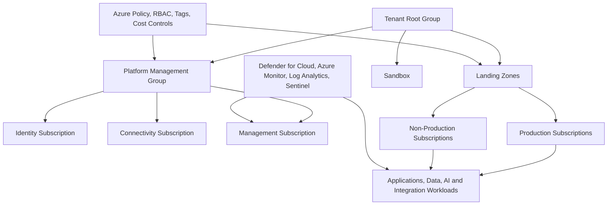
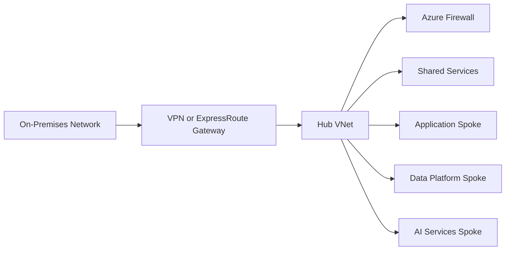

# Azure Landing Zone Architecture

  

    <small>ARCHITECTURE DECISION</small>
    <strong>Design Azure as an enterprise foundation, not a subscription collection</strong>
    Landing zone decisions should connect identity, network, policy, security, cost and workload onboarding before application migration begins.
  

  

    <small>01</small>
    <strong>Foundation</strong>
    Define management groups, subscriptions, policy and identity guardrails.
  

  

    <small>02</small>
    <strong>Connectivity</strong>
    Design hub-spoke, DNS, routing, private access and inspection patterns.
  

  

    <small>03</small>
    <strong>Operations</strong>
    Prepare monitoring, cost control, ownership, deployment and exception rhythm.
  

## Executive Summary

Azure Landing Zone provides a scalable and governed foundation for enterprise cloud adoption.

The objective is to establish a secure, compliant and operationally manageable Azure environment before workloads are deployed.

Landing Zone architecture standardizes governance, identity, networking, security, monitoring, cost management and operations across Azure subscriptions.

## 한국어 요약

Azure Landing Zone은 workload를 Azure에 올리기 전에 먼저 준비해야 하는 enterprise cloud foundation입니다.

Management group, subscription, identity, network, security, monitoring, policy, cost management를 표준화하면 이후 migration, application modernization, AI platform 구축을 더 빠르고 안전하게 진행할 수 있습니다.

## Business Scenario

Typical Azure initiatives include:

- Datacenter modernization
- Azure migration programs
- Hybrid cloud deployment
- Disaster recovery implementation
- Application modernization
- Azure Virtual Desktop deployment
- AI and data platform initiatives
- Global cloud expansion

## Landing Zone Architecture Overview

## Core Components

| Component | Design Focus | Output |
|---|---|---|
| Management Groups | Enterprise hierarchy and policy inheritance | Management group design |
| Subscriptions | Workload, environment and ownership separation | Subscription model |
| Identity | Entra ID, RBAC, PIM, break-glass accounts | Access control baseline |
| Connectivity | Hub-and-spoke, ExpressRoute, VPN, firewall | Network architecture |
| Security | Defender for Cloud, Sentinel, Key Vault | Security baseline |
| Governance | Azure Policy, tags, locks, naming | Governance standard |
| Operations | Monitor, Log Analytics, alerts, backup | Operational model |
| FinOps | Budgets, cost allocation, rightsizing | Cost management model |

## Network Architecture

## Decision Checklist

| Decision | Recommended Question |
|---|---|
| Management group model | Which hierarchy supports policy inheritance and business ownership? |
| Subscription strategy | How are production, non-production, sandbox and shared services separated? |
| Network topology | Is hub-and-spoke, virtual WAN or isolated workload design appropriate? |
| Security baseline | Which Defender, logging, key management and backup controls are mandatory? |
| Policy enforcement | Which Azure Policy rules should be audit-only first and enforced later? |
| FinOps model | How are budgets, tags, alerts and cost ownership managed? |

## Anti-Patterns

- Deploying production workloads before the Landing Zone is defined
- Using a flat subscription model for all workloads
- Treating Azure Policy as a one-time compliance task
- Allowing broad Owner permissions without PIM and review
- Building network connectivity without central inspection and logging
- Ignoring cost ownership until consumption has already grown

## Delivery Artifacts

- Azure Landing Zone target architecture
- Management group and subscription design
- Hub-and-spoke network architecture
- Azure Policy and tagging standard
- RBAC and PIM access model
- Security monitoring and logging design
- Backup and disaster recovery baseline
- FinOps dashboard and cost governance model

## Operating Model

| Function | Owner |
|---|---|
| Identity | IAM Team |
| Network | Infrastructure Team |
| Security | Security Team |
| Monitoring | Operations Team |
| Governance | Cloud Center of Excellence |
| Cost Management | FinOps Team |
| Workload Ownership | Application or Business Service Owner |

## Lessons Learned

- Governance is easier to implement before workloads are deployed.
- Network redesign later is expensive and disruptive.
- RBAC, PIM and policy reduce operational risk.
- Cost visibility requires tagging discipline from day one.
- Landing Zone accelerates migration and future AI/data platform projects.
- Security architecture must be embedded into the foundation, not added later.

## 검색 키워드

- Azure Landing Zone architecture
- Azure management group design
- Azure subscription governance
- Azure hub and spoke architecture
- Azure Policy governance
- Azure FinOps
- Azure 보안 아키텍처

## References

- [Executive Architecture Blueprint](./executive-architecture-blueprint)
- [Governance Architecture](./governance-architecture)
- [Security Reference Architecture](./security-reference-architecture)
- [Migration Architecture](./migration-architecture)

## Contact / Asset Request

For architecture decision records, reference diagrams, executive summaries, review checklists or roadmap templates, use [Contact and Asset Request](../contact).
