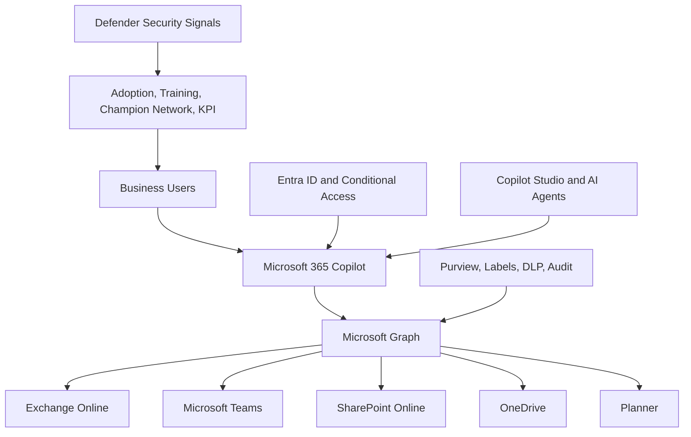

# Microsoft Copilot Architecture

  

    <small>ARCHITECTURE DECISION</small>
    <strong>Copilot architecture starts with data boundary and adoption intent</strong>
    A strong Copilot design connects Microsoft 365 permissions, Purview, user scenarios, agent governance and measurable value.
  

  

    <small>01</small>
    <strong>Readiness</strong>
    Check identity, permissions, labels, sharing and sensitive content exposure.
  

  

    <small>02</small>
    <strong>Adoption</strong>
    Prioritize use cases, champions, training and measurable work outcomes.
  

  

    <small>03</small>
    <strong>Governance</strong>
    Define owner, approval, telemetry, cost and agent lifecycle controls.
  

## Executive Summary

Microsoft 365 Copilot is not simply an AI assistant.

Successful adoption requires a secure architecture that combines identity, permissions, information architecture, governance, compliance and change management.

This reference architecture provides a framework for enterprise Copilot readiness and long-term AI adoption.

## 한국어 요약

Copilot architecture는 license 배정이나 기능 활성화가 아니라 Microsoft Graph, permission, Purview, DLP, Conditional Access, adoption, AI Agent governance를 하나로 연결하는 설계입니다.

Copilot은 사용자가 이미 접근 가능한 Microsoft 365 데이터를 기반으로 작동하므로, data readiness와 permission cleanup이 architecture의 핵심입니다.

## Business Scenario

Typical Copilot initiatives include:

- Microsoft 365 Copilot deployment
- AI transformation programs
- Executive productivity improvement
- Knowledge management modernization
- Employee experience enhancement
- Secure AI adoption
- Copilot governance implementation
- Global AI rollout

## Copilot Architecture Overview

## Core Components

| Component | Purpose | Architecture Concern |
|---|---|---|
| Microsoft Graph | Data access layer | Permission and content quality |
| Copilot Service | AI orchestration | User experience and response quality |
| Exchange Online | Email intelligence | Mailbox governance and retention |
| Teams | Meeting and collaboration intelligence | Team lifecycle and external access |
| SharePoint Online | Organizational knowledge | Oversharing and information architecture |
| OneDrive | Personal knowledge repository | Sharing, retention and ownership |
| Purview | Data governance and protection | Labels, DLP, audit and compliance |
| Entra ID | Identity and access control | MFA, Conditional Access and risk |
| Copilot Studio | Agent extension model | Approval, lifecycle and ownership |

## Decision Checklist

| Decision | Recommended Question |
|---|---|
| Pilot scope | Which user personas and departments validate Copilot first? |
| Data readiness | Which SharePoint and Teams areas need permission cleanup before rollout? |
| Security baseline | Are Conditional Access, Purview, DLP and audit controls ready? |
| Agent governance | Who can create, approve, publish and retire Copilot Studio agents? |
| Adoption model | Which training, champion and office-hour model supports users? |
| Value tracking | Which business scenarios prove measurable Copilot value? |

## Anti-Patterns

- Assigning Copilot licenses before permission and data readiness review
- Treating Copilot as a generic training program instead of role-based adoption
- Allowing agent creation without approval, lifecycle and ownership rules
- Measuring only active users without business outcome metrics
- Ignoring user trust issues caused by overshared or outdated content

## Delivery Artifacts

- Copilot readiness assessment
- Oversharing and permission review report
- Copilot governance charter
- Agent lifecycle and approval model
- Adoption roadmap and champion plan
- Use case prioritization matrix
- Value tracking dashboard

## Adoption Operating Model

| Workstream | Focus |
|---|---|
| Executive sponsorship | Business priority, communication and funding support |
| Champion network | Department use cases, local support and feedback |
| Training | Role-based prompt and workflow enablement |
| Office hours | Prompt coaching and use case support |
| Governance forum | Security, compliance, agent and adoption decisions |
| Analytics | Usage, satisfaction, use case value and support trends |

## Lessons Learned

- Secure before scaling.
- Clean up permissions before broad license assignment.
- Establish governance before agent creation.
- Treat adoption as role-based behavior change.
- Measure business value, not only usage.

## 검색 키워드

- Microsoft 365 Copilot architecture
- Copilot readiness architecture
- Copilot governance
- Copilot Studio Agent governance
- Microsoft Graph Copilot data access
- Copilot data protection
- Copilot 도입 아키텍처

## References

- [Copilot Overview](../copilot/overview)
- [Copilot Governance](../copilot/governance)
- [Agent Factory Operating Model](../copilot/agent-factory-operating-model)
- [Executive Architecture Blueprint](./executive-architecture-blueprint)

## Contact / Asset Request

For architecture decision records, reference diagrams, executive summaries, review checklists or roadmap templates, use [Contact and Asset Request](../contact).
