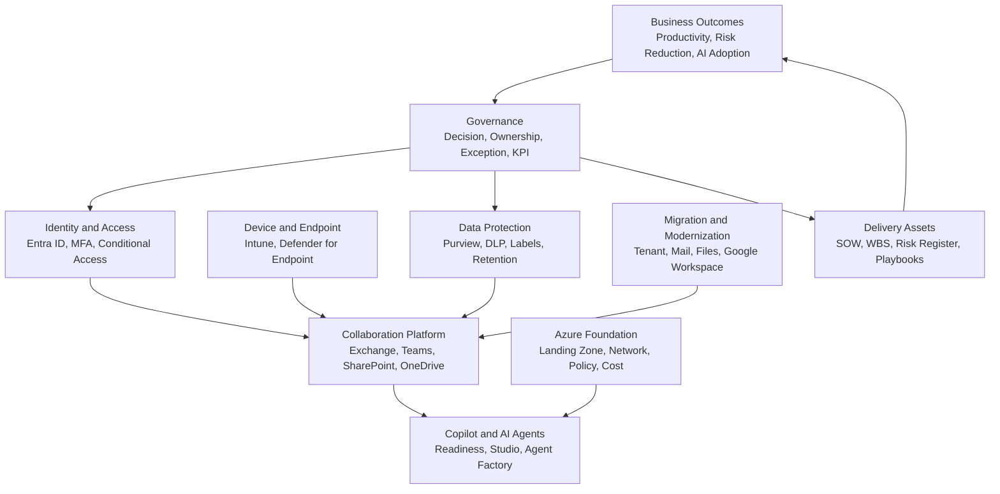
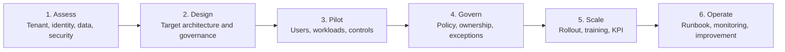

# Executive Architecture Blueprint

This blueprint explains how the major areas of this Knowledge Center connect into one enterprise Microsoft platform architecture.

It is designed for executive review, presales storytelling, architecture workshops and project kickoff discussions where business leaders, security owners, IT teams and delivery teams need the same view of the target platform.

  

    <small>ARCHITECTURE DECISION</small>
    <strong>Turn technical architecture into an executive decision story</strong>
    Executive architecture should clarify business pressure, risk, roadmap, investment sequence and operating model ownership.
  

  

    <small>01</small>
    <strong>Context</strong>
    Explain the business driver and risk in language leaders can act on.
  

  

    <small>02</small>
    <strong>Decision</strong>
    Show which architecture choices require sponsorship, funding or policy approval.
  

  

    <small>03</small>
    <strong>Roadmap</strong>
    Sequence initiatives into waves with measurable outcomes and owners.
  

## 한국어 요약

이 문서는 Microsoft 365, Security, Copilot, AI Agent, Azure, Migration, Governance, Proposal asset을 하나의 enterprise architecture 관점으로 연결한 executive blueprint입니다.

개별 기술 문서가 아니라, 고객에게 "왜 이 구성이 필요한지", "어떤 순서로 준비해야 하는지", "어떤 산출물이 필요한지"를 설명하기 위한 상위 architecture story로 사용할 수 있습니다.

## Executive Platform View

## Architecture Layers

| Layer | Purpose | Key Microsoft Capabilities | Consulting Output |
|---|---|---|---|
| Business | Define outcome and priority | Microsoft 365, Copilot, Azure | Executive summary, success metrics |
| Governance | Define owner, policy, exception and KPI | Entra ID, Purview, Intune, Defender | Governance model, decision log |
| Identity | Verify user, role, device and risk | Entra ID, MFA, Conditional Access, PIM | Identity and access design |
| Device | Control endpoint trust | Intune, Defender for Endpoint | Device compliance policy matrix |
| Data | Protect sensitive information | Purview, DLP, retention, audit | Data protection readiness report |
| Collaboration | Standardize workspaces and communication | Exchange Online, Teams, SharePoint, OneDrive | Collaboration governance guide |
| AI | Govern Copilot and agents | Microsoft 365 Copilot, Copilot Studio | Copilot readiness and agent governance |
| Cloud | Provide platform foundation | Azure Landing Zone, Policy, Monitor | Landing zone design |
| Delivery | Execute with repeatable assets | SOW, WBS, Risk Register, Playbooks | Delivery pack and handover guide |

## Readiness Sequence

## Executive Decision Checklist

Use this checklist before approving a Microsoft 365, Security, Copilot or Azure program.

| Question | Why It Matters |
|---|---|
| What business outcome is this program expected to improve? | Prevents technology-only delivery |
| Which data and users are in scope? | Controls risk and licensing assumptions |
| Who owns policy decisions and exceptions? | Prevents unclear governance after go-live |
| Which security controls must be in place before rollout? | Reduces disruption and audit gaps |
| What pilot group validates the design? | Proves feasibility before scale |
| What SOW, WBS and risk register are required? | Connects architecture to delivery execution |
| How will success be measured after rollout? | Turns adoption into measurable value |

## Customer Conversation Flow

For customer workshops, use this sequence:

1. Confirm business drivers and risk concerns.
2. Map Microsoft workloads to the business outcome.
3. Review current tenant, identity, security and data posture.
4. Identify Copilot, migration or Azure readiness gaps.
5. Define target architecture and governance decisions.
6. Convert decisions into proposal scope, SOW, WBS and risk register.
7. Agree on pilot, rollout and operating model.

## Executive Anti-Patterns

- Starting with product features before business outcomes are agreed
- Discussing Copilot without data, identity and security readiness
- Building an architecture without delivery artifacts such as SOW, WBS and risk register
- Treating governance as a policy document instead of an operating rhythm
- Measuring success only by deployment completion rather than adoption, risk reduction and business value

## Executive Delivery Artifacts

- Executive architecture one-page brief
- Business outcome and success metric definition
- Target-state architecture diagram
- Governance decision log
- Security and data readiness summary
- Copilot or Azure readiness roadmap
- Proposal scope, SOW, WBS and risk register
- Executive steering committee status pack

## 검색 키워드

이 문서는 다음과 같은 검색어와 관련됩니다.

- Microsoft enterprise architecture
- Microsoft 365 architecture blueprint
- Microsoft 365 컨설팅 아키텍처
- Copilot readiness architecture
- Security architecture blueprint
- Azure Landing Zone architecture
- Microsoft 365 governance model
- SOW WBS architecture proposal

## Related Documents

- [Microsoft 365 Reference Architecture](./m365-reference-architecture)
- [Security Reference Architecture](./security-reference-architecture)
- [Copilot Architecture](./copilot-architecture)
- [Azure Landing Zone Architecture](./azure-landing-zone-architecture)
- [Proposal Center](../proposal/overview)
- [Customer Success Reference Patterns](../projects/customer-success-reference-patterns)

## Contact / Asset Request

For architecture decision records, reference diagrams, executive summaries, review checklists or roadmap templates, use [Contact and Asset Request](../contact).
