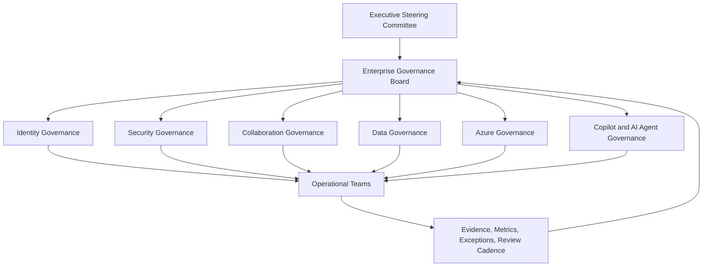

# Governance Architecture

## Executive Summary

Governance architecture defines how Microsoft 365, Azure, Security and Copilot environments are controlled, operated and continuously improved.

A successful governance model clarifies decision ownership, policy standards, operational roles, exception handling, lifecycle management and executive reporting.

The objective is to prevent platform sprawl, reduce security risk and keep cloud services aligned with business objectives.

## 한국어 요약

Governance architecture는 Microsoft 365와 Azure를 안정적으로 운영하기 위한 의사결정 구조입니다.

Teams, SharePoint, Entra ID, Purview, Azure subscription, Copilot, AI Agent가 빠르게 확산될수록 정책, 소유자, 예외 승인, 정기 검토 체계가 필요합니다.

## Business Scenario

Typical governance initiatives include:

- Microsoft 365 tenant governance
- Teams lifecycle management
- SharePoint external sharing control
- Azure subscription governance
- Copilot readiness governance
- Security and compliance policy management
- Global subsidiary governance standardization
- License and cost optimization
- AI Agent lifecycle and approval model

## Governance Architecture Overview

## Governance Domains

| Domain | Scope | Primary Decision |
|---|---|---|
| Identity Governance | Entra ID, MFA, Conditional Access, guest access | Who can access what, under which condition |
| Collaboration Governance | Teams, SharePoint, OneDrive | How workspaces are created, shared and retired |
| Data Governance | Purview, labels, DLP, retention | How sensitive data is classified and protected |
| Security Governance | Defender, incident process, exceptions | Which controls are mandatory and how exceptions are approved |
| Azure Governance | Management groups, subscriptions, policy, cost | How cloud resources are standardized and controlled |
| Copilot Governance | Copilot readiness, agents, adoption | How AI capabilities are enabled, measured and governed |

## Decision Checklist

| Decision | Recommended Question |
|---|---|
| Governance board | Who owns cross-platform policy decisions? |
| Policy baseline | Which controls are mandatory for all users and workloads? |
| Exception process | Who approves exceptions, and when do they expire? |
| Workspace lifecycle | How are Teams, sites, groups and agents created and retired? |
| Evidence model | What metrics prove governance is operating effectively? |
| Review cadence | How often are policies, risks and exceptions reviewed? |

## Anti-Patterns

- Creating policies without accountable owners
- Allowing permanent security exceptions
- Treating Teams and SharePoint governance as an admin-only task
- Measuring governance only by license usage
- Launching Copilot or AI Agents without data and lifecycle governance

## Delivery Artifacts

- Enterprise governance charter
- Policy baseline matrix
- RACI and decision authority model
- Teams and SharePoint lifecycle policy
- Azure subscription and tagging standard
- Copilot and AI Agent governance model
- Exception register and review cadence
- Executive governance dashboard

## Operating Model

| Role | Responsibility |
|---|---|
| Executive Sponsor | Business priority, funding and escalation |
| Governance Board | Cross-domain policy decision and risk acceptance |
| Platform Owner | Microsoft 365, Azure or Security service ownership |
| Security Owner | Control baseline, incident process and exception approval |
| Compliance Owner | Data protection, retention, audit and regulatory alignment |
| Service Desk | User support, intake and operational feedback |

## Lessons Learned

- Governance must be simple enough to operate repeatedly.
- Policies need owners, evidence and review dates.
- Exception handling is as important as policy design.
- Copilot governance depends on existing data and collaboration governance.
- Executive visibility turns governance from documentation into an operating rhythm.

## 검색 키워드

- Microsoft 365 governance architecture
- Azure governance architecture
- Copilot governance model
- Teams lifecycle governance
- SharePoint external sharing governance
- Microsoft Purview governance
- Enterprise cloud governance

## References

- [Microsoft 365 Reference Architecture](./m365-reference-architecture)
- [Security Reference Architecture](./security-reference-architecture)
- [Copilot Architecture](./copilot-architecture)
- [Executive Architecture Blueprint](./executive-architecture-blueprint)
