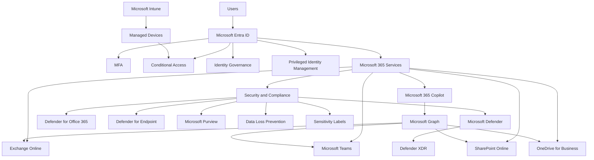
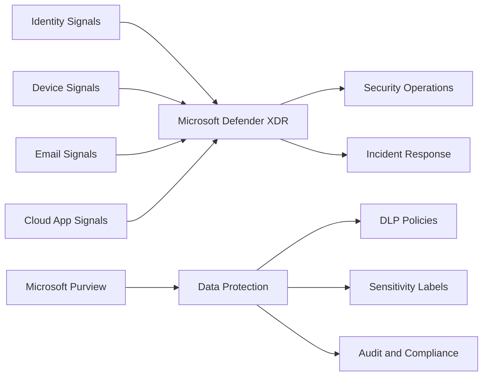
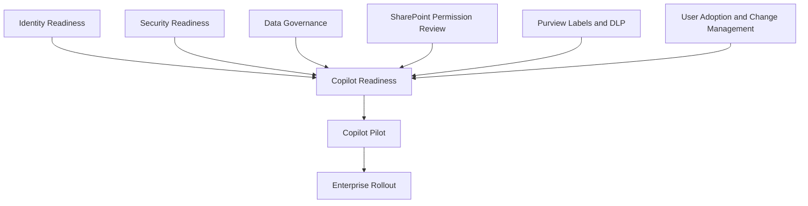

# Microsoft 365 Reference Architecture

## Executive Summary

Microsoft 365 should not be deployed as a standalone productivity platform.

Enterprise success requires an integrated architecture spanning identity, collaboration, security, compliance, governance and operational management.

This reference architecture provides a standardized framework for Microsoft 365 modernization, security transformation, migration and Copilot readiness programs.

The objective is to establish a scalable, secure and operationally sustainable digital workplace platform that aligns with business objectives while reducing operational complexity and security risk.

---

## Business Scenario

Typical enterprise initiatives include:

- Microsoft 365 tenant modernization
- Exchange Online migration
- Teams and SharePoint adoption
- File server modernization
- Security and compliance transformation
- Zero Trust implementation
- Microsoft 365 Copilot readiness
- Global governance standardization
- License optimization initiatives

Common stakeholders include:

- CIO
- CISO
- IT Director
- Infrastructure Manager
- Security Operations Team
- Compliance Team
- Collaboration Platform Owner

---

## Design Principles

The architecture should follow the following principles:

### Cloud First

Prioritize Microsoft cloud-native capabilities before introducing third-party solutions.

### Identity as the Security Boundary

Identity becomes the primary security control plane.

### Zero Trust

Never trust. Always verify.

### Least Privilege

Grant only the minimum level of access required.

### Governance Before Deployment

Governance must be designed before large-scale rollout.

### Security by Default

Security controls should be enabled by design.

### Operational Simplicity

Reduce unnecessary complexity.

### Global Scalability

Architecture must support global subsidiaries and regional requirements.

---

## Reference Architecture Overview

---

## Identity Architecture

Identity architecture should define:

- Microsoft Entra ID tenant model
- Authentication methods
- MFA enforcement
- Conditional Access policies
- Privileged access management
- Guest access governance
- Identity lifecycle management

Recommended baseline:

| Area | Recommendation |
|---|---|
| MFA | Enforce for all users |
| Conditional Access | Apply risk-based access control |
| Admin Access | Use PIM where available |
| Guest Access | Review and govern regularly |
| Legacy Authentication | Block by default |

---

## Messaging Architecture

Exchange Online architecture should define:

- Mailbox strategy
- Shared mailbox governance
- Mail flow
- External forwarding control
- Anti-phishing protection
- Retention requirements
- SMTP relay dependencies

Recommended controls:

| Area | Recommendation |
|---|---|
| External Forwarding | Block or restrict |
| Anti-Phishing | Enable advanced protection |
| Mail Flow | Document business dependencies |
| Shared Mailboxes | Assign ownership |
| Retention | Align with compliance requirements |

---

## Collaboration Architecture

Microsoft Teams and SharePoint should be designed as an integrated collaboration platform.

Key areas:

- Teams lifecycle
- SharePoint site architecture
- Permission model
- External sharing
- Guest access
- Information architecture
- Ownership model

Recommended governance:

| Area | Recommendation |
|---|---|
| Teams Creation | Controlled or governed |
| External Sharing | Restricted by sensitivity |
| Site Ownership | Minimum two owners |
| Inactive Teams | Review periodically |
| Permission Review | Establish recurring process |

---

## Security Architecture

Security controls should include:

- Microsoft Defender XDR
- Defender for Endpoint
- Defender for Office 365
- Conditional Access
- Microsoft Purview
- DLP
- Sensitivity Labels
- Insider Risk Management

Recommended architecture:

---

## Copilot Readiness Architecture

Successful Copilot adoption requires:

- Identity modernization
- SharePoint permission review
- Information architecture cleanup
- Data governance
- Sensitivity label design
- DLP policy review
- User adoption strategy
- Responsible AI governance

Copilot readiness model:

---

## Operational Model

Operational ownership should be defined across:

| Area | Owner |
|---|---|
| Identity | IAM Team |
| Messaging | Messaging Team |
| Collaboration | M365 Team |
| Security | Security Team |
| Compliance | Compliance Team |
| Endpoint | Endpoint Management Team |
| Governance | IT Leadership |

---

## Expected Outcomes

Expected business and technical outcomes include:

- Improved security posture
- Reduced operational complexity
- Standardized governance
- Improved collaboration experience
- Better data protection
- Copilot readiness
- Stronger executive visibility
- Scalable global operating model

---

## Implementation Roadmap

Recommended phased approach:

| Phase | Focus | Output |
|---|---|---|
| Phase 1 | Assessment | Current state and risk analysis |
| Phase 2 | Architecture | Target-state design |
| Phase 3 | Governance | Policy and operating model |
| Phase 4 | Security Baseline | Identity, endpoint and data protection |
| Phase 5 | Adoption | User enablement and change management |
| Phase 6 | Optimization | Continuous improvement |

---

## Risks and Considerations

| Risk | Impact | Mitigation |
|---|---|---|
| Poor identity governance | Security exposure | Implement MFA, CA and PIM |
| Excessive SharePoint permissions | Oversharing risk | Permission review and governance |
| Weak data classification | Compliance gap | Sensitivity label design |
| Unmanaged devices | Access risk | Intune and device compliance |
| No operating model | Operational inconsistency | Define ownership and governance |
| Copilot before readiness | Data exposure risk | Complete readiness assessment |

---

## References

- Microsoft Learn
- Microsoft Cloud Adoption Framework
- Microsoft Well-Architected Framework
- Microsoft Zero Trust Guidance
- Microsoft 365 Enterprise Documentation