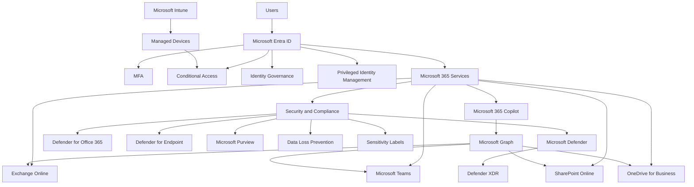
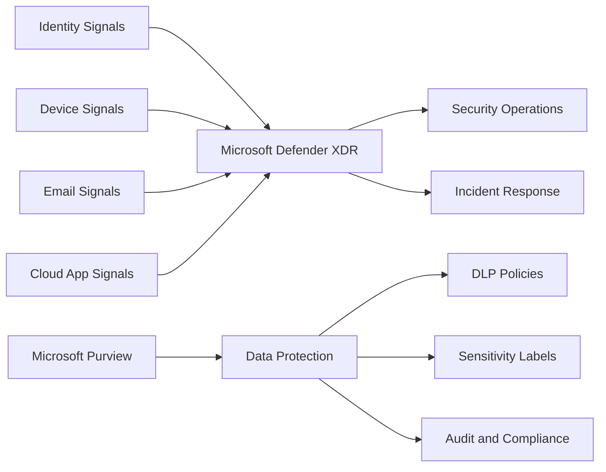
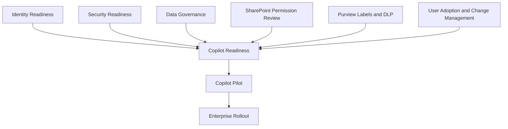

# Microsoft 365 Reference Architecture

  

    <small>ARCHITECTURE DECISION</small>
    <strong>Microsoft 365 reference architecture connects productivity and control</strong>
    Tenant, identity, collaboration, endpoint, security, compliance and Copilot readiness should be designed as one operating platform.
  

  

    <small>01</small>
    <strong>Tenant</strong>
    Set identity, admin role, baseline policy and collaboration governance.
  

  

    <small>02</small>
    <strong>Workloads</strong>
    Align Exchange, Teams, SharePoint, OneDrive, Intune, Defender and Purview.
  

  

    <small>03</small>
    <strong>Operate</strong>
    Define lifecycle, support, reporting, adoption and improvement ownership.
  

## Executive Summary

Microsoft 365 should not be deployed as a standalone productivity platform.

Enterprise success requires an integrated architecture spanning identity, collaboration, security, compliance, governance and operational management.

This reference architecture provides a standardized framework for Microsoft 365 modernization, security transformation, migration and Copilot readiness programs.

The objective is to establish a scalable, secure and operationally sustainable digital workplace platform that aligns with business objectives while reducing operational complexity and security risk.

---

## 한국어 요약

Microsoft 365 Reference Architecture는 Exchange, Teams, SharePoint, OneDrive를 개별 서비스로 보는 것이 아니라 Entra ID, Intune, Defender, Purview, Copilot readiness, governance와 연결된 enterprise digital workplace architecture로 설계하는 방식입니다.

핵심은 생산성 도구를 빠르게 배포하는 것이 아니라 identity, device, data, security, collaboration, adoption, operation이 함께 작동하는 운영 가능한 플랫폼을 만드는 것입니다.

---

## Business Scenario

Typical enterprise initiatives include:

- Microsoft 365 tenant modernization
- Exchange Online migration
- Teams and SharePoint adoption
- File server modernization
- Security and compliance transformation
- Zero Trust implementation
- Microsoft 365 Copilot readiness
- Global governance standardization
- License optimization initiatives

Common stakeholders include:

- CIO
- CISO
- IT Director
- Infrastructure Manager
- Security Operations Team
- Compliance Team
- Collaboration Platform Owner

---

## Design Principles

The architecture should follow the following principles:

### Cloud First

Prioritize Microsoft cloud-native capabilities before introducing third-party solutions.

### Identity as the Security Boundary

Identity becomes the primary security control plane.

### Zero Trust

Never trust. Always verify.

### Least Privilege

Grant only the minimum level of access required.

### Governance Before Deployment

Governance must be designed before large-scale rollout.

### Security by Default

Security controls should be enabled by design.

### Operational Simplicity

Reduce unnecessary complexity.

### Global Scalability

Architecture must support global subsidiaries and regional requirements.

---

## Reference Architecture Overview

```mermaid
flowchart TB
    U[Users] --> E[Microsoft Entra ID]

    E --> MFA[MFA]
    E --> CA[Conditional Access]
    E --> IG[Identity Governance]
    E --> PIM[Privileged Identity Management]

    E --> M365[Microsoft 365 Services]

    M365 --> EXO[Exchange Online]
    M365 --> TEAMS[Microsoft Teams]
    M365 --> SPO[SharePoint Online]
    M365 --> ODB[OneDrive for Business]

    M365 --> SEC[Security and Compliance]

    SEC --> DEF[Microsoft Defender]
    SEC --> MDO[Defender for Office 365]
    SEC --> MDE[Defender for Endpoint]
    SEC --> PUR[Microsoft Purview]
    SEC --> DLP[Data Loss Prevention]
    SEC --> LABEL[Sensitivity Labels]

    M365 --> COP[Microsoft 365 Copilot]

    COP --> GRAPH[Microsoft Graph]
    GRAPH --> EXO
    GRAPH --> TEAMS
    GRAPH --> SPO
    GRAPH --> ODB

    INTUNE[Microsoft Intune] --> DEVICE[Managed Devices]
    DEVICE --> CA
    DEF --> XDR[Defender XDR]
```

---

## Identity Architecture

Identity architecture should define:

- Microsoft Entra ID tenant model
- Authentication methods
- MFA enforcement
- Conditional Access policies
- Privileged access management
- Guest access governance
- Identity lifecycle management

Recommended baseline:

| Area | Recommendation |
|---|---|
| MFA | Enforce for all users |
| Conditional Access | Apply risk-based access control |
| Admin Access | Use PIM where available |
| Guest Access | Review and govern regularly |
| Legacy Authentication | Block by default |

---

## Messaging Architecture

Exchange Online architecture should define:

- Mailbox strategy
- Shared mailbox governance
- Mail flow
- External forwarding control
- Anti-phishing protection
- Retention requirements
- SMTP relay dependencies

Recommended controls:

| Area | Recommendation |
|---|---|
| External Forwarding | Block or restrict |
| Anti-Phishing | Enable advanced protection |
| Mail Flow | Document business dependencies |
| Shared Mailboxes | Assign ownership |
| Retention | Align with compliance requirements |

---

## Collaboration Architecture

Microsoft Teams and SharePoint should be designed as an integrated collaboration platform.

Key areas:

- Teams lifecycle
- SharePoint site architecture
- Permission model
- External sharing
- Guest access
- Information architecture
- Ownership model

Recommended governance:

| Area | Recommendation |
|---|---|
| Teams Creation | Controlled or governed |
| External Sharing | Restricted by sensitivity |
| Site Ownership | Minimum two owners |
| Inactive Teams | Review periodically |
| Permission Review | Establish recurring process |

---

## Security Architecture

Security controls should include:

- Microsoft Defender XDR
- Defender for Endpoint
- Defender for Office 365
- Conditional Access
- Microsoft Purview
- DLP
- Sensitivity Labels
- Insider Risk Management

Recommended architecture:

```mermaid
flowchart LR
    ID[Identity Signals] --> XDR[Microsoft Defender XDR]
    DEV[Device Signals] --> XDR
    MAIL[Email Signals] --> XDR
    APP[Cloud App Signals] --> XDR

    XDR --> SOC[Security Operations]
    XDR --> IR[Incident Response]

    PUR[Microsoft Purview] --> DATA[Data Protection]
    DATA --> DLP[DLP Policies]
    DATA --> LABEL[Sensitivity Labels]
    DATA --> AUDIT[Audit and Compliance]
```

---

## Copilot Readiness Architecture

Successful Copilot adoption requires:

- Identity modernization
- SharePoint permission review
- Information architecture cleanup
- Data governance
- Sensitivity label design
- DLP policy review
- User adoption strategy
- Responsible AI governance

Copilot readiness model:

```mermaid
flowchart TB
    ID[Identity Readiness] --> READY[Copilot Readiness]
    SEC[Security Readiness] --> READY
    DATA[Data Governance] --> READY
    SPO[SharePoint Permission Review] --> READY
    PUR[Purview Labels and DLP] --> READY
    ADOPT[User Adoption and Change Management] --> READY

    READY --> PILOT[Copilot Pilot]
    PILOT --> SCALE[Enterprise Rollout]
```

---

## Operational Model

Operational ownership should be defined across:

| Area | Owner |
|---|---|
| Identity | IAM Team |
| Messaging | Messaging Team |
| Collaboration | M365 Team |
| Security | Security Team |
| Compliance | Compliance Team |
| Endpoint | Endpoint Management Team |
| Governance | IT Leadership |

---

## Expected Outcomes

Expected business and technical outcomes include:

- Improved security posture
- Reduced operational complexity
- Standardized governance
- Improved collaboration experience
- Better data protection
- Copilot readiness
- Stronger executive visibility
- Scalable global operating model

---

## Implementation Roadmap

Recommended phased approach:

| Phase | Focus | Output |
|---|---|---|
| Phase 1 | Assessment | Current state and risk analysis |
| Phase 2 | Architecture | Target-state design |
| Phase 3 | Governance | Policy and operating model |
| Phase 4 | Security Baseline | Identity, endpoint and data protection |
| Phase 5 | Adoption | User enablement and change management |
| Phase 6 | Optimization | Continuous improvement |

---

## Decision Checklist

| Decision | Recommended Question |
|---|---|
| Tenant model | Is the tenant designed for global, subsidiary or M&A requirements? |
| Identity baseline | Are MFA, Conditional Access, guest access and PIM standards defined? |
| Collaboration model | How are Teams, SharePoint sites, groups and external sharing governed? |
| Security baseline | Which Defender, Intune and Purview controls are mandatory before rollout? |
| Copilot readiness | Which SharePoint permissions, labels and DLP controls must be remediated first? |
| Operating model | Who owns lifecycle, policy, incidents, support and continuous improvement? |

---

## Anti-Patterns

- Deploying Microsoft 365 as only email and collaboration tools
- Enabling Teams or SharePoint broadly without lifecycle ownership
- Treating external sharing as a one-time setting instead of a governance process
- Assigning Copilot licenses before permission and data readiness review
- Operating Defender and Purview as separate tools without integrated reporting
- Measuring platform success only by active users or license assignment

---

## Delivery Artifacts

- Microsoft 365 target-state architecture
- Tenant governance model
- Identity and Conditional Access baseline
- Teams and SharePoint lifecycle policy
- External sharing and guest access policy
- Purview label and DLP readiness matrix
- Copilot readiness assessment
- Microsoft 365 operating model and RACI
- Executive platform roadmap

---

## Risks and Considerations

| Risk | Impact | Mitigation |
|---|---|---|
| Poor identity governance | Security exposure | Implement MFA, CA and PIM |
| Excessive SharePoint permissions | Oversharing risk | Permission review and governance |
| Weak data classification | Compliance gap | Sensitivity label design |
| Unmanaged devices | Access risk | Intune and device compliance |
| No operating model | Operational inconsistency | Define ownership and governance |
| Copilot before readiness | Data exposure risk | Complete readiness assessment |

---

## 검색 키워드

- Microsoft 365 reference architecture
- Microsoft 365 enterprise architecture
- Entra ID Conditional Access
- Teams SharePoint governance
- Microsoft Purview DLP
- Microsoft 365 Copilot readiness
- Microsoft 365 보안 아키텍처
- Microsoft 365 거버넌스

---

## References

- [Security Reference Architecture](./security-reference-architecture)
- [Copilot Architecture](./copilot-architecture)
- [Governance Architecture](./governance-architecture)
- [Migration Architecture](./migration-architecture)
- [Executive Architecture Blueprint](./executive-architecture-blueprint)

## Contact / Asset Request

For architecture decision records, reference diagrams, executive summaries, review checklists or roadmap templates, use [Contact and Asset Request](../contact).
