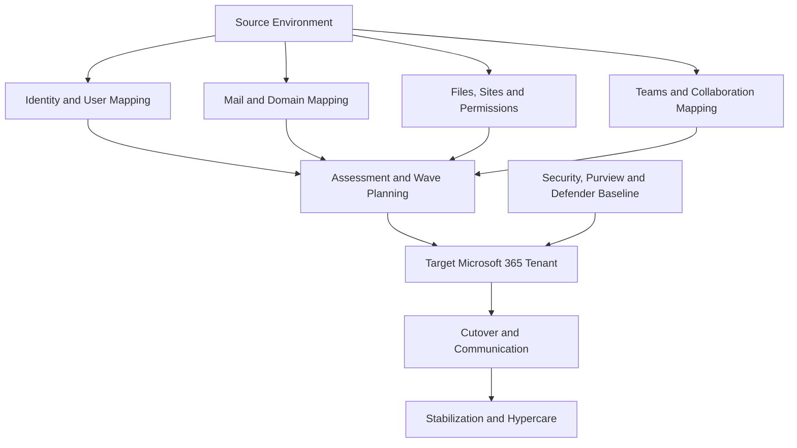

# Migration Architecture

  

    <small>ARCHITECTURE DECISION</small>
    <strong>Migration architecture protects business continuity during change</strong>
    Successful migration design aligns source discovery, target state, coexistence, security validation, wave plan, cutover and hypercare.
  

  

    <small>01</small>
    <strong>Discover</strong>
    Inventory users, data, dependencies, permissions, mail flow and risk.
  

  

    <small>02</small>
    <strong>Transition</strong>
    Design coexistence, pilot, batch strategy, go/no-go and rollback.
  

  

    <small>03</small>
    <strong>Stabilize</strong>
    Close with hypercare, issue trend, operations guide and owner handover.
  

## Executive Summary

Microsoft 365 migration architecture should be designed as a business transition program, not only as a technical data transfer project.

A successful migration aligns identity, mail flow, collaboration, permissions, security, user communication, service desk readiness and operational support.

This architecture provides a standardized framework for tenant-to-tenant migration, Google Workspace migration, Exchange migration and file server to Microsoft 365 migration projects.

## 한국어 요약

Migration architecture는 단순한 data copy 작업이 아닙니다.

Source environment 분석, target Microsoft 365 tenant 설계, identity mapping, mail flow, permission, security, user communication, cutover, stabilization까지 하나의 전환 프로그램으로 관리해야 합니다.

## Business Scenario

Typical migration scenarios include:

- Exchange Server to Exchange Online
- Google Workspace to Microsoft 365
- Tenant-to-Tenant migration
- File Server or NAS to SharePoint Online
- OneDrive migration
- Teams migration
- Global subsidiary consolidation
- M&A integration or divestiture

## Migration Architecture Overview

## Migration Domains

| Domain | Design Focus | Key Output |
|---|---|---|
| Identity | User mapping, domain strategy, authentication | Identity mapping workbook |
| Messaging | Mailbox, shared mailbox, mail flow, coexistence | Mail migration plan |
| Collaboration | Teams, SharePoint, OneDrive, permissions | Collaboration mapping plan |
| Security | Conditional Access, Defender, Purview, DLP | Security baseline |
| Communication | User readiness, cutover notice, support process | Communication plan |
| Operations | Service desk, hypercare, rollback criteria | Stabilization model |

## Decision Checklist

| Decision | Recommended Question |
|---|---|
| Migration scope | Which workloads and user groups are included in each wave? |
| Cutover strategy | Is the project big-bang, phased, coexistence or hybrid? |
| Identity mapping | How are users, domains, aliases and guests mapped? |
| Permission handling | Which permissions are migrated, redesigned or removed? |
| Security baseline | Which controls must be active before user cutover? |
| Hypercare | Who supports users during the first business days after cutover? |

## Anti-Patterns

- Starting migration before source inventory and ownership are validated
- Treating permission migration as a copy-only activity
- Running cutover without business communication and service desk readiness
- Ignoring coexistence, DNS and mail flow dependencies
- Measuring success only by migrated item count

## Delivery Artifacts

- Migration assessment report
- Source-to-target mapping workbook
- Migration wave plan
- Cutover runbook
- Communication template set
- Risk and issue register
- Hypercare and stabilization plan
- Executive migration status report

## Customer Success Reference Patterns

| Industry | Scenario | Success Pattern |
|---|---|---|
| Manufacturing | Global mail and file migration | Wave-based migration with local champions and weekend cutover control |
| Retail | Google Workspace to Microsoft 365 | Department mapping, training and staged SharePoint adoption |
| Financial Services | Tenant consolidation | Security baseline validation before production cutover |
| Technology | M&A tenant integration | Identity mapping, coexistence and executive reporting cadence |

## Lessons Learned

- Migration quality depends on assessment quality.
- Permission cleanup improves both security and Copilot readiness.
- Communication reduces perceived migration risk.
- Hypercare must be planned before cutover, not after user issues start.
- Executive reporting should show risk, readiness and business impact, not only item counts.

## 검색 키워드

- Microsoft 365 migration architecture
- Tenant to Tenant migration
- Google Workspace to Microsoft 365 migration
- Exchange Online migration
- SharePoint Online migration
- OneDrive migration
- Teams migration

## References

- [Microsoft 365 Reference Architecture](./m365-reference-architecture)
- [Security Reference Architecture](./security-reference-architecture)
- [Customer Success Reference Patterns](../projects/customer-success-reference-patterns)
- [Executive Architecture Blueprint](./executive-architecture-blueprint)

## Contact / Asset Request

For architecture decision records, reference diagrams, executive summaries, review checklists or roadmap templates, use [Contact and Asset Request](../contact).
