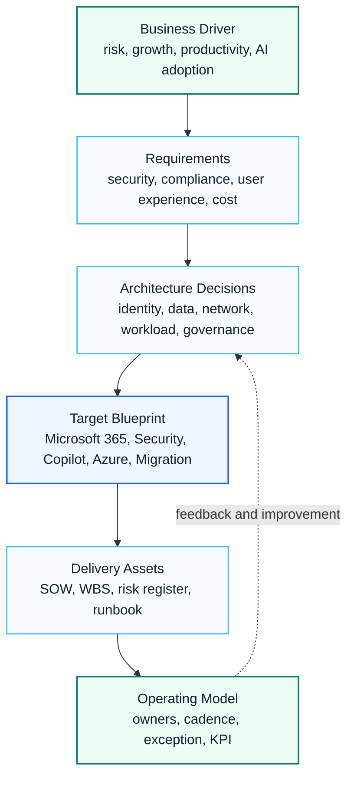

# Architecture Center

The Architecture Center organizes Microsoft cloud reference architectures, design patterns and decision frameworks for enterprise consulting work.

Architecture content here is intended to be practical. Each topic connects business requirements, Microsoft capabilities, governance decisions and delivery outputs.

## Visual Architecture Map

## 한국어 요약

Architecture Center는 Microsoft 365, Security, Copilot, Azure, Migration, Governance를 각각의 제품 설명이 아니라 하나의 enterprise architecture 관점으로 연결합니다.

좋은 아키텍처는 구성도만 의미하지 않습니다. 왜 이 설계가 필요한지, 어떤 결정을 내려야 하는지, 누가 운영 책임을 갖는지, 어떤 산출물로 고객과 합의할지를 함께 설명해야 합니다.

## Focus Areas

| Area | Architecture Questions |
|---|---|
| Microsoft 365 | How should tenant, collaboration, identity and governance be designed? |
| Security | How do identity, endpoint, data, messaging and network controls work together? |
| Copilot | What readiness, data protection and adoption architecture is required? |
| Azure | What landing zone, network, identity and workload patterns are needed? |
| Migration | What target state and transition architecture should guide migration? |
| Governance | What decisions, policies, owners and operating rhythms are required? |

## Architecture Deliverables

- current-state and target-state architecture
- workload dependency map
- identity and access model
- security baseline and control matrix
- governance and operating model
- migration and transition architecture
- executive architecture summary

## Architecture Review Model

| Review Lens | Key Questions | Expected Evidence |
|---|---|---|
| Business Fit | What business problem is this architecture solving? | executive summary, stakeholder requirement map |
| Identity | How are users, admins, guests and workloads authenticated and authorized? | Entra ID design, role model, access policy |
| Security | Which controls prevent, detect and respond to risk? | Conditional Access, Defender, Purview, logging model |
| Data | How is sensitive information classified, shared, retained and protected? | DLP, retention, sensitivity label and sharing design |
| Operations | Who owns incidents, changes, exceptions and continuous improvement? | operating model, RACI, handover checklist |
| Adoption | How will users, champions and service owners use the platform correctly? | adoption plan, training assets, success metrics |

## Decision Checklist

- Confirm business goals before selecting Microsoft services.
- Separate mandatory controls from optional improvements.
- Document assumptions, constraints and explicit exclusions.
- Translate each design decision into implementation tasks and owner names.
- Include governance and handover from the beginning, not only at project closure.

## Recommended Reading

- [Executive Architecture Blueprint](./executive-architecture-blueprint)
- [Microsoft 365 Reference Architecture](./m365-reference-architecture)
- [Security Reference Architecture](./security-reference-architecture)
- [Copilot Architecture](./copilot-architecture)
- [Azure Landing Zone Architecture](./azure-landing-zone-architecture)
- [Migration Architecture](./migration-architecture)
- [Governance Architecture](./governance-architecture)

## Consulting Principle

Good architecture is not only a diagram. It must explain why a design is needed, what decisions are required, who owns the controls and how the platform will be operated after delivery.

## 검색 키워드

- Microsoft 365 architecture
- Microsoft Security architecture
- Copilot architecture
- Azure Landing Zone architecture
- Enterprise Architecture Microsoft
- Microsoft 365 아키텍처
- Microsoft 보안 설계
- Copilot 거버넌스
- Zero Trust architecture
