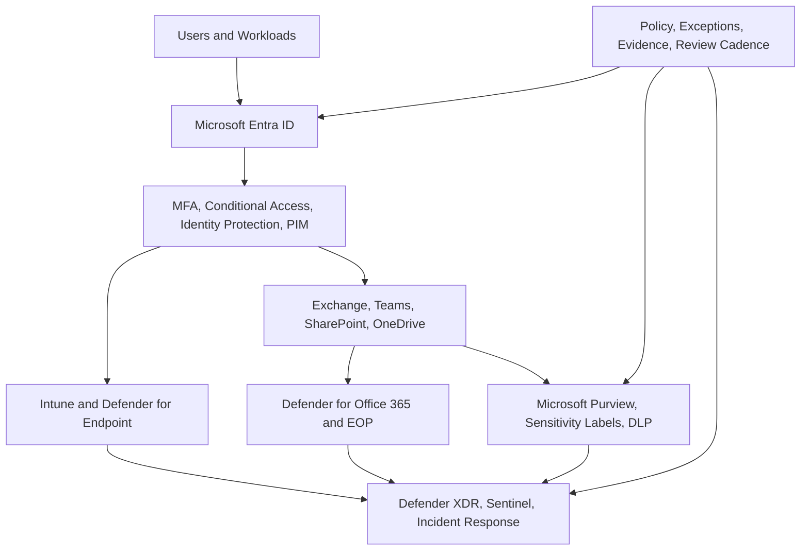

# Security Reference Architecture

  

    <small>ARCHITECTURE DECISION</small>
    <strong>Security architecture should make controls measurable and operable</strong>
    Zero Trust, identity, endpoint, email, data, cloud and monitoring controls must map to owners, evidence and response process.
  

  

    <small>01</small>
    <strong>Prevent</strong>
    Use identity, device, data and application controls to reduce exposure.
  

  

    <small>02</small>
    <strong>Detect</strong>
    Connect Defender, audit, alert tuning and signal quality to SOC process.
  

  

    <small>03</small>
    <strong>Respond</strong>
    Prepare triage, exception, escalation, reporting and continuous improvement.
  

## Executive Summary

Enterprise security architecture should be designed using a Zero Trust model.

The objective is to continuously verify users, devices, applications and data access while reducing cyber risk and enabling secure productivity.

Microsoft security architecture integrates identity, endpoint, email, collaboration, cloud applications, data protection and security operations into a unified operating model.

## 한국어 요약

이 문서는 Microsoft Security architecture를 Zero Trust 관점으로 정리한 reference architecture입니다.

Entra ID, Conditional Access, Intune, Defender, Purview, DLP, Sentinel, security operation을 따로 보는 것이 아니라 하나의 security operating model로 연결합니다.

## Business Scenario

Typical security initiatives include:

- Zero Trust transformation
- Conditional Access implementation
- Microsoft Defender XDR deployment
- Endpoint security modernization
- Email threat protection
- Microsoft Purview implementation
- DLP and information protection
- Security operations improvement
- Copilot security readiness

## Security Architecture Overview

## Security Domains

| Domain | Microsoft Capability | Design Focus |
|---|---|---|
| Identity Security | Entra ID, MFA, Conditional Access, PIM | Verify user, role, risk and session |
| Endpoint Security | Intune, Defender for Endpoint | Validate device trust and posture |
| Email Security | Defender for Office 365, EOP | Reduce phishing and malicious content |
| Collaboration Security | Teams, SharePoint, OneDrive controls | Control external sharing and access |
| Data Security | Purview, DLP, Sensitivity Labels | Protect sensitive information |
| Cloud App Security | Defender for Cloud Apps | Control SaaS and session risk |
| Security Operations | Defender XDR, Sentinel | Detect, investigate and respond |

## Decision Checklist

| Decision | Recommended Question |
|---|---|
| Identity baseline | Are MFA, Conditional Access and break-glass accounts defined? |
| Device trust | Which workloads require compliant or managed devices? |
| Email protection | Which users require Defender for Office 365 P2 controls? |
| Data protection | Which information types require labels, DLP or encryption? |
| SOC process | Who triages Defender XDR alerts and how are incidents escalated? |
| Exception handling | Who approves security exceptions and when are they reviewed? |

## Anti-Patterns

- Enforcing every security control at once without pilot validation
- Allowing broad Conditional Access exclusions without owner and expiry date
- Treating DLP as a technical setting instead of a business policy
- Deploying Defender without alert triage ownership
- Running security assessment without documenting risk acceptance

## Delivery Artifacts

- Security reference architecture
- Conditional Access policy matrix
- Defender onboarding plan
- Purview and DLP readiness matrix
- Security exception register
- Incident response operating model
- Executive security review pack

## Licensing Considerations

| Capability | Typical License Dependency |
|---|---|
| Conditional Access | Microsoft Entra ID P1 |
| Identity Protection | Microsoft Entra ID P2 |
| Privileged Identity Management | Microsoft Entra ID P2 |
| Defender for Endpoint P2 | Microsoft 365 E5 or security add-on |
| Defender for Office 365 P2 | Microsoft 365 E5 or security add-on |
| Defender XDR | Microsoft 365 E5 security capabilities |
| Purview advanced compliance | Microsoft 365 E5 compliance capabilities |

## Lessons Learned

- Identity security is the foundation of Zero Trust.
- Conditional Access policies must be deployed in phases.
- Device compliance improves data protection significantly.
- DLP requires business alignment and tuning.
- Security operations need both technology and process.
- E5 value increases when Defender and Purview are integrated into one operating model.

## 검색 키워드

- Microsoft Security architecture
- Zero Trust architecture
- Entra ID Conditional Access
- Defender XDR architecture
- Microsoft Purview DLP
- Microsoft 365 보안 아키텍처
- Copilot data protection

## References

- [Security Overview](../security/overview)
- [Conditional Access](../security/conditional-access)
- [Purview](../security/purview)
- [Executive Architecture Blueprint](./executive-architecture-blueprint)

## Contact / Asset Request

For architecture decision records, reference diagrams, executive summaries, review checklists or roadmap templates, use [Contact and Asset Request](../contact).
