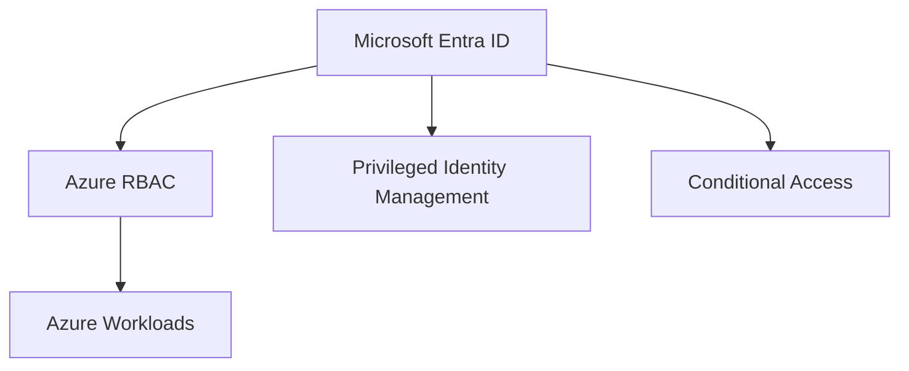

# Azure Identity

## Executive Summary

Azure identity design defines how users, administrators, workloads and applications access cloud resources.

In modern Microsoft architecture, identity is the control plane for Azure, Microsoft 365, security operations and Copilot access. A weak identity design creates risk across every workload.

## 한국어 요약

Azure Identity는 Azure resource 접근을 제어하는 핵심 control plane입니다.

Entra ID, Azure RBAC, PIM, Conditional Access, managed identity, service principal governance를 함께 설계해야 landing zone과 workload 운영이 안전해집니다.

## Business Scenario

- Secure Azure administrator access
- Standardize RBAC and privileged access
- Integrate Azure workloads with Entra ID
- Prepare landing zone governance
- Reduce standing privilege and unmanaged accounts

## Architecture

## Implementation

1. Define administrative role model.
2. Enable MFA and Conditional Access for privileged users.
3. Use PIM for eligible admin access.
4. Assign RBAC through groups where possible.
5. Separate platform, security and workload responsibilities.
6. Review service principals and managed identities.

## Security

- Use least privilege roles.
- Avoid permanent owner access.
- Protect break-glass accounts.
- Monitor risky sign-ins and role activation.
- Review application permissions regularly.

## Decision Checklist

| Decision | Recommended Question |
|---|---|
| Admin model | Which teams need platform, security or workload roles? |
| Privileged access | Which roles require PIM activation and approval? |
| Break-glass | How are emergency accounts protected and monitored? |
| Workload identity | Which applications use managed identities or service principals? |
| Access review | How often are RBAC and app permissions reviewed? |

## Delivery Artifacts

- Azure identity target design
- RBAC and PIM role matrix
- Conditional Access baseline
- Break-glass account procedure
- Managed identity and service principal review checklist

## Customer Success Pattern

| Industry | Scenario | Pattern |
|---|---|---|
| Manufacturing | Azure landing zone rollout | PIM-first admin model and subscription role separation |
| Finance | Privileged access control | Approval-based role activation and evidence review |
| SaaS | Cloud platform governance | Managed identity standard and app permission review |

## Lessons Learned

Identity cleanup should happen before broad Azure expansion. Retrofitting RBAC and privilege controls after workload growth is slower and riskier.

## 검색 키워드

- Azure identity architecture
- Microsoft Entra ID Azure
- Azure RBAC PIM
- Azure privileged access
- managed identity governance
- Azure 권한 관리
