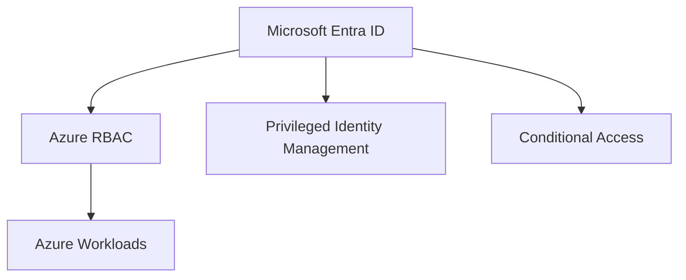

# Azure Identity

## Executive Summary

Azure identity design defines how users, administrators, workloads and applications access cloud resources.

In modern Microsoft architecture, identity is the control plane for Azure, Microsoft 365, security operations and Copilot access. A weak identity design creates risk across every workload.

## Business Scenario

- Secure Azure administrator access
- Standardize RBAC and privileged access
- Integrate Azure workloads with Entra ID
- Prepare landing zone governance
- Reduce standing privilege and unmanaged accounts

## Architecture

## Implementation

1. Define administrative role model.
2. Enable MFA and Conditional Access for privileged users.
3. Use PIM for eligible admin access.
4. Assign RBAC through groups where possible.
5. Separate platform, security and workload responsibilities.
6. Review service principals and managed identities.

## Security

- Use least privilege roles.
- Avoid permanent owner access.
- Protect break-glass accounts.
- Monitor risky sign-ins and role activation.
- Review application permissions regularly.

## Lessons Learned

Identity cleanup should happen before broad Azure expansion. Retrofitting RBAC and privilege controls after workload growth is slower and riskier.
