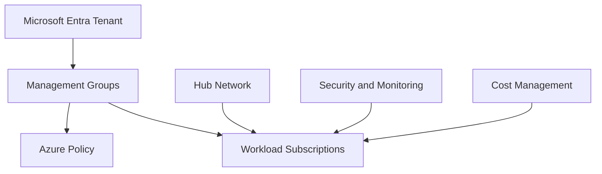

# Landing Zone

## Executive Summary

An Azure Landing Zone provides the foundation for scalable, governed and secure cloud adoption.

For enterprise customers, the landing zone is not only a network or subscription design. It defines how identity, policy, management groups, networking, security monitoring, cost control and operational ownership work together before workloads are deployed.

## Business Scenario

Common scenarios:

- New Azure adoption program
- Migration from on-premises infrastructure
- Multi-subscription governance cleanup
- Security baseline implementation
- Separation of production, non-production and shared services
- Preparing Azure foundations for AI, data or application modernization

For a manufacturing modernization scenario, a landing zone helped separate shared connectivity, workload subscriptions and security operations. This made later workload migration easier because routing, policy and monitoring standards were already defined.

## Architecture

Core design areas:

- Management group hierarchy
- Subscription vending and naming standards
- Identity and privileged access
- Network topology: hub-spoke, vWAN or hybrid
- Policy and compliance baseline
- Logging, monitoring and SIEM integration
- Cost management and tagging

## Implementation

Recommended implementation flow:

1. Define business units, environments and workload ownership.
2. Design management group and subscription structure.
3. Establish naming, tagging and resource organization standards.
4. Configure identity, RBAC and privileged access model.
5. Build network foundation and connectivity.
6. Apply Azure Policy baseline and exemptions.
7. Configure monitoring, logging and security posture management.
8. Validate a pilot workload before broad adoption.

## Licensing

Azure Landing Zone itself is an architecture model, but implementation may require services such as Azure Policy, Log Analytics, Defender for Cloud, Azure Firewall, VPN/ExpressRoute and monitoring services. Cost impact should be included in the proposal and reviewed with customer finance or platform owners.

## Security

Security considerations:

- Least privilege RBAC
- Privileged Identity Management
- Centralized logging
- Defender for Cloud posture management
- Network segmentation
- Policy-driven control enforcement
- Approved exception process

## Best Practice

- Keep the management group hierarchy simple enough to operate.
- Define policy exemptions with owner, reason and expiry date.
- Separate platform subscriptions from workload subscriptions.
- Use tagging for cost, ownership and lifecycle reporting.
- Validate network routing before workload migration.

## Troubleshooting

- Policy blocks deployment: review assignment scope and exemption process.
- Unexpected cost: check tagging, reservation usage and idle resources.
- Network connectivity issue: validate route tables, DNS and firewall rules.
- RBAC issue: confirm group assignment and propagation time.

## Lessons Learned

Landing zone projects fail when they become abstract architecture exercises. The best outcomes come from validating the foundation with one real workload and turning design standards into repeatable operating procedures.

## References

- Azure Landing Zone architecture guidance
- Azure Policy
- Microsoft Defender for Cloud
