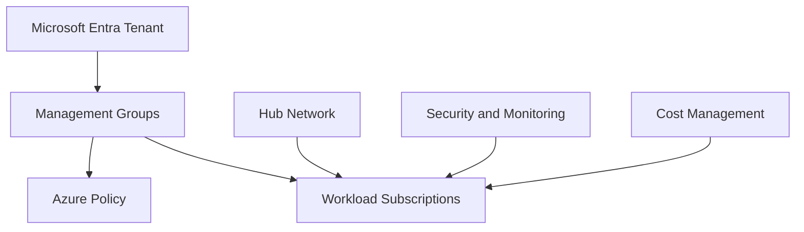

# Landing Zone

## Executive Summary

An Azure Landing Zone provides the foundation for scalable, governed and secure cloud adoption.

For enterprise customers, the landing zone is not only a network or subscription design. It defines how identity, policy, management groups, networking, security monitoring, cost control and operational ownership work together before workloads are deployed.

## Korean Summary

Azure Landing Zone은 Azure를 안전하고 일관되게 사용하기 위한 클라우드 기반 설계입니다. 단순히 구독을 만들거나 네트워크를 연결하는 작업이 아니라, 관리 그룹, 구독 구조, 네이밍, 태깅, 네트워크, 보안, 정책, 모니터링, 비용 관리, 운영 책임을 함께 정의하는 아키텍처입니다.

기업 고객이 Azure를 본격적으로 사용하거나 온프레미스 시스템을 Azure로 이전하려면 Landing Zone이 먼저 정리되어야 합니다. 특히 제조, 금융, 유통, 글로벌 조직처럼 여러 부서와 워크로드가 함께 사용하는 환경에서는 표준화된 Landing Zone이 비용 통제와 보안 운영의 기준이 됩니다.

AI, 데이터 플랫폼, 애플리케이션 현대화, 서버 마이그레이션을 준비하는 조직도 Azure Landing Zone을 통해 보안과 운영 거버넌스를 먼저 확립하는 것이 좋습니다.

## Business Scenario

Common scenarios:

- New Azure adoption program
- Migration from on-premises infrastructure
- Multi-subscription governance cleanup
- Security baseline implementation
- Separation of production, non-production and shared services
- Preparing Azure foundations for AI, data or application modernization

For a manufacturing modernization scenario, a landing zone helped separate shared connectivity, workload subscriptions and security operations. This made later workload migration easier because routing, policy and monitoring standards were already defined.

## Architecture

Core design areas:

- Management group hierarchy
- Subscription vending and naming standards
- Identity and privileged access
- Network topology: hub-spoke, vWAN or hybrid
- Policy and compliance baseline
- Logging, monitoring and SIEM integration
- Cost management and tagging

## Implementation

Recommended implementation flow:

1. Define business units, environments and workload ownership.
2. Design management group and subscription structure.
3. Establish naming, tagging and resource organization standards.
4. Configure identity, RBAC and privileged access model.
5. Build network foundation and connectivity.
6. Apply Azure Policy baseline and exemptions.
7. Configure monitoring, logging and security posture management.
8. Validate a pilot workload before broad adoption.

## Licensing

Azure Landing Zone itself is an architecture model, but implementation may require services such as Azure Policy, Log Analytics, Defender for Cloud, Azure Firewall, VPN/ExpressRoute and monitoring services. Cost impact should be included in the proposal and reviewed with customer finance or platform owners.

## Security

Security considerations:

- Least privilege RBAC
- Privileged Identity Management
- Centralized logging
- Defender for Cloud posture management
- Network segmentation
- Policy-driven control enforcement
- Approved exception process

## Best Practice

- Keep the management group hierarchy simple enough to operate.
- Define policy exemptions with owner, reason and expiry date.
- Separate platform subscriptions from workload subscriptions.
- Use tagging for cost, ownership and lifecycle reporting.
- Validate network routing before workload migration.

## Troubleshooting

- Policy blocks deployment: review assignment scope and exemption process.
- Unexpected cost: check tagging, reservation usage and idle resources.
- Network connectivity issue: validate route tables, DNS and firewall rules.
- RBAC issue: confirm group assignment and propagation time.

## Lessons Learned

Landing zone projects fail when they become abstract architecture exercises. The best outcomes come from validating the foundation with one real workload and turning design standards into repeatable operating procedures.

## Search Topics

This page is relevant for searches such as:

- Azure Landing Zone
- Azure Landing Zone 설계
- Azure 아키텍처
- Azure 구독 구조
- Azure 관리 그룹
- Azure Policy
- Azure 네트워크 설계
- Hub-Spoke Network
- Azure 보안 기준
- Azure 비용 관리
- Azure 마이그레이션 준비

## Consulting Use Cases

This guidance can be used for:

- Azure 신규 도입 전 표준 아키텍처 수립
- 온프레미스 서버를 Azure로 이전하기 전 기반 설계
- 여러 부서 또는 계열사의 Azure 구독 거버넌스 정리
- Defender for Cloud와 Azure Policy 기반 보안 기준 수립
- AI/Data/Application Modernization 프로젝트의 클라우드 기반 준비

## References

- Azure Landing Zone architecture guidance
- Azure Policy
- Microsoft Defender for Cloud
