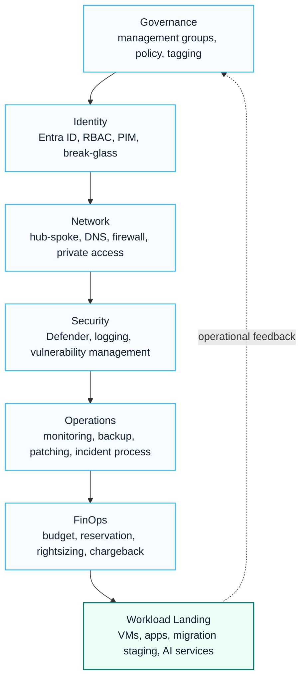

# Azure

This Azure section focuses on enterprise cloud architecture patterns that commonly support Microsoft 365, Security, Copilot and migration programs.

Azure work in enterprise consulting is rarely isolated. It often supports identity, network, landing zone, secure access, monitoring, migration staging, application modernization and cost governance decisions.

## Visual Azure Foundation Map

## 한국어 요약

Azure는 단독 인프라 구축 과제가 아니라 Microsoft 365, Security, Copilot, migration program을 안정적으로 받쳐주는 enterprise cloud foundation으로 보는 것이 좋습니다.

특히 landing zone, identity, network, monitoring, security, cost governance가 정리되지 않은 상태에서 workload를 올리면 이후 운영 비용과 보안 예외가 빠르게 증가합니다.

## Scope

| Area | Focus |
|---|---|
| Landing zone | subscription structure, management groups, policy, network and governance baseline |
| Identity | Entra ID integration, role model, privileged access and hybrid identity considerations |
| Network | hub-spoke design, private connectivity, DNS, firewall and secure access dependencies |
| Workload | virtual machines, migration staging, backup, monitoring and operational ownership |
| Cost | estimation, sizing, reserved capacity, tagging and accountability model |
| Security | Defender, logging, policy enforcement and compliance-ready evidence |

## Typical Consulting Questions

- Which Azure foundation is required before workload migration?
- How should identity, network and governance boundaries be designed?
- Which workloads should stay isolated, shared or consolidated?
- What monitoring, backup and security controls are required for operations?
- How should cost ownership and tagging be structured?

## Decision Checklist

| Decision Area | Questions To Resolve |
|---|---|
| Landing zone | Management group, subscription, policy and resource organization model |
| Identity | Entra ID integration, privileged access, break-glass and role assignment policy |
| Network | Hub-spoke, DNS, firewall, private endpoint and on-premises connectivity design |
| Security | Defender, logging, vulnerability management and compliance evidence requirements |
| Operations | Monitoring, backup, patching, incident process and ownership model |
| Cost | Tagging, budget, reservation, right-sizing and chargeback/showback policy |

## Consulting Scenarios

- Manufacturing workloads that require secure connectivity between plant, office and cloud.
- Financial or regulated environments that require control evidence, logging and policy enforcement.
- Microsoft 365 migration programs that need temporary staging, identity integration or secure admin operations.
- AI and automation initiatives that require Azure governance before expanding into production workloads.

## Recommended Reading

- [Azure Landing Zone Architecture](./landing-zone)
- [Azure Identity](./identity)
- [Virtual Machines](./virtual-machines)
- [Azure Landing Zone Reference Architecture](../architecture/azure-landing-zone-architecture)
- [Security Reference Architecture](../architecture/security-reference-architecture)

## Delivery Assets

- landing zone decision workbook
- subscription and resource group model
- identity and access control matrix
- firewall and network dependency checklist
- cost estimate and tagging standard
- operations handover checklist

## 검색 키워드

- Azure Landing Zone
- Azure 아키텍처
- Azure governance
- Azure cost optimization
- Azure network design
- Entra ID Azure integration
- Defender for Cloud
- Azure 운영 모델
