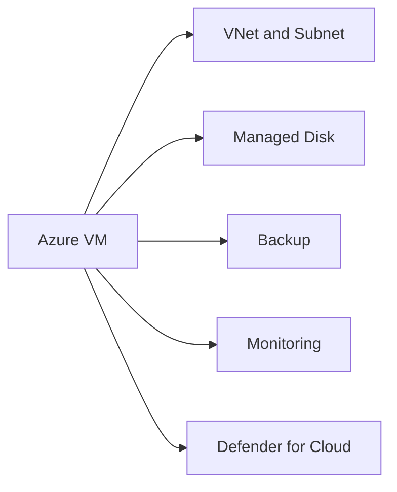

# Azure Virtual Machines

## Executive Summary

Azure Virtual Machines provide infrastructure-as-a-service compute for workloads that cannot immediately move to platform services or SaaS.

VM architecture should consider identity, network, backup, monitoring, patching, cost and security from the beginning. Lift-and-shift without governance often recreates on-premises complexity in the cloud.

## 한국어 요약

Azure Virtual Machines는 IaaS 기반 workload를 운영하기 위한 compute 서비스입니다.

단순 lift-and-shift가 아니라 network, identity, backup, monitoring, patching, security, cost ownership을 함께 설계해야 Azure 운영 복잡도와 비용 리스크를 줄일 수 있습니다.

## Business Scenario

- Migrate legacy servers to Azure
- Host workloads requiring OS-level control
- Build hybrid infrastructure
- Support temporary migration or modernization stages
- Separate production and non-production environments

## Architecture

## Implementation

1. Size VM based on workload data.
2. Select region, availability and storage design.
3. Configure network, NSG and access path.
4. Apply identity and admin access controls.
5. Enable backup, monitoring and update management.
6. Validate performance and cost after deployment.

## Security

- Avoid public RDP or SSH exposure.
- Use Bastion, VPN or privileged access paths.
- Apply Defender for Cloud recommendations.
- Encrypt disks and protect backups.
- Patch operating systems regularly.

## Decision Checklist

| Decision | Recommended Question |
|---|---|
| Workload fit | Should this workload remain on VM or move to PaaS/SaaS later? |
| Availability | What SLA, region and availability zone design is required? |
| Access path | How will administrators connect without public RDP or SSH? |
| Backup | What RPO/RTO and restore test cadence are required? |
| Cost | Who owns VM rightsizing, shutdown schedule and reservation review? |

## Delivery Artifacts

- VM workload assessment
- VM sizing and availability design
- Network and access path design
- Backup and monitoring baseline
- Patch and security operating model
- Cost optimization review

## Customer Success Pattern

| Industry | Scenario | Pattern |
|---|---|---|
| Manufacturing | Legacy server migration | VM landing zone with backup, monitoring and patch baseline |
| Retail | Seasonal workload | Rightsizing, schedule control and cost governance |
| Finance | Regulated workload | Private access, disk encryption and evidence-based operations |

## Lessons Learned

VM migration is often a bridge to modernization. Document which workloads should remain on VMs and which should later move to PaaS or SaaS.

## 검색 키워드

- Azure Virtual Machines architecture
- Azure VM migration
- Azure VM security baseline
- Azure VM backup monitoring
- Azure IaaS architecture
- Azure 가상 머신 설계
