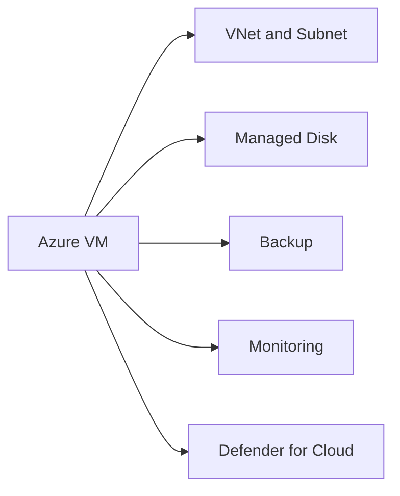

# Azure Virtual Machines

## Executive Summary

Azure Virtual Machines provide infrastructure-as-a-service compute for workloads that cannot immediately move to platform services or SaaS.

VM architecture should consider identity, network, backup, monitoring, patching, cost and security from the beginning. Lift-and-shift without governance often recreates on-premises complexity in the cloud.

## Business Scenario

- Migrate legacy servers to Azure
- Host workloads requiring OS-level control
- Build hybrid infrastructure
- Support temporary migration or modernization stages
- Separate production and non-production environments

## Architecture

## Implementation

1. Size VM based on workload data.
2. Select region, availability and storage design.
3. Configure network, NSG and access path.
4. Apply identity and admin access controls.
5. Enable backup, monitoring and update management.
6. Validate performance and cost after deployment.

## Security

- Avoid public RDP or SSH exposure.
- Use Bastion, VPN or privileged access paths.
- Apply Defender for Cloud recommendations.
- Encrypt disks and protect backups.
- Patch operating systems regularly.

## Lessons Learned

VM migration is often a bridge to modernization. Document which workloads should remain on VMs and which should later move to PaaS or SaaS.
