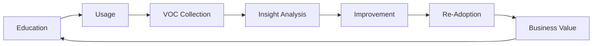
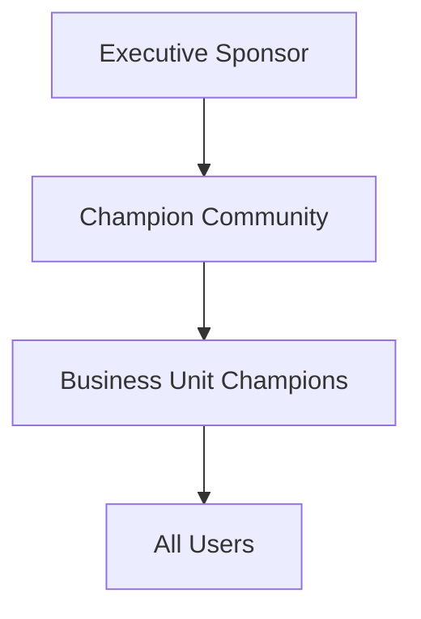
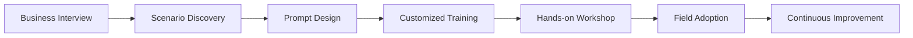
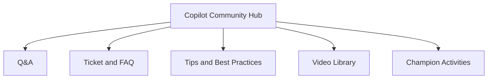
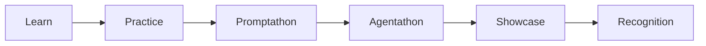
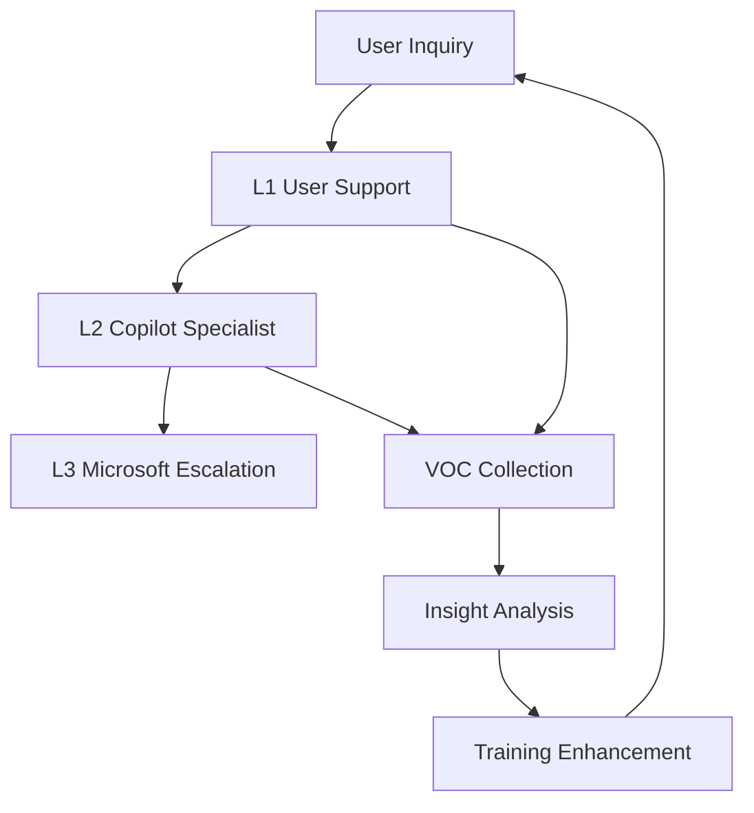
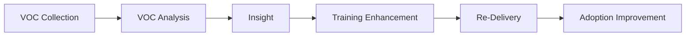
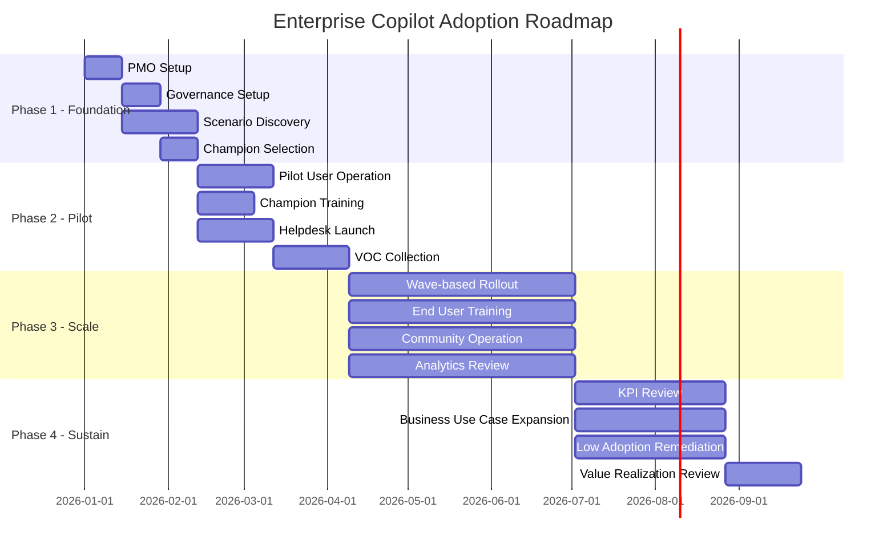

# Enterprise Copilot Adoption Program Framework

## Executive Summary

Microsoft 365 Copilot adoption is not a one-time training program.

Successful enterprise adoption requires a sustainable operating model that combines education, champion network, managed support, VOC feedback loop, governance, analytics and continuous improvement.

This framework provides a reusable operating model for planning, scaling and sustaining Copilot adoption across large enterprise organizations.

---

## Why Copilot Adoption Fails

Large-scale Copilot adoption commonly fails for the following reasons:

| Failure Factor | Business Impact |
|---|---|
| Feature-based training only | Users understand functions but do not apply Copilot to real work |
| No champion network | Adoption does not scale beyond initial users |
| No VOC feedback loop | User issues and improvement signals are not captured |
| No KPI model | Business value cannot be measured |
| No operating team | Adoption momentum stops after initial rollout |
| No PMO control tower | Ownership, decisions and execution become fragmented |

Copilot adoption should be managed as an operating system, not as a temporary project.

---

## Adoption Operating System

---

## Operating Model Components

| Component | Purpose |
|---|---|
| Education | Build user capability through role-based learning |
| Champion Network | Scale adoption through peer influence |
| Managed Service | Provide user support, prompt coaching and issue handling |
| VOC Feedback Loop | Capture user feedback and convert it into improvement actions |
| Governance | Align stakeholders, risks, decisions and operating cadence |
| Analytics | Track usage, adoption, satisfaction and business value |

---

## PMO and Orchestration Model

A dedicated PMO should operate as the control tower for the adoption program.

### PMO Responsibilities

| Role | Responsibility |
|---|---|
| Lead PM | Executive communication, stakeholder alignment, governance, reporting |
| Operations PM | Training operations, managed service coordination, VOC tracking, KPI management |

The PMO should connect leadership, business units, IT, security, Microsoft stakeholders and delivery teams into a single operating rhythm.

---

## Capability-Based Resource Model

The adoption team should be structured by capability, not only by headcount.

| Capability Area | Primary Responsibility |
|---|---|
| PMO | Program governance, stakeholder coordination, executive reporting |
| Training & Adoption Team | Customized training, scenario workshops, adoption coaching |
| Managed Service Team | User support, prompt coaching, VOC collection, usage guidance |
| Global Support Team | Regional coordination, timezone support, multi-language support |
| Content Development Team | Training content, FAQ, prompt library and use case updates |
| Analytics Team | Usage reporting, KPI dashboard and adoption insights |

---

## Champion Program Framework

Adoption requires both top-down sponsorship and bottom-up engagement.

### Champion Tiers

| Tier | Role |
|---|---|
| Executive Sponsor | Vision, endorsement, investment and leadership messaging |
| Champion Community | Enterprise-wide adoption network |
| Business Unit Champion | Department-level support and use case discovery |
| All Users | Daily Copilot usage and feedback |

---

## Champion Responsibilities

Champions should:

- Promote Copilot best practices
- Support peer users
- Identify department use cases
- Collect feedback
- Share success stories
- Support prompt improvement
- Participate in community activities

---

## Education Framework

Copilot education should be customized by role, maturity and scenario.

| Audience | Learning Outcome |
|---|---|
| Executives | Strategy, business value, AI transformation direction |
| Managers | Team productivity, decision support, use case leadership |
| Knowledge Workers | Daily productivity, prompt design, scenario application |
| Champions | Peer coaching, use case discovery, community leadership |
| Administrators | Tenant governance, security, compliance, analytics |

---

## Customized Learning Model

Training should be based on real business scenarios.

### Learning Principles

| Principle | Description |
|---|---|
| Scenario-driven | Training must start from business pain points |
| Role-customized | Curriculum must be customized by user role |
| Continuously improved | VOC and analytics should update training content |

---

## Training Delivery Model

| Dimension | Options |
|---|---|
| Training Coverage | Executive briefing, champion training, end-user training, admin training, refresher sessions |
| Delivery Method | Online, offline, hybrid, live workshop, self-paced learning, coaching |
| Geography | HQ, regional offices, global subsidiaries |
| Support Capability | Timezone support, onsite support, local enablement, regional champion network |

---

## Community Engagement Model

A Copilot community should be operated as an always-on adoption hub.

### Community Pillars

| Pillar | Purpose |
|---|---|
| Q&A | User questions, expert answers, champion support |
| Ticket & FAQ | Helpdesk integration and self-service support |
| Tips & Best Practices | Prompt tips, productivity scenarios, success stories |
| Video Library | Micro learning and how-to guides |
| Champion Activities | Peer learning, recognition and community leadership |

---

## Promptathon and Agentathon Program

Innovation programs can convert learning into business value.

### Program Stages

| Stage | Objective |
|---|---|
| Learn | Build AI fundamentals and Copilot usage skills |
| Practice | Apply prompts to real business tasks |
| Promptathon | Discover and improve high-value prompts |
| Agentathon | Identify automation and Copilot Studio opportunities |
| Showcase | Share best practices and business value |
| Recognition | Reward teams and scale successful use cases |

---

## Managed Service Framework

Managed service should not be limited to ticket processing.

It should operate as an adoption enablement function.

### Support Levels

| Level | Scope |
|---|---|
| L1 | General user support, basic usage guidance, prompt coaching |
| L2 | Advanced scenario support, adoption coaching, usage analysis |
| L3 | Product issue, tenant issue, Microsoft escalation |

---

## Engagement and Support Channels

Recommended user support channels include:

- Microsoft Teams support channel
- Dedicated helpdesk mailbox
- Service request portal
- Champion community
- Office hours
- FAQ repository
- Prompt library

---

## VOC and Feedback Management

VOC should be treated as an adoption improvement engine.

### Feedback Sources

| Source | Example |
|---|---|
| Helpdesk Ticket | Usage issues, prompt difficulties, access issues |
| Training Q&A | Common user questions |
| Champion Feedback | Department-level adoption blockers |
| Survey | Satisfaction and readiness |
| Business Review | Executive and business unit feedback |
| Adoption Analytics | Usage and behavior signals |

### VOC Closed Loop

---

## Adoption Analytics and KPI Framework

Adoption must be measurable.

### Usage KPIs

| KPI | Description |
|---|---|
| Monthly Active Users | Active Copilot users by month |
| Feature Usage Rate | Usage by Copilot capability |
| App Adoption Rate | Usage across Word, Excel, PowerPoint, Outlook, Teams |
| Training Completion Rate | Training completion vs target |
| User Satisfaction Score | Survey-based satisfaction |
| Retention Rate | Continued usage over time |

### Business KPIs

| KPI | Description |
|---|---|
| Time Saving | Estimated time saved per user |
| Meeting Efficiency | Reduction in meeting follow-up effort |
| Document Creation Time | Reduction in document drafting time |
| Business Use Case Expansion | Number of validated business scenarios |
| ROI | Productivity value compared to investment |

---

## 12-Month Adoption Roadmap

---

## Governance and Operating Cadence

| Cadence | Participants | Agenda |
|---|---|---|
| Weekly | PMO and operational stakeholders | Training, helpdesk, VOC and issue review |
| Bi-weekly | PMO and Microsoft stakeholders | Adoption progress and joint action alignment |
| Monthly | Executive stakeholders | KPI review, risk escalation and decisions |
| Quarterly | Business leadership | Business value, ROI and roadmap adjustment |

---

## Communication Governance

| Layer | Stakeholder | Responsibility |
|---|---|---|
| Strategic Leadership | Executive sponsors and Microsoft stakeholders | Direction, investment and customer success |
| PMO | Dedicated adoption PMO | Operating execution and coordination |
| Business TFT | Business, IT and security representatives | Scenario ownership and business alignment |
| Business Units | End users and champions | Adoption execution and feedback |

---

## Recommended Curriculum

### 1. Copilot Fundamentals

| Item | Description |
|---|---|
| Audience | General users and new Copilot users |
| Objective | Understand Copilot fundamentals and daily usage |
| Format | Online, offline or hybrid |
| Duration | Approximately 2-3 hours |
| Focus | Copilot Chat, prompt basics, M365 app usage, daily productivity |

### 2. Advanced Copilot Usage

| Item | Description |
|---|---|
| Audience | Knowledge workers and power users |
| Objective | Improve scenario-based usage and prompt engineering |
| Format | Hands-on workshop |
| Duration | Half-day |
| Focus | Prompt engineering, document creation, data analysis, meeting productivity |

### 3. Champion Enablement

| Item | Description |
|---|---|
| Audience | Department champions and power users |
| Objective | Build peer coaching and use case discovery capability |
| Format | Workshop and community operation |
| Duration | 3 hours to 1 day |
| Focus | Peer coaching, use case discovery, community leadership, VOC collection |

### 4. Executive and Manager Briefing

| Item | Description |
|---|---|
| Audience | Executives and managers |
| Objective | Align AI vision, leadership behavior and business value |
| Format | Executive briefing |
| Duration | 1-2 hours |
| Focus | Business value, decision support, team productivity, change leadership |

### 5. Copilot Studio Agent Workshop

| Item | Description |
|---|---|
| Audience | Power users, automation owners and IT developers |
| Objective | Design and build custom agents |
| Format | Hands-on workshop |
| Duration | 1-2 days |
| Focus | Agent design, Copilot Studio, Power Platform integration, publishing and governance |

---

## Deliverables

An enterprise Copilot adoption program should produce:

- Adoption Strategy
- PMO Operating Model
- Education Curriculum
- Champion Program Framework
- Managed Service Model
- VOC and Feedback Management Process
- KPI Dashboard
- Community Operating Model
- 12-Month Adoption Roadmap
- Executive Adoption Report

---

## Success Factors

The most successful Copilot adoption programs consistently include:

1. Strong executive sponsorship
2. Scenario-driven education
3. Business-led champion network
4. Managed support and prompt coaching
5. Closed-loop VOC management
6. Adoption analytics and KPI tracking
7. Continuous improvement cadence
8. Business value measurement

---

## References

- Microsoft Adoption Framework
- Microsoft Copilot Success Kit
- Microsoft Change Management Guidance
- Microsoft Learn
- Enterprise Adoption Best Practices