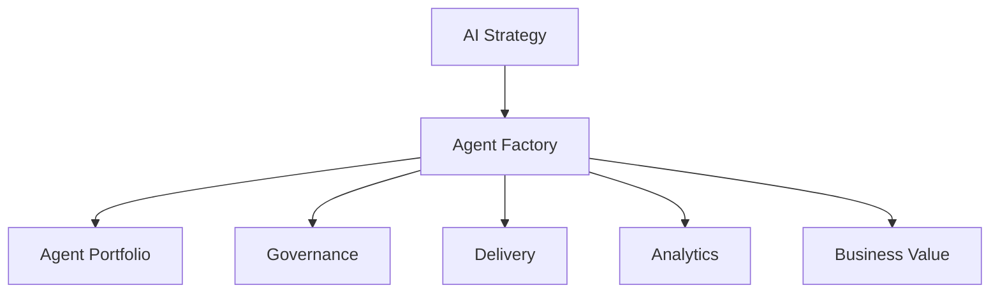
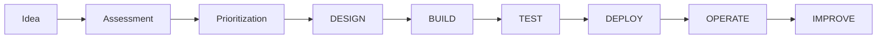
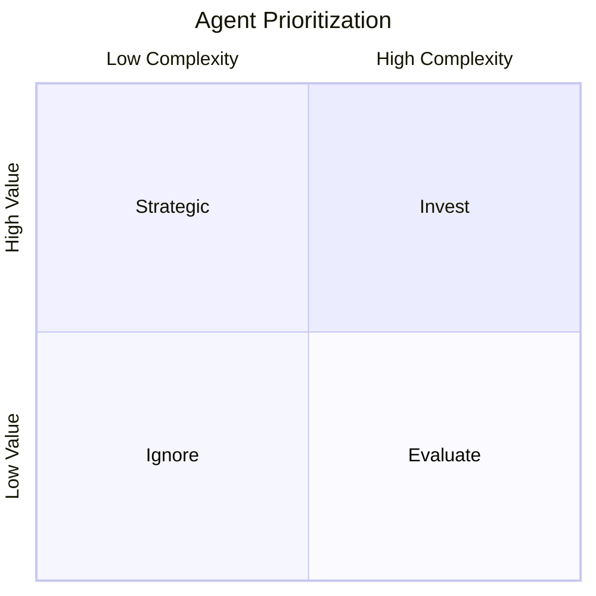
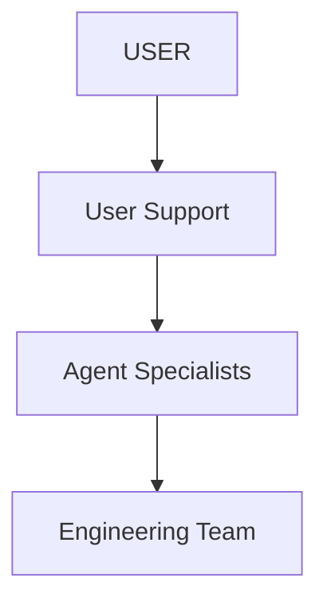
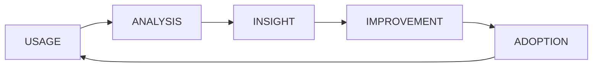
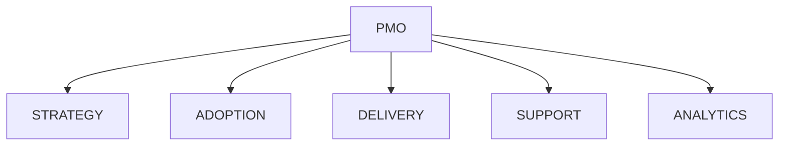

# Agent Factory and AI Operating Model

## Executive Summary

Most organizations approach AI as isolated pilots.

The challenge is not creating one successful agent.

The challenge is creating, governing, operating and continuously improving hundreds of agents across the enterprise.

Agent Factory provides a repeatable operating model for discovering, prioritizing, designing, deploying and managing enterprise AI agents.

The objective is to establish an Enterprise AI Operating System.

---

# Why Agent Factory

Without an operating model:

- Agents are duplicated
- Governance becomes inconsistent
- Security risks increase
- Business value is difficult to measure
- Adoption becomes fragmented

Agent Factory provides structure.

---

# Enterprise AI Operating System



---

# Agent Factory Lifecycle



---

# Stage 1 - Idea Intake

## Sources

- Business Units
- IT
- Security
- HR
- Operations
- Executive Requests
- Innovation Programs
- Promptathon
- Agentathon

---

## Intake Template

| Item | Description |
|--------|-------------|
| Business Problem | What issue are we solving? |
| Users | Who benefits? |
| Current Process | Existing workflow |
| Expected Benefit | Productivity, quality, cost |
| Risk Level | Low / Medium / High |
| Systems Required | Applications and data |

---

# Stage 2 - Assessment

## Assessment Dimensions

| Area | Weight |
|---------|--------|
| Business Value | 30% |
| Feasibility | 20% |
| Adoption Potential | 15% |
| Risk | 15% |
| Data Readiness | 10% |
| Strategic Alignment | 10% |

---

# Stage 3 - Prioritization

## Value vs Complexity



---

# Stage 4 - Design

## Design Components

- Business Process
- Agent Scope
- Data Sources
- Security Model
- Knowledge Architecture
- Tool Architecture
- Governance Controls
- KPI Framework

---

## Architecture Deliverables

| Deliverable | Description |
|------------|-------------|
| Agent Design Document | Functional design |
| Data Architecture | Knowledge sources |
| Security Design | Access model |
| Governance Plan | Ownership and controls |

---

# Stage 5 - Build

## Microsoft Technology Stack

| Layer | Technology |
|---------|------------|
| Personal Agent | Scout |
| Team Agent | Agent Builder |
| Business Agent | Copilot Studio |
| Enterprise Agent | Foundry |
| Automation | Power Automate |
| Integration | Logic Apps |
| Data | Fabric |
| Security | Defender |
| Compliance | Purview |

---

# Stage 6 - Test

## Validation Areas

- Functional
- Security
- Compliance
- Data Quality
- User Acceptance
- Performance

---

# Stage 7 - Deploy

## Deployment Channels

- Microsoft Teams
- Microsoft 365 Copilot
- SharePoint
- Web Portal
- Mobile
- Business Applications

---

# Stage 8 - Operate

## Managed Service Model



---

# Stage 9 - Improve

## Continuous Improvement Loop



---

# Agent Portfolio Management

## Portfolio Categories

| Category | Example |
|-----------|---------|
| Personal Productivity | Scout |
| Department Operations | HR Agent |
| Service Delivery | IT Agent |
| Sales Enablement | Proposal Agent |
| Finance | FP&A Agent |
| Security | Security Advisor |
| Executive Support | Executive Agent |

---

# AI PMO Structure

## Governance Board

- CIO
- CTO
- Security
- Compliance
- Business Leaders

---

## PMO Responsibilities

- Prioritization
- Funding
- KPI Review
- Risk Management
- Executive Reporting

---

# Agent Factory Organization



---

# Adoption Operating Model

## Components

| Area | Purpose |
|---------|---------|
| Education | Capability building |
| Champion Network | Scale adoption |
| Managed Service | User support |
| Community | Knowledge sharing |
| Analytics | Visibility |
| VOC | Improvement |

---

# AI Community Framework

## Community Hub

- Tips
- FAQ
- Prompt Library
- Agent Catalog
- Champion Activities
- Innovation Events

---

# Promptathon

Purpose:

- Discover prompts
- Share knowledge
- Create use cases

---

# Agentathon

Purpose:

- Build agents
- Validate business value
- Scale innovation

---

# KPI Framework

## Adoption KPIs

| KPI | Target |
|--------|--------|
| Active Users | >70% |
| Monthly Usage | Growth |
| Satisfaction | >85% |
| Training Completion | >90% |

---

## Business KPIs

| KPI | Example |
|---------|---------|
| Hours Saved | Productivity |
| Cost Reduction | Operations |
| Ticket Reduction | Service Desk |
| Faster Delivery | Projects |
| Revenue Impact | Sales |

---

# AI Maturity Model

## Level 1

Copilot Usage

---

## Level 2

Department Agents

---

## Level 3

Enterprise Agents

---

## Level 4

Multi-Agent Systems

---

## Level 5

Enterprise AI Operating System

---

# Recommended Roadmap

```mermaid
gantt
title Enterprise AI Roadmap
dateFormat YYYY-MM-DD

section Foundation

Strategy
Governance
Readiness

section Pilot

Copilot
Agent Builder
Copilot Studio

section Scale

Department Agents
Agent Factory

section Enterprise

Multi-Agent
AI Operating System
```

---

# Executive Dashboard

Track:

- Active Users
- Agent Utilization
- Business Value
- Cost Savings
- Adoption Rate
- Risk Events
- AI ROI

---

# Executive Recommendations

1. Establish AI PMO.
2. Build Agent Factory.
3. Govern before scale.
4. Prioritize business value.
5. Measure outcomes.
6. Create reusable agents.
7. Develop AI champions.
8. Operate continuously.

---

# Deliverables

- AI Strategy
- Agent Factory Framework
- AI PMO Model
- Governance Framework
- Agent Portfolio
- KPI Dashboard
- Adoption Framework
- AI Roadmap
- Executive Reporting Model

---

# Strategic Positioning

The future state is not:

"Deploying Copilot"

The future state is:

"Operating an Enterprise AI Platform"