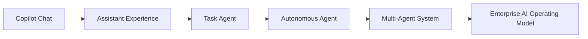
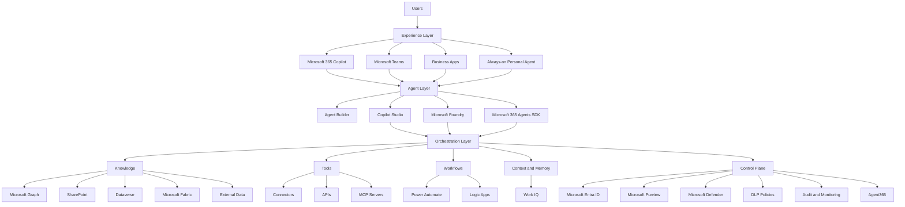
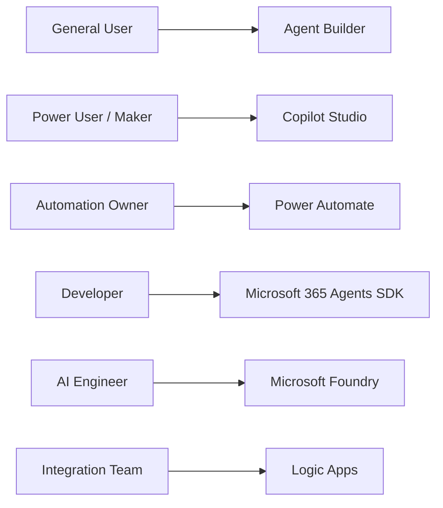
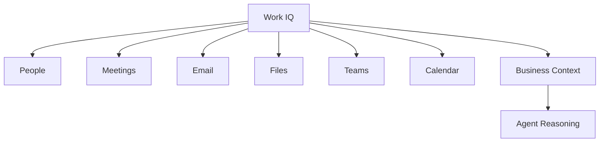
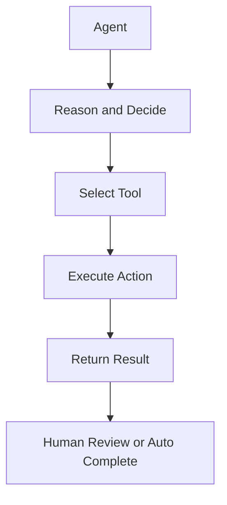
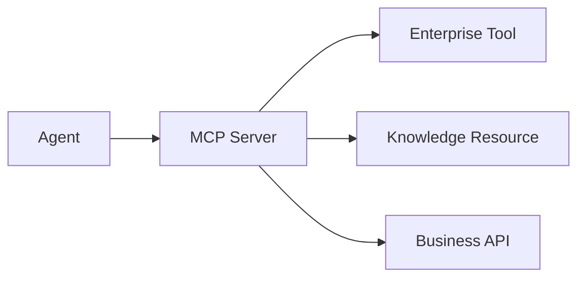
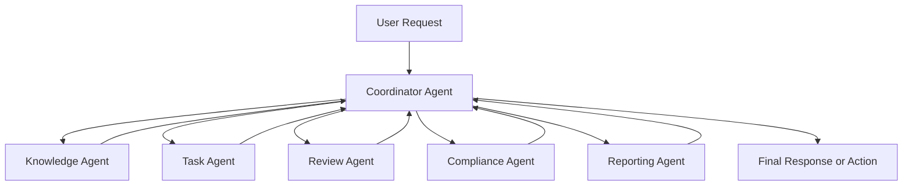
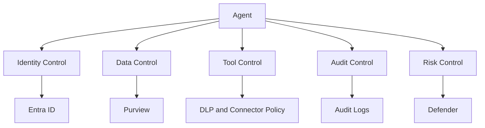
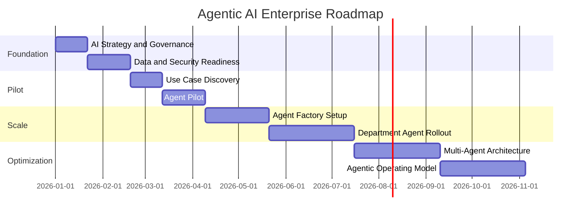

# Agentic AI Architecture

## Executive Summary

Agentic AI represents the shift from prompt-based assistance to goal-oriented, context-aware and action-capable AI systems.

In the Microsoft ecosystem, Agentic AI is enabled through Microsoft 365 Copilot, Copilot Studio, Agent Builder, Microsoft Foundry, Microsoft 365 Agents SDK, Power Platform, Microsoft Graph, Work IQ, Microsoft Purview, Microsoft Defender and Agent365.

The objective is not simply to create many agents. The objective is to establish a governed enterprise agent platform that can safely automate work, support decision-making, orchestrate business processes and continuously improve through feedback and analytics.

---

## From Copilot to Agentic AI

Traditional Copilot usage is primarily user-initiated.

Agentic AI introduces agents that can:

- Understand goals
- Maintain context
- Use enterprise knowledge
- Call tools and workflows
- Coordinate with other agents
- Trigger actions
- Monitor outcomes
- Escalate exceptions
- Improve over time

---

## Core Architecture

---

## Architecture Layers

| Layer | Purpose | Microsoft Capabilities |
|---|---|---|
| Experience Layer | User interaction and agent access | Microsoft 365 Copilot, Teams, Outlook, Business Apps |
| Agent Layer | Agent creation and runtime | Agent Builder, Copilot Studio, Microsoft Foundry, Agents SDK |
| Orchestration Layer | Reasoning, routing, tool calling and workflow execution | Copilot Studio, Power Automate, Logic Apps |
| Knowledge Layer | Enterprise grounding and context | Microsoft Graph, SharePoint, Dataverse, Fabric, external data |
| Tool Layer | Business actions and system integration | Connectors, APIs, MCP servers |
| Control Plane | Security, compliance and governance | Entra ID, Purview, Defender, DLP, Audit, Agent365 |
| Analytics Layer | Measurement and optimization | Copilot Analytics, Power BI, operational reporting |

---

## Agentic AI Design Principles

| Principle | Description |
|---|---|
| Human-in-the-loop | Critical decisions should remain reviewable by humans |
| Least privilege | Agents should only access and execute what is required |
| Observable by design | Agent actions must be logged, monitored and reviewable |
| Business-owned | Every agent needs a business owner and IT owner |
| Secure by default | Identity, data and tool access must be governed |
| Task-specific | Agents should have clear purpose and boundaries |
| Reusable | Tools, prompts, workflows and knowledge should be reusable |
| Continuously improved | Usage, VOC and analytics should feed improvement cycles |

---

## Agent Types

### Personal Agent

Supports individual productivity.

Examples:

- Meeting preparation
- Email prioritization
- Follow-up tracking
- Personal task management

### Business Process Agent

Supports department or workflow automation.

Examples:

- HR onboarding
- IT service desk
- Finance close process
- Sales proposal support

### Knowledge Agent

Answers questions from approved enterprise knowledge sources.

Examples:

- Policy agent
- Compliance agent
- Product documentation agent
- Project knowledge agent

### Action Agent

Executes business actions through tools and APIs.

Examples:

- Create ticket
- Update CRM
- Submit approval
- Generate report
- Notify stakeholders

### Autonomous Agent

Operates based on trigger, event or schedule.

Examples:

- Daily status monitoring
- Exception detection
- Report generation
- Risk escalation

### Multi-Agent System

Coordinates multiple specialized agents to complete complex work.

Examples:

- Research Agent
- Drafting Agent
- Review Agent
- Compliance Agent
- Coordinator Agent

---

## Agent Build Spectrum

| Persona | Platform | Primary Use Case |
|---|---|---|
| General User | Agent Builder | Simple personal or team agent |
| Power User | Copilot Studio | Business agent and low-code automation |
| Automation Owner | Power Automate | Workflow and process automation |
| Developer | Microsoft 365 Agents SDK | Custom Microsoft 365 agent |
| AI Engineer | Microsoft Foundry | Advanced AI agent and model orchestration |
| Integration Team | Logic Apps | Enterprise integration and workflow engine |

---

## Work IQ and Context

Agentic AI depends on context.

Work IQ provides organizational and work context such as:

- People
- Meetings
- Emails
- Files
- Teams conversations
- Calendar
- Organizational relationships
- Work patterns

---

## Knowledge Grounding

Agents must be grounded in trusted knowledge.

Recommended grounding sources:

| Source | Use Case |
|---|---|
| SharePoint | Policies, procedures, templates, project documents |
| Microsoft Graph | Work context across Microsoft 365 |
| Dataverse | Structured business data |
| Microsoft Fabric | Analytical and operational data |
| Websites | Public or internal web content |
| Files | Manuals, guides, SOPs and playbooks |
| External Systems | CRM, ERP, ITSM, HR and finance platforms |

---

## Tool Use and Action Execution

Agents become business-relevant when they can take action.

Examples:

| Tool | Business Action |
|---|---|
| Power Automate | Approval, notification, ticket creation |
| Connector | CRM, ERP, ITSM integration |
| REST API | Custom business system action |
| MCP Server | Reusable external tools and resources |
| Logic Apps | Enterprise workflow and integration |
| Prompt Tool | Reusable reasoning task |

---

## MCP in Agentic AI

Model Context Protocol provides a way to connect agents to external tools and resources.

MCP is important because it can help organizations:

- Standardize tool integration
- Reuse capabilities across agents
- Connect to non-Microsoft systems
- Reduce one-off integration patterns
- Support scalable agent ecosystems

---

## Multi-Agent Reference Model

### Agent Roles

| Agent | Responsibility |
|---|---|
| Coordinator Agent | Understands the request and routes work |
| Knowledge Agent | Retrieves and summarizes enterprise knowledge |
| Task Agent | Executes workflow or system actions |
| Review Agent | Checks quality and completeness |
| Compliance Agent | Validates policy, data and risk requirements |
| Reporting Agent | Generates output and management reporting |

---

## Security Control Plane

Agentic AI requires stronger governance than simple chat experiences.

---

## Governance Requirements

| Area | Requirement |
|---|---|
| Identity | Entra ID authentication and authorization |
| Permissions | Least privilege access to data and tools |
| Data Protection | Sensitivity labels, DLP and retention |
| Tool Governance | Approved connectors, APIs, MCP servers and flows |
| Agent Ownership | Business owner and IT owner assigned |
| Monitoring | Usage, quality, cost and security monitoring |
| Audit | Agent actions must be logged and reviewable |
| Lifecycle | Agents must be reviewed, updated and retired |

---

## Human-in-the-Loop Model

Not every action should be autonomous.

| Risk Level | Recommended Control |
|---|---|
| Low-risk information retrieval | Fully automated response |
| Medium-risk workflow action | User confirmation required |
| High-risk business action | Manager approval required |
| Regulated or financial action | Formal approval and audit required |
| Security-sensitive action | Security review and escalation required |

---

## Enterprise Use Cases

### Executive Assistant Agent

- Meeting preparation
- Action item follow-up
- Email prioritization
- Calendar conflict detection

### Sales Pursuit Agent

- Account research
- Proposal preparation
- Opportunity summary
- Follow-up drafting

### IT Operations Agent

- Incident intake
- Knowledge article search
- Ticket classification
- Resolution recommendation

### Security Operations Agent

- Alert triage
- Policy guidance
- Incident summarization
- Escalation recommendation

### Finance Agent

- Variance analysis
- Forecast review
- Report preparation
- Control checklist validation

### Project Management Agent

- Meeting summary
- Risk tracking
- Deliverable status
- Stakeholder reporting

---

## Adoption and Operating Model

Agentic AI adoption requires operating discipline.

| Operating Area | Requirement |
|---|---|
| Strategy | Define target business outcomes |
| Portfolio | Maintain agent use case backlog |
| Governance | Establish AI governance board |
| Delivery | Use phased pilot-to-scale model |
| Support | Provide help desk and maker support |
| Analytics | Track usage, quality, risk and ROI |
| Improvement | Review VOC and update agents regularly |

---

## Agentic AI Roadmap

---

## Agent Factory Model

An Agent Factory provides repeatable delivery.

| Capability | Description |
|---|---|
| Intake | Capture and prioritize agent ideas |
| Assessment | Evaluate value, feasibility and risk |
| Design | Define data, tools, UX and governance |
| Build | Develop agent and automation |
| Validate | Test quality, security and permissions |
| Deploy | Publish to selected channels |
| Operate | Monitor and improve |

---

## Maturity Model

| Level | Description |
|---|---|
| Level 1 | Individual Copilot usage |
| Level 2 | Personal and team agents |
| Level 3 | Department business process agents |
| Level 4 | Governed agent portfolio |
| Level 5 | Multi-agent enterprise operating model |

---

## KPI Framework

| KPI | Purpose |
|---|---|
| Agent Active Users | Adoption tracking |
| Task Completion Rate | Effectiveness |
| Human Escalation Rate | Automation quality |
| Average Handling Time Reduction | Productivity improvement |
| Business Process Cycle Time | Process impact |
| User Satisfaction | Experience quality |
| Cost Avoidance | Financial benefit |
| Risk Events | Governance effectiveness |

---

## Risk Register

| Risk | Impact | Mitigation |
|---|---|---|
| Uncontrolled agent creation | Governance and security risk | Establish agent approval model |
| Excessive permissions | Data leakage | Apply least privilege and permission review |
| Unapproved tools | Business process risk | Govern connectors, APIs and MCP servers |
| Poor knowledge quality | Wrong or low-quality output | Curate approved knowledge sources |
| No monitoring | Agent degradation | Implement analytics and review cadence |
| Over-automation | Business control risk | Apply human-in-the-loop controls |

---

## Executive Decision Points

Leadership should confirm:

- Which business processes should be agent-enabled first?
- Who owns the enterprise agent strategy?
- What level of autonomy is acceptable?
- Which systems and data can agents access?
- How will risk and compliance be governed?
- What is the target operating model?
- How will business value be measured?

---

## Deliverables

An Agentic AI architecture engagement should produce:

- Agentic AI Strategy
- Enterprise Agent Reference Architecture
- Agent Governance Model
- Use Case Portfolio
- Agent Factory Operating Model
- Security and Compliance Baseline
- Pilot Agent Design
- Multi-Agent Roadmap
- KPI and ROI Framework

---

## References

- Microsoft Copilot Studio
- Microsoft 365 Copilot
- Microsoft Foundry
- Microsoft 365 Agents SDK
- Microsoft Entra
- Microsoft Purview
- Microsoft Defender
- Microsoft Power Platform