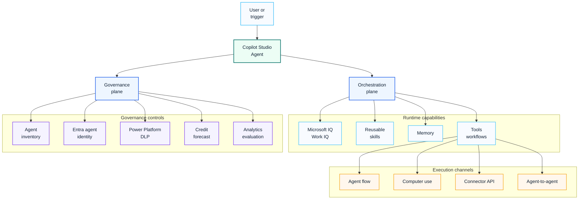

# Copilot Studio 2026 Platform Update

## Executive Summary

Copilot Studio has moved beyond chatbot authoring. In 2026, it should be positioned as an enterprise agent platform that combines low-code agent design, workflow automation, Microsoft 365 grounding, reusable skills, computer use, agent-to-agent connectivity and governance telemetry.

The most important design shift is this: an agent is no longer just a conversational interface. It is an operational object that needs identity, ownership, knowledge boundaries, tools, cost forecasting, monitoring and retirement rules.

## 한국어 요약

Copilot Studio는 더 이상 단순한 chatbot builder로 보기 어렵습니다.

2026년 기준 Copilot Studio는 new agent experience, Microsoft IQ, skills, memory, computer use, agent inventory, A2A protocol, Entra agent identity 같은 기능을 통해 enterprise agent platform에 가까워지고 있습니다.

따라서 기업 고객에게는 "agent를 만들 수 있다"보다 "누가 소유하고, 어떤 데이터에 접근하며, 어떤 도구를 실행하고, 비용과 품질을 어떻게 관리할 것인가"를 먼저 설계해야 합니다.

GPT-5.6이 Microsoft 365 Copilot에 적용되면서 Copilot, Copilot Studio, M365 Agents, Copilot Cowork를 하나의 adoption journey로 설명하는 것이 더 중요해졌습니다. 더 강한 reasoning 모델은 사용자 경험을 좋게 만들 수 있지만, enterprise 환경에서는 model selection, data boundary, approval, cost control, evaluation 기준이 함께 준비되어야 합니다.

## 2026 Capabilities To Track

| Capability | Enterprise Meaning |
|---|---|
| New agent experience | enhanced orchestration runtime and improved reasoning for agent design |
| Microsoft IQ | grounding agents with Microsoft 365 emails, calendar, files, Teams messages and people context |
| Skills | reusable instruction packages that can be added to multiple agents |
| Memory | persistent per-user context for more personalized responses |
| Computer use | agents can automate browser and desktop application tasks |
| Microsoft 365 Copilot node | workflows can call Microsoft 365 Copilot or a specific agent |
| Agent inventory schema | organizations can discover and audit agents centrally |
| Agent readiness status | consolidated status page for runtime, publishing and configuration issues |
| Entra agent identities | preview pattern for scoping permissions and Conditional Access to individual agents |
| A2A protocol | agent-to-agent connectivity for multi-agent scenarios |
| Copilot Credit estimator | consumption forecasting before scale-out |
| Workflows | public preview flow model with improved designer, testing, prompts, agent calls and human review steps |
| Teams classic chatbot shift | makers should plan around Copilot Studio web app and avoid new dependency on the Teams app for classic chatbot creation |

## Platform Migration Checkpoints

| Checkpoint | Why It Matters |
|---|---|
| Classic chatbot dependency | After the end of June 2026, the Copilot Studio for Teams app can no longer be used to create classic chatbots. Existing strategy should move toward the Copilot Studio web app and new agent experience. |
| Maker licensing | Agent makers need Copilot Studio user licensing; published agent users do not need a special license just to interact with an accessible agent. |
| Tenant licensing | Copilot Studio tenant licensing and user licensing are separate checks. Procurement and admin teams should validate both. |
| Capacity model | Purchased capacity is pooled at tenant level, but consumption should be reviewed per agent. |
| Agent flows and workflows | Workflows can run prompts, call agents and include human review, so agent architecture is now closer to an operational workflow platform. |
| Governance telemetry | Agent inventory, readiness status, analytics and evaluations should be part of the release gate. |

## Updated Agent Architecture

| Layer | Design Detail |
|---|---|
| User or trigger | human request, workflow trigger, business event or scheduled task |
| Copilot Studio Agent | the visible agent experience and orchestration boundary |
| Orchestration plane | reasoning, routing, memory, skills and tool selection |
| Runtime capabilities | Microsoft IQ, reusable skills, memory and tool/workflow execution |
| Execution channels | agent flow, computer use, connectors, APIs and agent-to-agent collaboration |
| Governance plane | inventory, identity, DLP, credit forecasting, analytics and evaluation |

## GPT-5.6 Planning Impact

GPT-5.6 in Microsoft 365 Copilot should be reflected in Copilot Studio planning because users will expect richer reasoning across daily Copilot experiences and agent workflows.

| Impact Area | What To Update |
|---|---|
| Adoption story | Explain the journey from Copilot personal productivity to Copilot Studio business agents and Copilot Cowork. |
| Model selection | Add user guidance for selecting GPT-5.6 where it is available in the tenant. |
| Agent design | Use stronger reasoning for higher-value scenarios, but keep approvals for sensitive actions. |
| Evaluation | Update test sets to include document quality, analysis accuracy, task completion and escalation behavior. |
| Change management | Train champions on business scenarios rather than isolated prompts. |
| Governance | Keep security, privacy, compliance, cost and lifecycle controls in the rollout message. |

## Design Implications

| Design Area | New Question |
|---|---|
| Identity | Does the agent need its own scoped identity and access boundary? |
| Knowledge | Which Microsoft 365 context can the agent use through Microsoft IQ or Work IQ? |
| Skills | Which instructions should be reusable across agents? |
| Memory | Is persistent context appropriate for this scenario and user group? |
| Computer use | Is UI automation allowed, monitored and recoverable? |
| Agent-to-agent | Which agent owns orchestration and which agents are specialist agents? |
| Cost | How many Copilot Credits or billed sessions could this scenario consume? |
| Operations | Who reviews failed responses, tool errors and quality regressions? |
| Migration | Does the design depend on classic chatbot authoring or Teams-only publishing? |

## Governance Checklist

- Define business owner, technical owner and security reviewer.
- Register the agent in an inventory before production rollout.
- Review connected knowledge sources and Microsoft 365 data scope.
- Review tools, workflows, connectors, APIs and computer use permissions.
- Forecast Copilot Credit or billed session consumption.
- Apply DLP policies by environment and connector group.
- Define evaluation test sets before pilot.
- Monitor usage, failure, escalation and user feedback.
- Retire agents that no longer have an owner or measurable value.

## Delivery Pattern

| Phase | Activities | Output |
|---|---|---|
| Discover | identify use case, user group, knowledge and action scope | agent opportunity card |
| Design | map instructions, knowledge, skills, tools, identity and cost model | agent design document |
| Build | create agent, skills, workflows and connector actions | pilot agent |
| Validate | test response quality, permissions, cost and safety | evaluation report |
| Operate | monitor inventory, usage, failures, cost and business value | agent operations dashboard |

## Customer Success Pattern

| Scenario | Recommended Pattern |
|---|---|
| HR policy assistant | knowledge agent with approved SharePoint sources and no high-risk actions |
| IT service request | transaction agent with connector/tool review and escalation path |
| Sales preparation | Microsoft 365 grounding with strict permission review and value tracking |
| Security intake | workflow agent with human review, audit and incident routing |
| Multi-agent proposal support | coordinator agent plus specialist research, pricing and review agents |

## Common Mistakes

| Mistake | Better Approach |
|---|---|
| Building agents before ownership is clear | require owner and lifecycle before build |
| Treating computer use as a shortcut | classify it as high-governance automation |
| Allowing every maker to publish freely | use environment strategy, DLP and approval |
| Ignoring cost forecasting | estimate consumption before pilot expansion |
| Designing one large agent | use specialist agents and reusable skills |

## References

- [What's new in Copilot Studio](https://learn.microsoft.com/en-us/microsoft-copilot-studio/whats-new)
- [Copilot Studio overview](https://learn.microsoft.com/en-us/microsoft-copilot-studio/fundamentals-what-is-copilot-studio)
- [Copilot Studio licensing and access](https://learn.microsoft.com/en-us/microsoft-copilot-studio/requirements-licensing)
- [Copilot Studio agent usage estimator](https://microsoft.github.io/copilot-studio-agent-usage-estimator/)

## Related Pages

- [Microsoft Copilot Studio](./copilot-studio)
- [Agent Factory Operating Model](./agent-factory-operating-model)
- [Multi-Agent Framework](./multi-agent-framework)
- [Agentic AI Architecture](./agentic-ai-architecture)
- [Enterprise AI Agent Factory Case Study](../projects/case-study-enterprise-ai-agent-factory)
