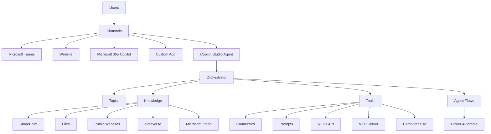
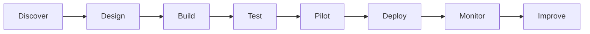
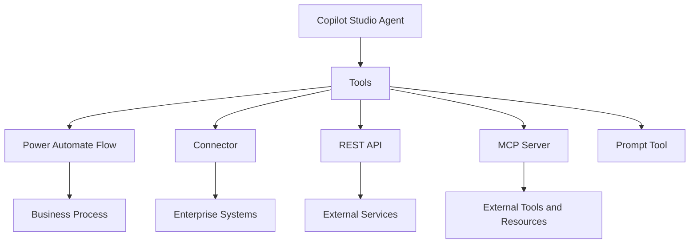
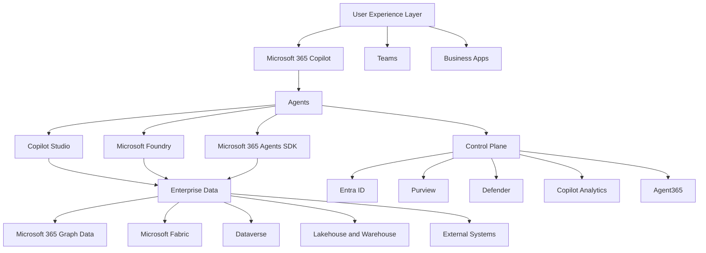
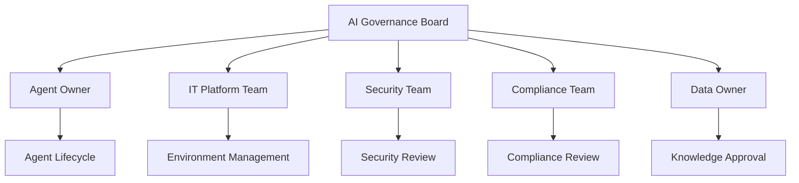
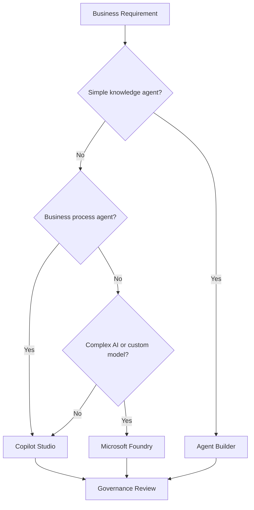

# Microsoft Copilot Studio

## Executive Summary

Microsoft Copilot Studio is the enterprise platform for building, extending, deploying and governing AI agents.

It enables business users, power users and developers to create agents that connect to enterprise knowledge, automate workflows, call business systems and extend Microsoft 365 Copilot.

Copilot Studio should not be positioned only as a chatbot builder. It is a core component of the Microsoft Agent Platform for enabling enterprise-scale Agentic AI.

---

## Business Context

Many organizations want to introduce "one agent per user" or department-level AI agents, but they face practical challenges.

### Business User Challenges

- Users understand business problems but do not know how to build agents.
- Business teams want to test ideas quickly without waiting for development teams.
- Users need agents that reflect their own workflows, data and terminology.

### Developer Team Challenges

- Development demand is higher than available resources.
- Central IT must prioritize enterprise-wide systems over department-level ideas.
- Minor changes and business logic updates often depend on developers.

Copilot Studio addresses this gap by enabling low-code agent creation while still allowing professional extensibility where needed.

---

## Microsoft Agent Build Spectrum

```mermaid
flowchart LR
    A[Agent Builder] --> B[Copilot Studio]
    B --> C[Power Automate]
    C --> D[Power Apps]
    D --> E[Microsoft Foundry]
    E --> F[Logic Apps]
    F --> G[Agents SDK]

    A:::noCode
    B:::lowCode
    C:::lowCode
    D:::lowCode
    E:::proCode
    F:::proCode
    G:::proCode

    classDef noCode fill:#eef6ff,stroke:#5b8def,color:#003366
    classDef lowCode fill:#f0fff4,stroke:#2f9e44,color:#003b1f
    classDef proCode fill:#fff4e6,stroke:#f08c00,color:#3b2500
```

| Platform | Primary User | Purpose |
|---|---|---|
| Agent Builder | General users | Create simple agents from Microsoft 365 Copilot |
| Copilot Studio | Power users and business makers | Build and deploy business agents |
| Power Automate | Automation makers | Automate workflows and approvals |
| Power Apps | App makers | Build business apps and interfaces |
| Microsoft Foundry | Developers and AI engineers | Build large-scale custom agents |
| Logic Apps | Integration developers | Build enterprise workflow engines |
| Microsoft 365 Agents SDK | Developers | Build custom agents for Microsoft 365 channels |

---

## What Copilot Studio Is

Copilot Studio is a graphical low-code tool for creating agents and agent flows.

It supports:

- Natural language-based agent creation
- Knowledge grounding
- Topics and orchestration
- Tools and actions
- Connectors
- Agent flows
- Microsoft Teams deployment
- Website deployment
- Authentication
- Analytics and diagnostics
- Governance and lifecycle management

---

## Core Architecture

---

## Copilot Studio Building Blocks

| Component | Description |
|---|---|
| Agent | AI interface that interacts with users and systems |
| Topic | Conversation path or intent handling logic |
| Knowledge | Grounding source for agent responses |
| Tool | Function or capability the agent can invoke |
| Connector | Integration with Microsoft or third-party systems |
| Agent Flow | Workflow automation used by the agent |
| Prompt | Reusable instruction or task definition |
| MCP Server | External tool/resource provider using Model Context Protocol |
| Analytics | Usage, performance and quality monitoring |

---

## Agent Types

### 1. Knowledge Agent

Provides answers based on enterprise knowledge.

Examples:

- Policy assistant
- HR knowledge agent
- IT FAQ agent
- Product documentation agent

### 2. Transaction Agent

Executes actions through tools and connectors.

Examples:

- Create service request
- Update CRM record
- Submit approval
- Register expense request

### 3. Workflow Agent

Orchestrates multi-step business processes.

Examples:

- Employee onboarding
- Customer request handling
- Contract review workflow
- Security incident intake

### 4. Autonomous Agent

Runs based on trigger, schedule or event.

Examples:

- Monitor incoming requests
- Analyze recurring reports
- Detect overdue tasks
- Generate operational summaries

### 5. Multi-Agent Pattern

Coordinates multiple specialized agents.

Examples:

- Coordinator Agent
- Knowledge Agent
- Action Agent
- Review Agent
- Reporting Agent

---

## Agent Lifecycle

| Stage | Key Output |
|---|---|
| Discover | Business problem and target scenario |
| Design | Agent scope, knowledge, tools and governance |
| Build | Agent, topics, tools and flows |
| Test | Functional and security validation |
| Pilot | Limited user validation |
| Deploy | Production release |
| Monitor | Usage, quality and risk tracking |
| Improve | Iterative enhancement |

---

## Knowledge Architecture

Knowledge quality determines agent quality.

Recommended knowledge sources:

| Source | Use Case |
|---|---|
| SharePoint | Policies, procedures, project documents |
| Dataverse | Business data and structured entities |
| Files | Manuals, guides, templates |
| Public Websites | Public-facing information |
| Microsoft Graph | Microsoft 365 context |
| Fabric | Analytical and enterprise data |
| External Systems | CRM, ERP, ITSM, HR systems |

---

## Tool and Action Architecture

Agents become more valuable when they can take action.

| Tool Type | Example |
|---|---|
| Power Automate Flow | Approval, ticket creation, notification |
| Connector | ServiceNow, Salesforce, SAP, Dataverse |
| REST API | Custom business system integration |
| MCP Server | Reusable external tools and resources |
| Prompt Tool | Standardized reasoning task |

---

## MCP Integration

Model Context Protocol expands agent extensibility.

MCP enables agents to connect to external tools and resources in a reusable way.

### MCP Use Cases

- Connect existing enterprise tools
- Reuse agent capabilities across systems
- Expose external data or actions to agents
- Standardize tool integration
- Support scalable agent ecosystems

### MCP Connection Options

| Option | Description |
|---|---|
| MCP onboarding wizard | Recommended method inside Copilot Studio |
| Custom connector | Power Apps or Power Automate custom connector approach |
| API key authentication | Simple server-level authentication |
| OAuth 2.0 authentication | User-delegated access model |

---

## No-Code, Low-Code and Pro-Code Positioning

| Approach | Target User | Recommended Platform |
|---|---|---|
| No-code agent creation | General user | Agent Builder |
| Low-code business agent | Power user / maker | Copilot Studio |
| Workflow automation | Business automation owner | Power Automate |
| Business app plus agent | App maker | Power Apps + Copilot Studio |
| Enterprise AI service | Developer / AI engineer | Microsoft Foundry |
| Enterprise integration | Integration developer | Logic Apps |
| Custom Microsoft 365 agent | Developer | Microsoft 365 Agents SDK |

---

## Enterprise Agent Platform View

---

## Security and Governance

Copilot Studio must be governed as part of the enterprise AI control plane.

### Governance Domains

| Domain | Governance Requirement |
|---|---|
| Identity | Entra ID authentication and access control |
| Agent Ownership | Assign business and technical owners |
| Data Access | Validate knowledge and connector permissions |
| Tool Usage | Review tools, APIs, flows and MCP servers |
| Compliance | Apply Purview and audit requirements |
| Monitoring | Track usage, risk and performance |
| Lifecycle | Review, retire or update agents regularly |

---

## Agent Governance Model

---

## Security Review Checklist

| Area | Review Question |
|---|---|
| Identity | Who can use the agent? |
| Knowledge | What data sources are connected? |
| Permissions | Does the agent expose sensitive data? |
| Tools | What actions can the agent execute? |
| Connectors | Are connectors approved and secured? |
| MCP | Is the MCP server trusted and authenticated? |
| Logging | Are conversations and actions auditable? |
| DLP | Are Power Platform DLP policies applied? |

---

## Deployment Channels

Copilot Studio agents can be deployed through several channels.

| Channel | Use Case |
|---|---|
| Microsoft Teams | Internal employee support |
| Microsoft 365 Copilot | Extend M365 Copilot experience |
| Website | Customer or employee web support |
| Demo site | Pilot and validation |
| Custom app | Embedded business process |
| Azure Bot Service channels | Extended channel deployment |

---

## Analytics and Operations

Agent operations should continuously track performance.

### Operational Metrics

| Metric | Purpose |
|---|---|
| Active Users | Adoption tracking |
| Conversation Volume | Demand tracking |
| Resolution Rate | Effectiveness measurement |
| Escalation Rate | Human handoff requirement |
| Failed Topics | Improvement opportunity |
| Tool Invocation | Action usage tracking |
| User Satisfaction | Experience quality |
| Cost and Capacity | Consumption governance |

---

## Use Case Portfolio

### IT Helpdesk Agent

- Password reset guidance
- Service request intake
- Incident classification
- Knowledge article search
- Ticket creation

### HR Agent

- Leave policy guidance
- Benefits inquiry
- Onboarding checklist
- Employee FAQ
- HR ticket routing

### Sales Agent

- Customer meeting preparation
- Opportunity summary
- Proposal drafting support
- CRM update
- Follow-up tracking

### Finance Agent

- Budget inquiry
- Variance analysis request
- Report generation
- Approval routing
- Policy validation

### Security Agent

- Security policy search
- Incident intake
- Risk classification
- Escalation routing
- Compliance guidance

---

## Recommended Delivery Approach

| Phase | Key Activities | Deliverables |
|---|---|---|
| Phase 1. Assessment | Identify target scenarios and systems | Use case backlog |
| Phase 2. Design | Define agent architecture, data, tools and governance | Agent design document |
| Phase 3. Build | Build agent, knowledge, topics, tools and flows | Pilot-ready agent |
| Phase 4. Validate | Test responses, security, permissions and actions | Test report |
| Phase 5. Deploy | Publish to Teams, web or Copilot | Production agent |
| Phase 6. Operate | Monitor adoption, quality and risk | Operations dashboard |

---

## Licensing and Capacity Considerations

Licensing should be reviewed before production rollout.

Consider:

- Microsoft 365 Copilot licensing
- Copilot Studio licensing
- Copilot Studio messages
- Power Platform capacity
- Dataverse capacity
- Connector licensing
- Azure consumption
- Third-party system licensing

---

## Decision Framework

---

## Best Practices

1. Start with high-value, low-risk scenarios.
2. Define the business owner before building.
3. Limit knowledge sources to approved repositories.
4. Validate permissions before pilot.
5. Separate pilot agents from production agents.
6. Apply Power Platform DLP policies.
7. Review tools and MCP servers before use.
8. Monitor usage and failed conversations.
9. Establish agent lifecycle governance.
10. Measure business value, not only usage.

---

## Common Risks

| Risk | Impact | Mitigation |
|---|---|---|
| Poorly defined use case | Low adoption | Start with scenario discovery |
| Uncontrolled knowledge source | Data exposure | Approve and govern knowledge |
| Excessive tool permission | Business process risk | Review tool actions |
| No ownership model | Operational failure | Assign business and IT owners |
| No monitoring | Quality degradation | Use analytics and review cadence |
| License misunderstanding | Cost issue | Validate licensing and capacity early |

---

## Executive Positioning

Copilot Studio should be positioned as an enterprise agent platform.

It enables organizations to:

- Reduce development backlog
- Empower business-led innovation
- Standardize AI agent creation
- Connect AI to enterprise systems
- Govern agent usage
- Scale from personal productivity to business process transformation

---

## Deliverables

A Copilot Studio engagement should produce:

- Agent Opportunity Assessment
- Use Case Backlog
- Agent Architecture
- Knowledge Source Design
- Tool and Connector Design
- Security and Governance Review
- Pilot Agent
- Deployment Plan
- Operations Dashboard
- Agent Lifecycle Framework

---

## References

- Microsoft Learn
- Microsoft Copilot Studio Documentation
- Power Platform Documentation
- Microsoft 365 Agents SDK
- Microsoft Foundry
- Microsoft Entra
- Microsoft Purview
- Microsoft Defender