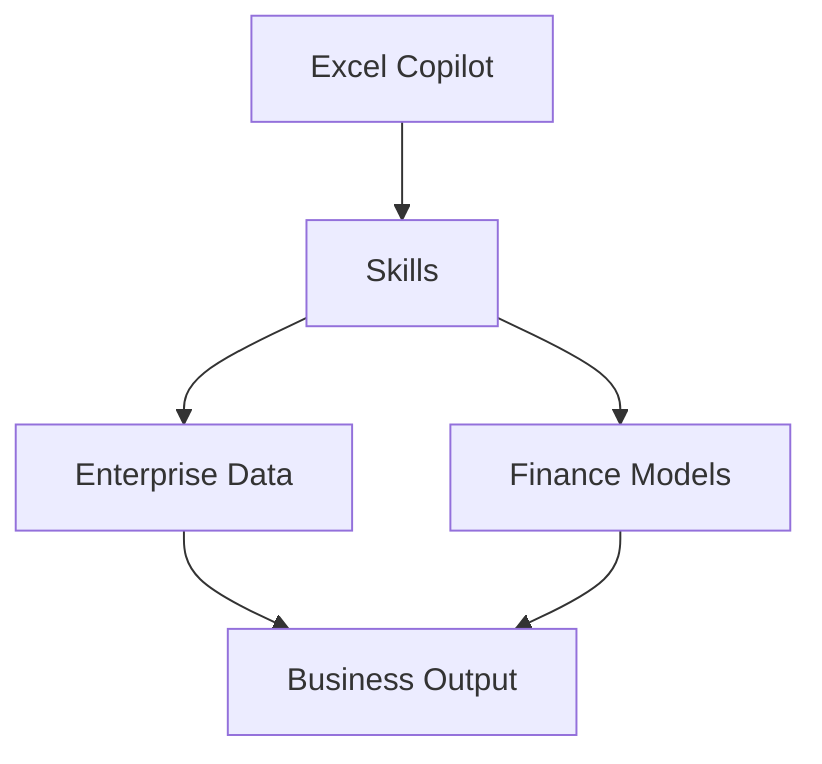

# Excel Copilot Skills and Frontier Finance

## Executive Summary

Microsoft has introduced Skills for Excel Copilot, enabling reusable task-specific capabilities that extend beyond traditional prompt-based interactions.

Skills allow organizations to standardize financial analysis, planning, forecasting, valuation and reporting workflows while maintaining transparency, auditability and governance.

This capability represents a major evolution of Copilot for Finance scenarios and establishes a foundation for Enterprise Finance AI.

---

## Why Skills Matter

Traditional prompting creates challenges:

- Inconsistent output
- User dependency
- Difficult governance
- Limited repeatability

Skills introduce reusable business logic.


---

## What Is a Skill

A Skill is a reusable task definition for Copilot.

Examples:

- DCF Valuation
- Variance Analysis
- Forecast Refresh
- Monthly Closing Review
- Financial Statement Validation
- Portfolio Analysis
- Investment Screening

---

## Enterprise Benefits

| Benefit | Description |
|----------|----------|
| Repeatability | Consistent financial analysis |
| Governance | Controlled execution model |
| Auditability | Full change tracking |
| Transparency | Explainable outputs |
| Productivity | Faster financial operations |
| Standardization | Shared business methodology |

---

## Frontier Finance Architecture



---

## Traceability and Governance

One of the most important requirements in finance is traceability.

Excel Copilot introduces:

### Plan with Copilot

Review planned changes before execution.

### Show Changes

Track all Copilot modifications.

### Workbook Rules

Apply workbook-specific standards.

### Personalization

Support analyst-specific preferences.

---

## Supported Financial Scenarios

### Variance Analysis

Compare actual versus budget.

### Forecast Refresh

Update assumptions and projections.

### DCF Modeling

Generate discounted cash flow models.

### Comparable Company Analysis

Automate valuation benchmarking.

### Portfolio Review

Analyze investment performance.

### Risk Assessment

Evaluate exposure and risk trends.

### Quarterly Close

Support month-end and quarter-end activities.

---

## Data Connectors

Microsoft is expanding trusted financial data integration.

Supported ecosystem includes:

- CB Insights
- Daloopa
- FactSet
- Morningstar
- PitchBook
- S&P Global

These connectors enable enterprise-grade finance scenarios.

---

## Custom Skills

Organizations can build custom Skills.

Location:

Documents

→ Copilot

→ Microsoft Excel

→ Skills

Custom Skills are defined using:

```text
SKILL.md
```

This allows organizations to codify internal finance processes and operating procedures.

---

## Example Enterprise Skills

### Revenue Forecast Update

Automatically refresh forecast assumptions.

### Investment Evaluation

Generate investment analysis.

### Financial Validation

Validate financial model integrity.

### Executive Reporting

Prepare management reporting packages.

### Budget Review

Perform budget variance analysis.

---

## Enterprise Architecture Perspective

Skills provide a middle layer between:

- User Prompts
- Enterprise Data
- Business Process
- Financial Governance

This reduces reliance on individual prompt engineering.

---

## Future Roadmap

### Available Today

- Core Skills
- Financial Connectors
- Change Tracking
- Workbook Rules

### Upcoming

- Custom Skill General Availability
- Marketplace Distribution
- Partner Skills
- Industry-Specific Finance Skills

---

## Strategic Impact

Excel Copilot Skills represent a shift from AI-assisted spreadsheets toward AI-enabled financial operating models.

Organizations can move beyond individual productivity gains and establish repeatable, governed and scalable financial intelligence processes.

---

## References

- Microsoft 365 Blog
- Microsoft Learn
- Copilot in Excel Skills Documentation
- Frontier Finance Initiative