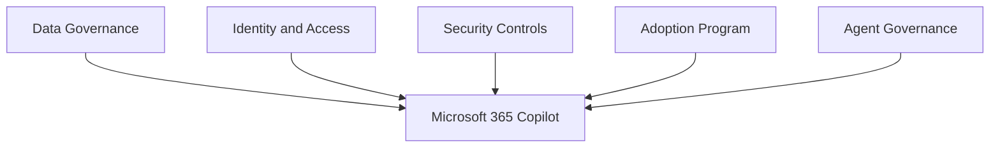

# Copilot Governance

## Executive Summary

Microsoft 365 Copilot governance defines how organizations control data access, user readiness, prompt behavior, extensibility, auditability and adoption.

Copilot should not be launched as a license assignment project. It should be launched as a governed business capability with clear ownership across IT, security, legal, compliance and business teams.

## Business Scenario

- Prepare Microsoft 365 data before Copilot rollout
- Reduce oversharing risk in SharePoint and Teams
- Define acceptable use and prompt guidance
- Govern Copilot Studio and agent creation
- Measure adoption and business value

## Architecture

## Implementation

1. Define Copilot ownership and steering committee.
2. Review SharePoint, Teams and OneDrive permissions.
3. Validate Purview labels, DLP and retention controls.
4. Select pilot users and business scenarios.
5. Publish prompt and responsible AI guidance.
6. Establish agent approval and lifecycle process.
7. Track adoption, feedback and measurable outcomes.

## Licensing

Copilot governance depends on Microsoft 365 licensing, Copilot licensing and compliance/security capabilities. Confirm whether Purview, Defender, audit and advanced governance features are included before rollout.

## Security

- Review overshared sites before pilot.
- Use least privilege and group-based access.
- Monitor sensitive data exposure.
- Define rules for connectors, plugins and agents.
- Keep audit and investigation workflow ready.

## Lessons Learned

Successful Copilot adoption starts with a narrow, high-value pilot. Broad rollout without data readiness creates trust issues and increases support load.

## MVP and Community-Informed Quality Notes

Public Microsoft 365 community discussions repeatedly reinforce one important point: Copilot governance is mostly a data access and operating model problem before it is an AI feature problem.

For enterprise projects, convert that insight into these practical controls:

- Treat SharePoint, Teams and OneDrive oversharing review as a required Copilot readiness gate.
- Define whether Copilot access is unrestricted, restricted to pilot groups, or restricted by data domain.
- Review sensitivity labels, DLP policies, retention and audit readiness before broad rollout.
- Decide how Copilot agents, Graph connectors and third-party extensions are approved.
- Prepare a support model for inaccurate responses, unexpected content discovery and user feedback.
- Track prompt usage, business scenarios and adoption outcomes without turning governance into surveillance.

## Korean Search Expansion

This page also supports Korean searches such as:

- Microsoft 365 Copilot 거버넌스
- Copilot 데이터 접근 제어
- Copilot 오버쉐어링 점검
- Copilot 도입 전 SharePoint 권한 검토
- Copilot 보안 준비도
- Copilot Agent 거버넌스

## Community and Official References

- [Microsoft 365 for IT Pros](https://office365itpros.com/)
- [Microsoft 365 Copilot data, privacy and security](https://learn.microsoft.com/en-us/microsoft-365/copilot/microsoft-365-copilot-privacy)
- [MVP and Community Research Map](../knowledge-center/mvp-community-research-map)
