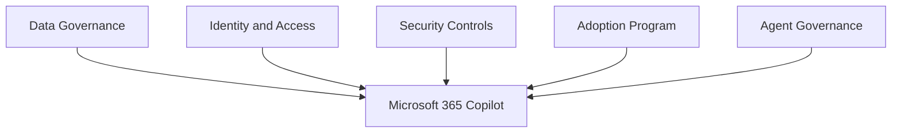

# Copilot Governance

## Executive Summary

Microsoft 365 Copilot governance defines how organizations control data access, user readiness, prompt behavior, extensibility, auditability and adoption.

Copilot should not be launched as a license assignment project. It should be launched as a governed business capability with clear ownership across IT, security, legal, compliance and business teams.

## Business Scenario

- Prepare Microsoft 365 data before Copilot rollout
- Reduce oversharing risk in SharePoint and Teams
- Define acceptable use and prompt guidance
- Govern Copilot Studio and agent creation
- Measure adoption and business value

## Architecture

## Implementation

1. Define Copilot ownership and steering committee.
2. Review SharePoint, Teams and OneDrive permissions.
3. Validate Purview labels, DLP and retention controls.
4. Select pilot users and business scenarios.
5. Publish prompt and responsible AI guidance.
6. Establish agent approval and lifecycle process.
7. Track adoption, feedback and measurable outcomes.

## Licensing

Copilot governance depends on Microsoft 365 licensing, Copilot licensing and compliance/security capabilities. Confirm whether Purview, Defender, audit and advanced governance features are included before rollout.

## Security

- Review overshared sites before pilot.
- Use least privilege and group-based access.
- Monitor sensitive data exposure.
- Define rules for connectors, plugins and agents.
- Keep audit and investigation workflow ready.

## Lessons Learned

Successful Copilot adoption starts with a narrow, high-value pilot. Broad rollout without data readiness creates trust issues and increases support load.
