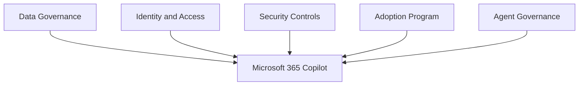

# Copilot Governance

## Executive Summary

Microsoft 365 Copilot governance defines how organizations control data access, user readiness, prompt behavior, extensibility, auditability and adoption.

Copilot should not be launched as a license assignment project. It should be launched as a governed business capability with clear ownership across IT, security, legal, compliance and business teams.

## Business Scenario

- Prepare Microsoft 365 data before Copilot rollout
- Reduce oversharing risk in SharePoint and Teams
- Define acceptable use and prompt guidance
- Govern Copilot Studio and agent creation
- Measure adoption and business value

## Architecture

## Implementation

1. Define Copilot ownership and steering committee.
2. Review SharePoint, Teams and OneDrive permissions.
3. Validate Purview labels, DLP and retention controls.
4. Select pilot users and business scenarios.
5. Publish prompt and responsible AI guidance.
6. Establish agent approval and lifecycle process.
7. Track adoption, feedback and measurable outcomes.

## Licensing

Copilot governance depends on Microsoft 365 licensing, Copilot licensing and compliance/security capabilities. Confirm whether Purview, Defender, audit and advanced governance features are included before rollout.

## Security

- Review overshared sites before pilot.
- Use least privilege and group-based access.
- Monitor sensitive data exposure.
- Define rules for connectors, plugins and agents.
- Keep audit and investigation workflow ready.

## Lessons Learned

Successful Copilot adoption starts with a narrow, high-value pilot. Broad rollout without data readiness creates trust issues and increases support load.

## MVP 커뮤니티 기반 설계 메모

Public Microsoft 365 community에서 반복적으로 강조되는 핵심은 분명합니다. Copilot governance는 AI 기능을 켜는 문제가 아니라, data access와 operating model을 먼저 정리하는 문제입니다.

Enterprise 프로젝트에서는 이 관점을 다음과 같은 실행 항목으로 바꾸는 것이 좋습니다.

- SharePoint, Teams, OneDrive oversharing review를 Copilot readiness의 필수 gate로 둡니다.
- Copilot access를 전체 허용할지, pilot group으로 제한할지, data domain 기준으로 제한할지 결정합니다.
- 전체 배포 전에 sensitivity label, DLP policy, retention, audit readiness를 확인합니다.
- Copilot agent, Graph connector, third-party extension의 승인 기준을 정합니다.
- 부정확한 답변, 예상하지 못한 content discovery, 사용자 feedback을 처리할 support model을 준비합니다.
- prompt usage, business scenario, adoption outcome을 추적하되 사용자 감시처럼 보이지 않도록 운영 기준을 명확히 합니다.

## 한국어 검색 키워드

이 문서는 다음과 같은 한국어 검색어와도 관련됩니다.

- Microsoft 365 Copilot governance
- Copilot data access control
- Copilot oversharing review
- Copilot 도입 전 SharePoint permission review
- Copilot security readiness
- Copilot Agent governance

## 커뮤니티 및 공식 참고 자료

- [Microsoft 365 for IT Pros](https://office365itpros.com/)
- [Microsoft 365 Copilot data, privacy and security](https://learn.microsoft.com/en-us/microsoft-365/copilot/microsoft-365-copilot-privacy)
- [MVP and Community Research Map](../knowledge-center/mvp-community-research-map)
