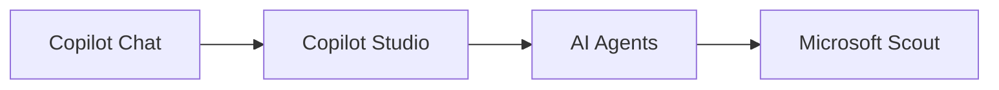
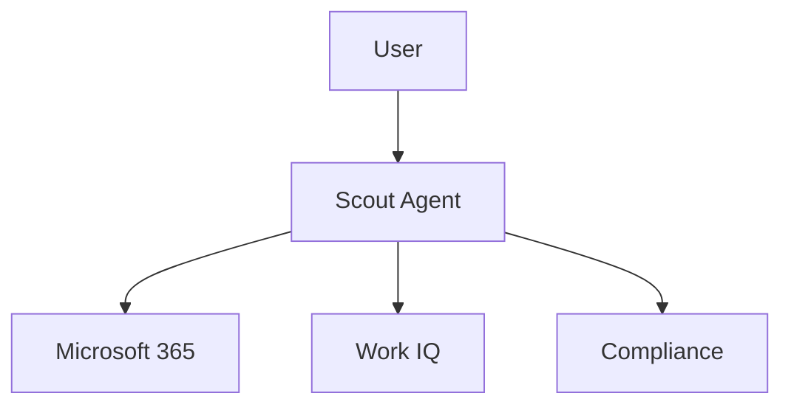

# Microsoft Scout

## Executive Summary

Microsoft Scout is Microsoft's first always-on personal agent announced at Microsoft Build 2026.

Unlike traditional Copilot experiences that require direct user interaction, Scout operates continuously in the background and proactively assists users by coordinating tasks, monitoring communications, preparing meetings and managing commitments. :contentReference[oaicite:1]{index=1}

---

# What is Microsoft Scout

Microsoft Scout is an autonomous personal work agent.

Scout continuously monitors:

- Outlook
- Teams
- Calendar
- Meetings
- Tasks
- Commitments

and proactively assists users without requiring explicit prompts. :contentReference[oaicite:2]{index=2}

---

# Evolution of Microsoft AI

---

# Copilot vs Scout

| Area | Copilot | Scout |
|--------|--------|--------|
| User Initiated | Yes | No |
| Background Operation | No | Yes |
| Memory | Limited | Persistent |
| Task Monitoring | Limited | Continuous |
| Scheduling | User Driven | Autonomous |
| Proactive Actions | Limited | High |

Scout represents Microsoft's move from Assistive AI toward Agentic AI. :contentReference[oaicite:3]{index=3}

---

# Core Capabilities

## Meeting Preparation

Scout automatically:

- Reviews meeting context
- Reads related emails
- Reviews Teams conversations
- Generates preparation materials

---

## Calendar Coordination

Scout can:

- Detect scheduling conflicts
- Coordinate across time zones
- Suggest optimal meeting times

---

## Task Management

Scout can:

- Track commitments
- Monitor action items
- Generate follow-up reminders

---

## Email Assistance

Scout continuously analyzes:

- Important emails
- Escalations
- Outstanding requests

and highlights items requiring attention. :contentReference[oaicite:4]{index=4}

---

# Work IQ Integration

Microsoft Scout is powered by Work IQ.

Work IQ provides:

- Organizational context
- User behavior understanding
- Enterprise knowledge grounding
- Business relationship mapping

This enables Scout to understand not only data but also business context. :contentReference[oaicite:5]{index=5}

---

# Enterprise Use Cases

## Executive Assistant

- Calendar optimization
- Meeting preparation
- Follow-up tracking

---

## Sales Manager

- Opportunity follow-up
- Customer meeting preparation
- Pipeline reminders

---

## Project Manager

- Action tracking
- Risk escalation
- Stakeholder communication

---

## Consulting Engagement

- Meeting coordination
- Deliverable tracking
- Proposal preparation

---

# Governance Model

---

# Security and Compliance

Microsoft positions Scout as an enterprise-grade agent.

Controls include:

- Microsoft Purview
- Microsoft Defender
- Policy Enforcement
- Audit Logging
- Enterprise Compliance Controls

Scout runs within Microsoft security boundaries and governance frameworks. :contentReference[oaicite:6]{index=6}

---

# Strategic Impact

Microsoft Scout represents a significant shift in enterprise productivity.

Traditional model:

User → AI

Future model:

AI → User

The agent continuously works on behalf of the employee and surfaces only the information requiring human attention. :contentReference[oaicite:7]{index=7}

---

# Future Outlook

Expected evolution:

- Multi-Agent Collaboration
- Persistent Memory
- Cross-Application Automation
- Autonomous Business Processes
- Enterprise Digital Assistants

Scout is likely to become a foundational component of Microsoft's Agentic AI strategy.

---

# Related Articles

- Copilot Readiness Assessment
- Copilot Adoption Program
- Excel Copilot Skills
- Microsoft 365 Copilot Governance