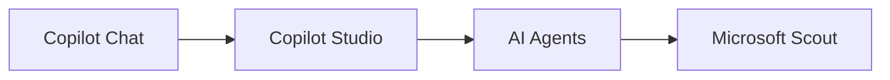
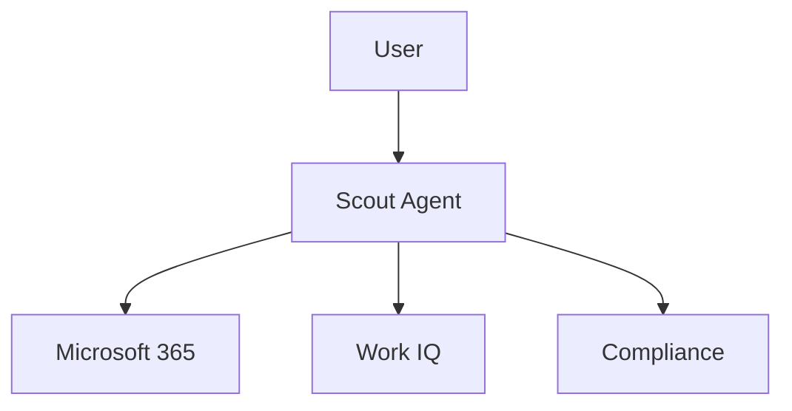

# Microsoft Scout

## Executive Summary

Microsoft Scout is Microsoft's always-on personal agent concept introduced for the next stage of Microsoft 365 AI experiences.

Unlike traditional Copilot experiences that require direct user interaction, Scout represents a more proactive agent pattern: coordinating tasks, monitoring communications, preparing meetings and helping users manage commitments.

---

## What is Microsoft Scout

Microsoft Scout is an autonomous personal work agent.

Scout continuously monitors:

- Outlook
- Teams
- Calendar
- Meetings
- Tasks
- Commitments

and proactively assists users without requiring every action to start from a manual prompt.

---

## Evolution of Microsoft AI

```mermaid
flowchart LR

A[Copilot Chat]
B[Copilot Studio]
C[AI Agents]
D[Microsoft Scout]

A --> B
B --> C
C --> D
```

---

## Copilot vs Scout

| Area | Copilot | Scout |
|--------|--------|--------|
| User Initiated | Yes | No |
| Background Operation | No | Yes |
| Memory | Limited | Persistent |
| Task Monitoring | Limited | Continuous |
| Scheduling | User Driven | Autonomous |
| Proactive Actions | Limited | High |

Scout represents Microsoft's broader move from assistive AI toward agentic AI.

---

## Core Capabilities

## Meeting Preparation

Scout automatically:

- Reviews meeting context
- Reads related emails
- Reviews Teams conversations
- Generates preparation materials

---

## Calendar Coordination

Scout can:

- Detect scheduling conflicts
- Coordinate across time zones
- Suggest optimal meeting times

---

## Task Management

Scout can:

- Track commitments
- Monitor action items
- Generate follow-up reminders

---

## Email Assistance

Scout continuously analyzes:

- Important emails
- Escalations
- Outstanding requests

and highlights items requiring attention.

---

## Work IQ Integration

Microsoft Scout is powered by Work IQ.

Work IQ provides:

- Organizational context
- User behavior understanding
- Enterprise knowledge grounding
- Business relationship mapping

This enables Scout-like agent experiences to understand not only data but also business context.

---

## Enterprise Use Cases

## Executive Assistant

- Calendar optimization
- Meeting preparation
- Follow-up tracking

---

## Sales Manager

- Opportunity follow-up
- Customer meeting preparation
- Pipeline reminders

---

## Project Manager

- Action tracking
- Risk escalation
- Stakeholder communication

---

## Consulting Engagement

- Meeting coordination
- Deliverable tracking
- Proposal preparation

---

## Governance Model

```mermaid
flowchart TB

A[User]
B[Scout Agent]
C[Microsoft 365]
D[Work IQ]
E[Compliance]

A --> B
B --> C
B --> D
B --> E
```

---

## Security and Compliance

Microsoft positions Scout as an enterprise-grade agent.

Controls include:

- Microsoft Purview
- Microsoft Defender
- Policy Enforcement
- Audit Logging
- Enterprise Compliance Controls

Scout-style enterprise agents should run within Microsoft security boundaries and governance frameworks.

---

## Strategic Impact

Microsoft Scout represents a significant shift in enterprise productivity.

Traditional model:

User -> AI

Future model:

AI -> User

The agent continuously works on behalf of the employee and surfaces only the information requiring human attention.

---

## Future Outlook

Expected evolution:

- Multi-Agent Collaboration
- Persistent Memory
- Cross-Application Automation
- Autonomous Business Processes
- Enterprise Digital Assistants

Scout is likely to become a foundational component of Microsoft's Agentic AI strategy.

---

## Related Articles

- Copilot Readiness Assessment
- Copilot Adoption Program
- Excel Copilot Skills
- Microsoft 365 Copilot Governance

---

## 한국어 요약

Microsoft Scout는 사용자가 직접 AI에게 질문하는 방식에서 한 단계 더 나아가, agent가 업무 맥락을 지속적으로 관찰하고 필요한 action item, follow-up, meeting preparation, escalation을 먼저 제안하는 방향을 보여줍니다.

기업 관점에서는 Scout 자체보다 더 중요한 질문이 있습니다. 어떤 데이터와 업무 맥락을 agent가 사용할 수 있는지, 어떤 action을 자동화할 수 있는지, 어떤 시점에 human approval이 필요한지, 그리고 audit과 compliance를 어떻게 남길 것인지입니다.

## Enterprise Readiness Checklist

| Area | Question |
|---|---|
| Work context | Calendar, Email, Teams, SharePoint, CRM, project data 중 어떤 범위를 사용할 것인가? |
| Action boundary | reminder, draft, task creation, approval request 중 어디까지 agent가 수행할 수 있는가? |
| Privacy | 개인 업무 지원과 조직 모니터링 사이의 경계를 어떻게 설명할 것인가? |
| Governance | agent owner, lifecycle, permission, audit log를 누가 관리할 것인가? |
| Adoption | 사용자에게 어떤 업무 시나리오부터 보여줄 것인가? |

## Related Documents

- [Copilot Overview](./overview)
- [Copilot Studio 2026 Platform Update](./copilot-studio-2026-platform-update)
- [Multi-Agent Framework](./multi-agent-framework)
- [Agent Factory Operating Model](./agent-factory-operating-model)
- [Contact and Asset Request](../contact)

## Search Keywords

이 문서는 다음 검색 의도에 답합니다.

- Microsoft Scout
- Microsoft Work IQ
- AI executive assistant
- Microsoft 365 agent
- Copilot agent assistant
- agentic AI Microsoft 365
- Microsoft Scout란
- Microsoft 365 AI Agent
- Copilot 개인 비서

## Contact / Asset Request

Scout-style agent scenario를 Copilot Studio, Microsoft 365 agents, Copilot Cowork 관점으로 정리한 workshop agenda나 governance checklist가 필요하면 [Contact and Asset Request](../contact)를 통해 요청할 수 있습니다.
