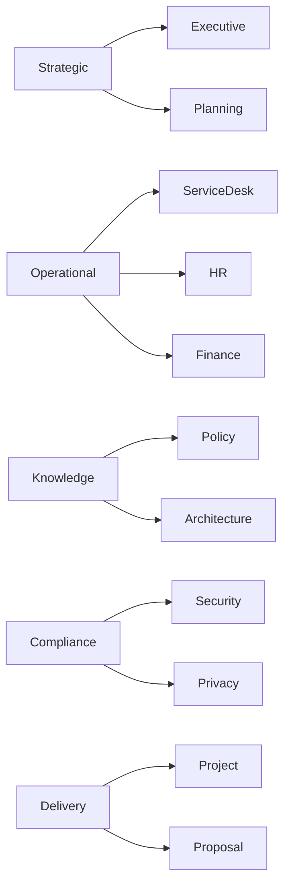
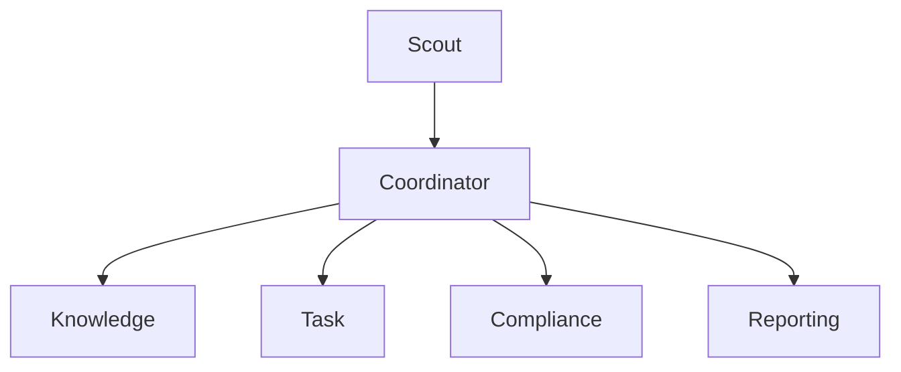
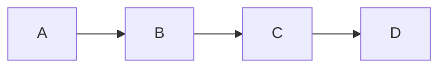
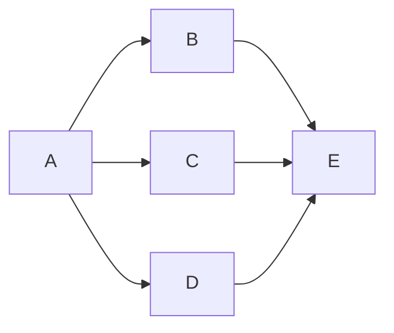
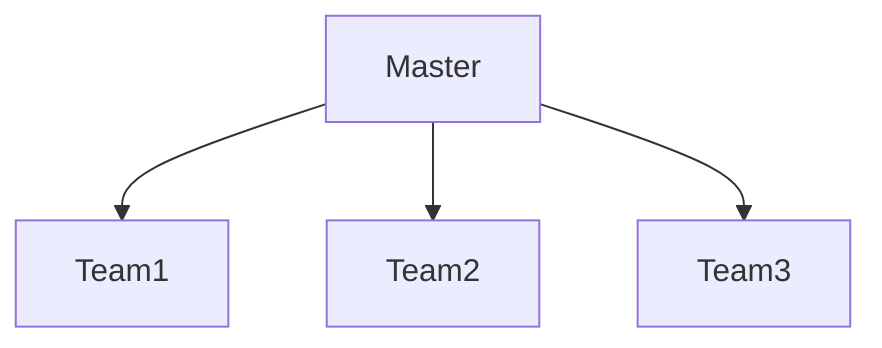
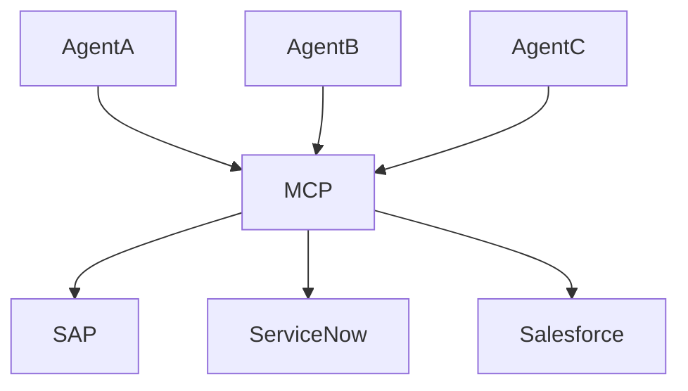
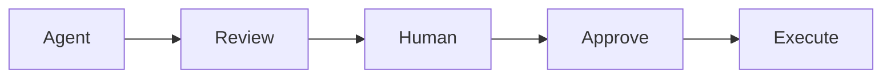
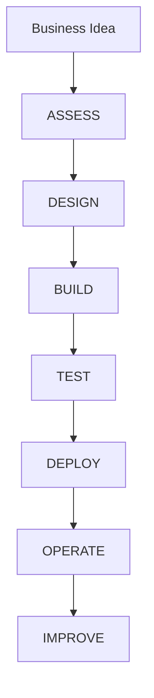

# Multi-Agent Framework

<section class="kc-topic-hero kc-topic-hero--agent" aria-label="Multi-agent framework hero">
  

    Multi-Agent Architecture
    <h2>Coordinate specialist agents without losing control</h2>
    
Multi-agent systems become valuable when complex work is divided across specialist agents and governed through a coordinator, policy boundary, human review and measurable outcomes.

    

      Coordinate
      Specialize
      Review
      Measure
    

    

      <a class="kc-topic-button kc-topic-button--primary" href="/knowledge/copilot/agentic-ai-architecture">Agentic AI Architecture</a>
      <a class="kc-topic-button" href="/knowledge/copilot/agent-factory-operating-model">Agent Factory</a>
      <a class="kc-topic-button" href="/knowledge/projects/case-study-enterprise-ai-agent-factory">Customer Pattern</a>
    

  

  

    

      Agent Team
      <strong>Specialists with control</strong>
    

    

      <a href="#coordinator-agent" class="kc-factory-card"><small>01</small><strong>Coordinator</strong>Decomposes work, assigns agents and consolidates response.</a>
      <a href="#knowledge-agent" class="kc-factory-card"><small>02</small><strong>Knowledge</strong>Retrieves policies, history, reference assets and enterprise context.</a>
      <a href="#task-agent" class="kc-factory-card"><small>03</small><strong>Task</strong>Executes workflow, ticket, CRM, proposal or system actions.</a>
      <a href="#review-agent" class="kc-factory-card"><small>04</small><strong>Review</strong>Checks quality, completeness, compliance and business fit.</a>
    

    

      <strong>Control point</strong>
      Multi-agent design should reduce complexity for users, not hide complexity from governance owners.
    

  

</section>

## Executive Summary

Enterprise AI is rapidly evolving from single-agent experiences toward coordinated multi-agent systems.

A single agent can perform individual tasks, but complex enterprise processes typically require multiple specialized agents working together.

Microsoft's long-term vision for Agentic AI includes coordinated agents that collaborate across Microsoft 365, business applications, enterprise knowledge repositories and external systems.

Multi-Agent Framework provides the architectural pattern for building scalable, governed and reusable enterprise AI ecosystems.

---

## Why Multi-Agent?

A single agent often becomes overloaded.

Typical enterprise requests require:

- Research
- Validation
- Compliance review
- Business processing
- Reporting
- Approval

Attempting to perform all of these tasks with one agent creates complexity, risk and maintenance challenges.

A multi-agent architecture distributes responsibilities across specialized agents.

---

## Single Agent vs Multi-Agent

| Capability | Single Agent | Multi-Agent |
|------------|-------------|-------------|
| Simple FAQ | Excellent | Excellent |
| Knowledge Search | Good | Excellent |
| Workflow Execution | Good | Excellent |
| Enterprise Scale | Limited | Strong |
| Governance | Moderate | Strong |
| Reusability | Limited | High |
| Maintainability | Difficult | Easier |
| Complex Decision Support | Limited | Strong |

---

## Core Architecture

  

    Core Architecture
    <strong>User request to governed response</strong>
  

  

    
<small>01</small><strong>User Request</strong>Business question, workflow request or executive task.

    
<small>02</small><strong>Coordinator</strong>Plans work, assigns specialists and owns final orchestration.

    
<small>03</small><strong>Specialists</strong>Knowledge, task, review, compliance and reporting agents.

    
<small>04</small><strong>Human Review</strong>Approves sensitive actions, exceptions and external-facing outputs.

    
<small>05</small><strong>Control Plane</strong>Identity, DLP, audit, telemetry, cost and evaluation signals.

    
<small>06</small><strong>Final Response</strong>Consolidated answer, action result, report or decision support.

  

  

    <small>Responsibility Model</small>
    <strong>Each specialist should have a narrow purpose and an explicit boundary.</strong>
    The coordinator should not become an uncontrolled super-agent. It should route work, enforce policy and explain how final outputs were assembled.
  

  

    <a href="#coordinator-agent"><small>Coordinate</small><strong>Task decomposition</strong>Break complex requests into specialist work packets.</a>
    <a href="#knowledge-agent"><small>Ground</small><strong>Enterprise knowledge</strong>Retrieve approved information from Microsoft 365 and business systems.</a>
    <a href="#task-agent"><small>Act</small><strong>Workflow execution</strong>Trigger tools, APIs, approvals and business actions within scope.</a>
    <a href="#review-agent"><small>Review</small><strong>Quality and consistency</strong>Check completeness, format, accuracy and business alignment.</a>
    <a href="#compliance-agent"><small>Control</small><strong>Compliance review</strong>Evaluate policy, data handling and risk before delivery.</a>
    <a href="#reporting-agent"><small>Report</small><strong>Executive output</strong>Create summaries, dashboards and stakeholder-ready narratives.</a>
  

---

## Coordinator Agent

The Coordinator Agent is the brain of the system.

Responsibilities:

- Understand user intent
- Break down tasks
- Assign work
- Consolidate outputs
- Resolve conflicts
- Produce final response

Without a coordinator, agent-to-agent communication becomes difficult to manage.

---

## Knowledge Agent

Purpose:

Retrieve and summarize enterprise knowledge.

### Data Sources

- SharePoint Online
- OneDrive
- Microsoft Graph
- Teams Knowledge
- Microsoft Fabric
- Dataverse
- External Knowledge Bases

### Typical Tasks

- Policy lookup
- Architecture retrieval
- SOP retrieval
- Proposal reference
- Project history lookup

---

## Task Agent

Purpose:

Execute business actions.

### Typical Actions

- Create ticket
- Update CRM
- Generate proposal
- Trigger approval
- Create project
- Schedule meeting
- Generate report

### Technology

- Power Automate
- Copilot Studio Tools
- REST APIs
- Logic Apps
- MCP Servers

---

## Review Agent

Purpose:

Validate quality before delivery.

### Review Areas

- Completeness
- Accuracy
- Formatting
- Consistency
- Business alignment

### Example

Proposal Draft Agent creates proposal.

Review Agent verifies:

- Executive Summary exists
- Scope defined
- Assumptions included
- Risks identified
- Timeline included

---

## Compliance Agent

Purpose:

Reduce organizational risk.

### Responsibilities

- Regulatory review
- Security validation
- DLP validation
- Privacy review
- Governance enforcement

### Example

Before sharing a document:

- Check sensitivity label
- Check external sharing
- Verify retention policy
- Verify approval process

---

## Reporting Agent

Purpose:

Produce executive outputs.

### Deliverables

- Dashboard
- Executive Summary
- KPI Report
- Risk Report
- Adoption Report

### Example

Generate:

- Weekly AI Adoption Report
- Monthly Security Dashboard
- Executive Steering Committee Pack

---

## Enterprise Agent Taxonomy

```mermaid
flowchart LR

    Strategic --> Executive
    Strategic --> Planning

    Operational --> ServiceDesk
    Operational --> HR
    Operational --> Finance

    Knowledge --> Policy
    Knowledge --> Architecture

    Compliance --> Security
    Compliance --> Privacy

    Delivery --> Project
    Delivery --> Proposal
```

---

## Microsoft Agent Platform Mapping

| Agent Type | Microsoft Technology |
|------------|---------------------|
| Personal Agent | Microsoft Scout |
| Team Agent | Agent Builder |
| Department Agent | Copilot Studio |
| Enterprise Agent | Microsoft Foundry |
| Workflow Agent | Power Automate |
| Autonomous Agent | Copilot Studio Autonomous Agents |
| Multi-Agent System | Foundry + Copilot Studio |

---

## Microsoft Scout Integration

Microsoft Scout introduces the concept of an always-on personal agent.

Scout can:

- Track work
- Monitor priorities
- Prepare meetings
- Surface risks
- Coordinate actions

In future architectures:

```mermaid
flowchart TB

    Scout --> Coordinator

    Coordinator --> Knowledge
    Coordinator --> Task
    Coordinator --> Compliance
    Coordinator --> Reporting
```

Scout becomes the user's personal orchestration layer.

---

## Agent Communication Patterns

### Pattern 1

Sequential

```mermaid
flowchart LR

A --> B --> C --> D
```

Example:

Research → Draft → Review → Deliver

---

### Pattern 2

Parallel

```mermaid
flowchart LR

A --> B
A --> C
A --> D

B --> E
C --> E
D --> E
```

Example:

Policy Review

Security Review

Architecture Review

Compliance Review

then consolidate.

---

### Pattern 3

Hierarchical

```mermaid
flowchart TB

Master --> Team1
Master --> Team2
Master --> Team3
```

Used for enterprise orchestration.

---

## MCP in Multi-Agent Systems

Model Context Protocol enables agents to share tools.

Benefits:

- Reusable integrations
- Standardized tool access
- Reduced API complexity
- Cross-agent consistency

Example:

```mermaid
flowchart TB

AgentA --> MCP

AgentB --> MCP

AgentC --> MCP

MCP --> SAP
MCP --> ServiceNow
MCP --> Salesforce
```

---

## Agent Memory Architecture

### Short-Term Memory

Conversation context

Examples:

- Current discussion
- Session variables
- Temporary state

---

### Long-Term Memory

Persistent knowledge

Examples:

- Customer history
- Project history
- Prior decisions
- Business preferences

---

### Organizational Memory

Shared enterprise intelligence

Examples:

- Architecture standards
- Governance models
- Project templates
- Proposal repositories

---

## Human-in-the-Loop Architecture

```mermaid
flowchart LR

Agent --> Review

Review --> Human

Human --> Approve

Approve --> Execute
```

Critical actions should remain reviewable.

Examples:

- Financial approval
- Contract generation
- External communication
- Security exceptions

---

## Multi-Agent Governance

### Governance Layers

| Layer | Purpose |
|---------|---------|
| Identity | Entra ID |
| Data | Purview |
| Security | Defender |
| Compliance | Audit |
| Operations | Agent365 |
| Analytics | Power BI |

---

## Agent Ownership Model

Every agent must have:

### Business Owner

Responsible for:

- Business value
- Requirements
- KPI

### Technical Owner

Responsible for:

- Platform
- Security
- Maintenance

### Governance Owner

Responsible for:

- Compliance
- Policy
- Audit

---

## Enterprise Operating Model

```mermaid
flowchart TB

IDEA[Business Idea]

IDEA --> ASSESS

ASSESS --> DESIGN

DESIGN --> BUILD

BUILD --> TEST

TEST --> DEPLOY

DEPLOY --> OPERATE

OPERATE --> IMPROVE
```

---

## Multi-Agent Use Cases

### Proposal Factory

Agents:

- Opportunity Agent
- Architecture Agent
- Pricing Agent
- Review Agent
- Executive Summary Agent

Output:

Complete Proposal Package

---

### Security Operations Center

Agents:

- Alert Agent
- Investigation Agent
- Compliance Agent
- Reporting Agent

Output:

Incident Report

---

### AI PMO

Agents:

- Project Agent
- Risk Agent
- Resource Agent
- Reporting Agent

Output:

Project Governance Dashboard

---

### Microsoft 365 Consulting Factory

Agents:

- Discovery Agent
- Assessment Agent
- Architecture Agent
- Proposal Agent
- Delivery Agent

Output:

Customer Engagement Package

---

## KPI Framework

| KPI | Description |
|------|-------------|
| Agent Utilization | Usage |
| Completion Rate | Success |
| Escalation Rate | Human involvement |
| Accuracy | Quality |
| Cost Reduction | Efficiency |
| Cycle Time | Speed |
| Adoption | User acceptance |
| Satisfaction | Experience |

---

## Maturity Model

### Level 1

Single Copilot Usage

---

### Level 2

Department Agents

---

### Level 3

Business Process Agents

---

### Level 4

Multi-Agent Coordination

---

### Level 5

Enterprise AI Operating System

---

## Recommended Microsoft Stack

| Layer | Technology |
|---------|-----------|
| Experience | Microsoft 365 Copilot |
| Personal Agent | Scout |
| Team Agent | Agent Builder |
| Business Agent | Copilot Studio |
| Enterprise Agent | Microsoft Foundry |
| Automation | Power Automate |
| Integration | Logic Apps |
| Security | Defender |
| Compliance | Purview |
| Identity | Entra ID |
| Analytics | Power BI |
| Governance | Agent365 |

---

## Executive Recommendations

1. Start with business outcomes.
2. Avoid building a single mega-agent.
3. Design reusable specialist agents.
4. Implement governance before scale.
5. Establish an Agent Factory model.
6. Apply Purview and Defender controls.
7. Monitor agent quality continuously.
8. Build toward an Enterprise AI Operating System.

---

## Deliverables

A Multi-Agent engagement should produce:

- Multi-Agent Reference Architecture
- Agent Interaction Model
- Agent Governance Framework
- Agent Ownership Matrix
- Enterprise Agent Catalog
- Agent Factory Model
- Security Baseline
- KPI Framework
- Operating Model
- Roadmap

## 검색 키워드

- Microsoft 365 Copilot
- Copilot Studio
- AI Agent governance
- Copilot adoption
- Copilot readiness
- Copilot 도입
- AI Agent 운영 모델

## Contact / Asset Request

For Copilot readiness workbooks, adoption roadmaps, agent governance templates, prompt libraries or executive AI value materials, use [Contact and Asset Request](../contact).
