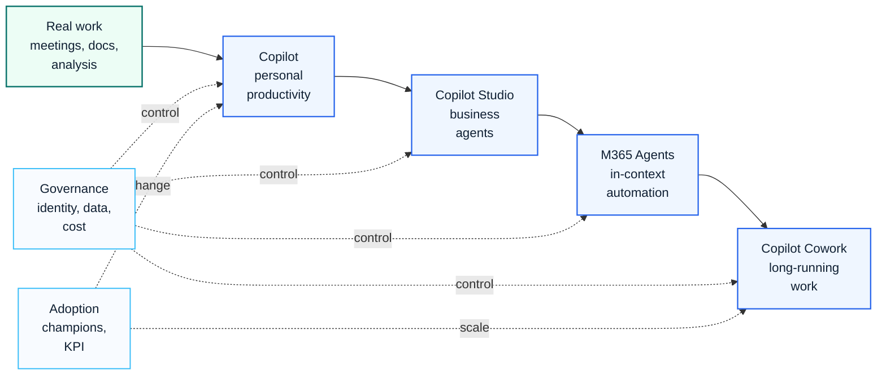

# Copilot

This Copilot section covers Microsoft 365 Copilot, Copilot Studio, AI agents and enterprise AI governance.

The focus is practical adoption: readiness, data protection, license value, use case prioritization, change management, agent lifecycle, cost control and executive decision support.

## Visual Adoption Journey

| Journey Layer | What It Means |
|---|---|
| Real work | meetings, documents, analysis, response and daily knowledge work |
| Copilot | personal productivity entry point across Microsoft 365 apps |
| Copilot Studio | governed business agents and workflow automation |
| M365 Agents | contextual task assistance inside Microsoft 365 work patterns |
| Copilot Cowork | longer-running work with approvals, cost control and ownership |
| Governance / Adoption | identity, data protection, DLP, owner model, champions, training, VOC and KPI |

## GPT-5.6 Update for Microsoft 365 Copilot

> **Update note:** Based on the July 9, 2026 Microsoft 365 Copilot update shared for review, GPT-5.6 should be treated as a reasoning-model upgrade that affects adoption design, model selection guidance and governance communication.

GPT-5.6 expands the way Microsoft 365 Copilot can support end-to-end knowledge work across Word, Excel, PowerPoint, Chat and Copilot Cowork. The practical consulting implication is not only "a better model is available." It changes how users should be guided to use Copilot for document drafting, spreadsheet analysis, presentation refinement, conversation-based reasoning and long-running agentic work.

Enterprise rollout should communicate the following points:

| Area | Planning Implication |
|---|---|
| User experience | Users may see stronger reasoning quality in writing, analysis, presentation and chat scenarios. |
| Model selection | Where available, users can select GPT-5.6 directly through the model selector depending on tenant and regional rollout status. |
| Adoption | Training should move from feature explanation to outcome scenarios such as "draft, analyze, decide and follow up." |
| Governance | Security, compliance and privacy controls remain part of the Microsoft 365 enterprise boundary. |
| Rollout | Availability can be phased by region, tenant configuration and service rollout schedule. |
| Cowork | Longer-running Copilot Cowork scenarios need owner, approval, cost and monitoring rules before scale-out. |

For adoption programs, this update should be reflected in champion training, executive demos, prompt patterns, model selection guidance and post-launch value measurement.

## 2026 Copilot Studio Update

Copilot Studio should now be treated as an enterprise agent platform, not only a chatbot builder.

The latest planning model includes new agent experience, Microsoft IQ, skills, memory, computer use, agent inventory, Microsoft Entra agent identities, agent-to-agent connectivity and Copilot Credit forecasting.

Start with [Copilot Studio 2026 Platform Update](./copilot-studio-2026-platform-update) before designing a large-scale agent program.

## 한국어 요약

Microsoft Copilot 도입은 단순히 license를 구매하고 사용자를 활성화하는 작업이 아닙니다. 성공적인 Copilot 도입을 위해서는 data readiness, permission cleanup, security policy, business scenario, user training, cost management, value measurement가 함께 설계되어야 합니다.

이 섹션은 Microsoft 365 Copilot readiness assessment, Copilot adoption strategy, Copilot Governance, Copilot Studio, AI Agent, Agent Factory, Multi-Agent Framework, Prompt Engineering, ROI measurement 같은 실무 주제를 다룹니다.

Enterprise 환경에서 Copilot은 기존 Microsoft 365 data permission을 기반으로 답변합니다. 따라서 SharePoint, Teams, OneDrive의 permission sprawl, sensitive information exposure, DLP policy, Purview label, Defender security signal을 함께 점검해야 합니다.

2026년 7월 GPT-5.6 업데이트 이후에는 "AI 기능을 켜는 것"보다 "어떤 업무에서 더 깊은 reasoning을 활용하고, 어떤 모델을 선택하며, 어떤 governance boundary 안에서 확장할 것인가"가 adoption의 핵심 질문이 됩니다.

## Copilot Adoption Model

| Phase | Key Question | Outputs |
|---|---|---|
| Readiness | Is the tenant, data and security baseline ready? | readiness report, risk log, pilot criteria |
| Use case design | Which roles and business scenarios create measurable value? | use case backlog, persona map, adoption hypothesis |
| Pilot | Can selected users validate value and support needs? | pilot plan, training assets, feedback dashboard |
| Governance | How will data, prompts, agents and licenses be controlled? | governance charter, policy, owner model |
| Scale | How will adoption expand without losing control? | rollout roadmap, KPI model, operating rhythm |

## Topics Covered

- Microsoft 365 Copilot readiness
- GPT-5.6 model selection and adoption messaging
- Copilot adoption program design
- business use case mapping
- prompt engineering guidance
- Copilot Studio and agent architecture
- AI agent operating model
- Copilot Cowork and usage-based cost governance
- ROI and value realization framework

## Recommended Reading

- [Copilot Readiness](./readiness)
- [Adoption Program](./adoption-program)
- [Business Use Cases](./business-use-cases)
- [Copilot Governance](./governance)
- [Copilot Studio 2026 Platform Update](./copilot-studio-2026-platform-update)
- [Agent Factory Operating Model](./agent-factory-operating-model)
- [Enterprise AI Agent Factory Case Study](../projects/case-study-enterprise-ai-agent-factory)
- [Copilot Cowork Cost Governance](./copilot-cowork-cost-governance)
- [Enterprise AI Adoption Program](../projects/enterprise-ai-adoption-program)

## Delivery Assets

- Copilot readiness checklist
- adoption WBS and milestone plan
- GPT-5.6 adoption message and model selection guide
- executive review pack
- use case prioritization model
- data protection and oversharing risk checklist
- agent governance checklist
- license and cost tracking model

## 검색 키워드

이 문서는 다음과 같은 검색어와 관련됩니다.

- Microsoft Copilot adoption
- Microsoft 365 Copilot readiness
- GPT-5.6 Microsoft 365 Copilot
- Copilot model selector
- Copilot Governance
- Copilot security
- Copilot Studio Agent
- AI Agent architecture
- Agent Factory operating model
- Multi-Agent Framework
- Prompt Engineering
- Copilot ROI
- Copilot license cost management

## 컨설팅 활용 사례

이 가이드는 다음과 같은 컨설팅 상황에서 활용할 수 있습니다.

- Copilot 도입 전 readiness assessment
- 임원 보고용 Copilot adoption roadmap 작성
- GPT-5.6 기반 모델 선택 및 사용자 안내 자료 정리
- 부서별 Copilot use case 발굴
- Copilot Studio 기반 business Agent 설계
- Copilot usage와 license value 측정
- 데이터 유출 위험을 줄이기 위한 Purview/DLP 연계 설계
