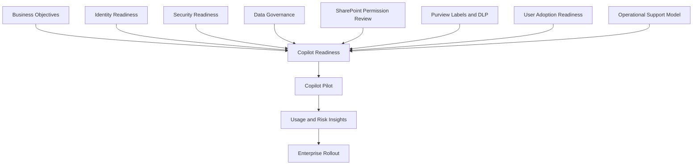
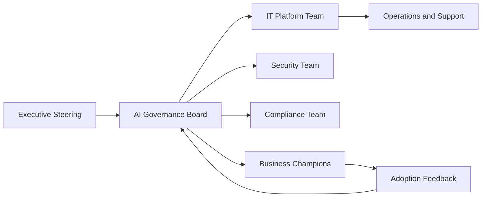
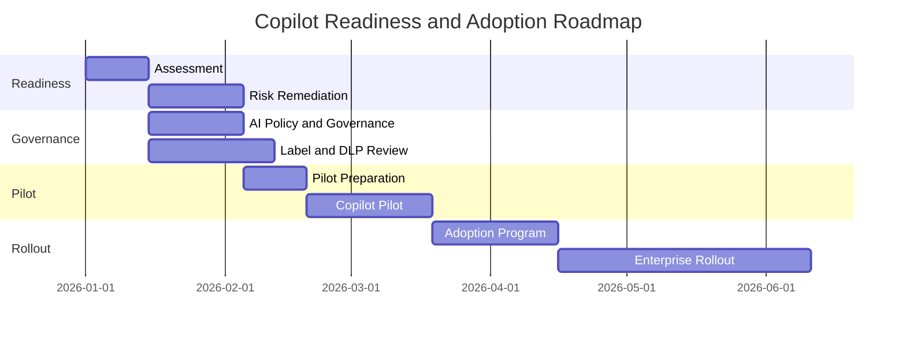

---
id: readiness
title: Copilot Readiness Assessment Framework
sidebar_label: Copilot Readiness
---

# Copilot Readiness Assessment Framework

## Executive Summary

Microsoft 365 Copilot adoption should not begin with license assignment.

Successful Copilot adoption requires readiness across identity, security, data governance, SharePoint permissions, information architecture, user adoption and operational support.

This framework provides a standardized assessment model to evaluate enterprise readiness before Copilot pilot or enterprise rollout.

---

## Readiness Architecture

---

## Assessment Domains

| Domain | Weight | Description |
|---|---:|---|
| Identity Readiness | 15% | Entra ID, MFA, Conditional Access, privileged access |
| Security Readiness | 20% | Defender, device compliance, threat protection |
| Data Readiness | 25% | SharePoint, OneDrive, Teams, permissions, content quality |
| Compliance Readiness | 15% | Purview, sensitivity labels, DLP, retention |
| Adoption Readiness | 15% | training, champions, help desk, business use cases |
| Governance Readiness | 10% | AI policy, risk management, operating model |

---

## Readiness Score Model

| Score | Readiness Level | Meaning |
|---:|---|---|
| 0-40 | Not Ready | High risk. Remediation required before pilot. |
| 41-60 | Partially Ready | Pilot possible only with limited scope and risk controls. |
| 61-80 | Ready with Improvements | Pilot recommended with targeted remediation. |
| 81-100 | Enterprise Ready | Ready for structured rollout and adoption program. |

---

## 1. Identity Readiness

### Assessment Areas

- Microsoft Entra ID configuration
- MFA coverage
- Conditional Access policy maturity
- Legacy authentication blocking
- Privileged Identity Management
- Guest access governance
- Break-glass account configuration

### Recommended Baseline

| Control Area | Recommendation |
|---|---|
| MFA | Enforce MFA for all users |
| Conditional Access | Apply risk-based and device-based access policies |
| Legacy Authentication | Block legacy authentication |
| Admin Access | Use least privilege and PIM where available |
| Guest Access | Review and govern external identities |

### Key Questions

- Are all Copilot users protected by MFA?
- Are unmanaged or non-compliant devices restricted?
- Are privileged roles reviewed regularly?
- Are guest users and external collaborators governed?

---

## 2. Security Readiness

### Assessment Areas

- Microsoft Defender deployment
- Defender for Endpoint readiness
- Defender for Office 365 readiness
- Defender XDR visibility
- Endpoint compliance
- Security operations process
- Incident response process

### Recommended Baseline

| Control Area | Recommendation |
|---|---|
| Endpoint Security | Deploy Defender for Endpoint or equivalent EDR |
| Email Security | Enable advanced anti-phishing and Safe Links / Safe Attachments where licensed |
| XDR | Centralize incident visibility |
| Device Compliance | Enforce compliant-device access for sensitive workloads |
| Monitoring | Establish incident review and escalation process |

### Key Questions

- Are target Copilot users on managed and secure devices?
- Are security alerts monitored?
- Is there a process to respond to oversharing or sensitive data exposure?
- Are high-risk users and sign-ins reviewed?

---

## 3. Data Readiness

### Assessment Areas

- SharePoint site structure
- Teams data structure
- OneDrive sharing policy
- Permission model
- External sharing
- Anonymous link usage
- Orphaned sites and ownerless Teams
- Content quality
- Duplicate and obsolete content

### Copilot Risk Focus

Copilot uses Microsoft Graph to reason over content that users already have access to.

Therefore, excessive permissions, poorly governed SharePoint sites and unmanaged sharing links can increase the risk of information exposure.

### Recommended Baseline

| Area | Recommendation |
|---|---|
| SharePoint Permissions | Review high-risk sites before rollout |
| External Sharing | Restrict based on business need and sensitivity |
| Anonymous Links | Disable or tightly control |
| Ownerless Sites | Assign accountable owners |
| Stale Content | Archive or remove obsolete content |
| Sensitive Data | Identify and classify sensitive repositories |

### Key Questions

- Do users have access to more SharePoint content than required?
- Are sensitive documents stored in broadly accessible sites?
- Are external sharing and anonymous links controlled?
- Are Teams and SharePoint owners accountable for content?

---

## 4. Compliance Readiness

### Assessment Areas

- Microsoft Purview readiness
- Sensitivity labels
- Label publishing policy
- DLP policies
- Retention policies
- Audit readiness
- eDiscovery requirements
- Regulatory requirements

### Recommended Baseline

| Control Area | Recommendation |
|---|---|
| Sensitivity Labels | Define and publish label taxonomy |
| DLP | Apply policies for sensitive information types |
| Retention | Align with business and legal requirements |
| Audit | Ensure audit log availability |
| Compliance Ownership | Assign compliance owners |

### Key Questions

- Are sensitivity labels defined and deployed?
- Are DLP policies configured for critical data types?
- Are retention and audit requirements understood?
- Are regulated data repositories identified?

---

## 5. Adoption Readiness

### Assessment Areas

- Executive sponsorship
- Target user selection
- Business use case definition
- Training program
- Prompt guidance
- Champion program
- Help desk support
- Success metrics

### Recommended Baseline

| Area | Recommendation |
|---|---|
| Executive Sponsorship | Secure visible leadership support |
| Use Cases | Define role-based and department-based scenarios |
| Training | Provide practical prompt and workflow training |
| Champions | Establish business champions by department |
| Support | Prepare help desk and FAQ process |
| Metrics | Track active usage and business outcomes |

### Key Questions

- Which business functions will use Copilot first?
- Are high-value use cases defined?
- Is there a training plan for executives, knowledge workers and champions?
- Is there a support model for user questions and adoption issues?

---

## 6. Governance Readiness

### Assessment Areas

- AI usage policy
- Responsible AI principles
- Data handling policy
- Prompt usage guidance
- Risk escalation model
- Adoption governance
- Reporting model
- Continuous improvement process

### Recommended Governance Model

### Key Questions

- Is there an AI usage policy?
- Who approves Copilot rollout scope?
- Who owns security and compliance risk decisions?
- How will feedback and risks be reported?

---

## Copilot Readiness Scorecard

| Domain | Weight | Score | Weighted Score | Key Risk |
|---|---:|---:|---:|---|
| Identity Readiness | 15% | | | |
| Security Readiness | 20% | | | |
| Data Readiness | 25% | | | |
| Compliance Readiness | 15% | | | |
| Adoption Readiness | 15% | | | |
| Governance Readiness | 10% | | | |
| **Total** | **100%** | | | |

---

## Risk Register

| ID | Risk | Impact | Mitigation |
|---|---|---|---|
| R-001 | Excessive SharePoint permissions | Sensitive information exposure | Permission review and access cleanup |
| R-002 | No sensitivity label strategy | Weak data classification | Define label taxonomy and publishing policy |
| R-003 | Weak DLP coverage | Data leakage risk | Implement priority DLP policies |
| R-004 | Low user readiness | Poor adoption and limited business value | Role-based training and champion program |
| R-005 | No AI governance model | Inconsistent usage and risk handling | Establish governance board and policy |

---

## Pilot Strategy

### Pilot Objectives

- Validate Copilot business value
- Identify data and permission risks
- Test support model
- Capture high-value use cases
- Establish adoption metrics

### Pilot User Selection

Recommended pilot group:

| User Group | Purpose |
|---|---|
| Executives | Validate decision support and meeting productivity |
| Sales / Presales | Validate proposal and customer communication use cases |
| IT | Validate technical documentation and support use cases |
| Security / Compliance | Validate risk and governance use cases |
| Business Champions | Validate department-specific adoption |

---

## Implementation Roadmap

---

## Deliverables

Copilot readiness engagement should produce:

- Current State Assessment
- Copilot Readiness Scorecard
- Risk Register
- Data and Permission Risk Summary
- Purview and DLP Readiness Review
- Pilot Strategy
- Adoption Roadmap
- Executive Briefing

---

## Executive Decision Points

Before Copilot rollout, leadership should confirm:

- Target user groups
- Security and data risk tolerance
- Required remediation scope
- Pilot timeline
- Adoption investment
- Governance ownership
- Success metrics

---

## Recommended Next Actions

1. Run Copilot readiness assessment.
2. Review SharePoint and Teams permission exposure.
3. Define sensitivity label and DLP baseline.
4. Identify pilot users and business use cases.
5. Establish AI governance and support model.
6. Execute controlled pilot before enterprise rollout.

---

## References

- Microsoft Learn
- Microsoft 365 Copilot Documentation
- Microsoft Purview Documentation
- Microsoft Entra Documentation
- Microsoft Zero Trust Guidance
- Microsoft Adoption Framework