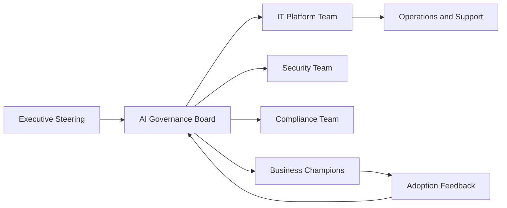
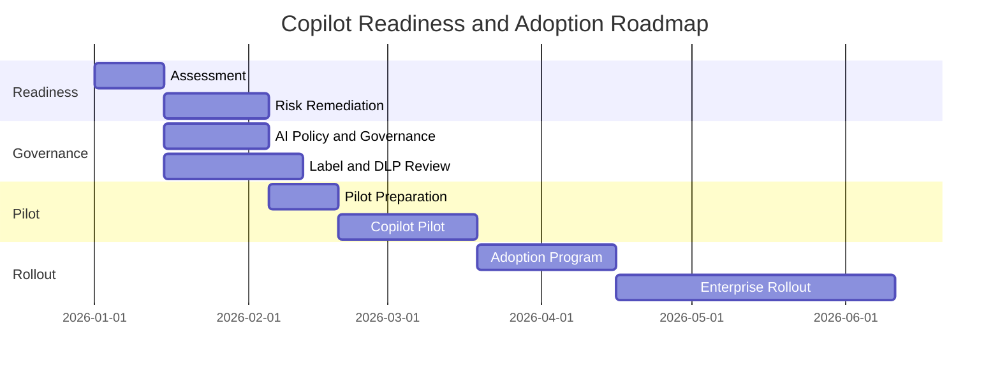

# Copilot Readiness Assessment Framework

<section class="kc-topic-hero kc-topic-hero--agent" aria-label="Copilot readiness assessment hero">
  

    Microsoft 365 Copilot Readiness
    <h2>Prove readiness before assigning licenses</h2>
    
Copilot readiness should prove that people, data and controls are ready for AI-assisted work. License assignment should follow evidence across identity, security, data governance, compliance, adoption and operating support.

    

      Identity
      Data
      Security
      Adoption
    

    

      <a class="kc-topic-button kc-topic-button--primary" href="/knowledge/copilot/adoption-program">Adoption Program</a>
      <a class="kc-topic-button" href="/knowledge/security/purview">Purview</a>
      <a class="kc-topic-button" href="/knowledge/microsoft365/sharepoint">SharePoint IA</a>
    

  

  

    

      Readiness Domains
      <strong>AI-safe rollout evidence</strong>
    

    

      <a href="#1-identity-readiness" class="kc-factory-card"><small>15%</small><strong>Identity</strong>Entra ID, MFA, Conditional Access and privileged access.</a>
      <a href="#2-security-readiness" class="kc-factory-card"><small>20%</small><strong>Security</strong>Defender, device compliance, monitoring and incident response.</a>
      <a href="#3-data-readiness" class="kc-factory-card"><small>25%</small><strong>Data</strong>SharePoint, Teams, OneDrive, permissions and content quality.</a>
      <a href="#5-adoption-readiness" class="kc-factory-card"><small>15%</small><strong>Adoption</strong>Training, champions, support, use cases and user confidence.</a>
    

    

      <strong>Readiness rule</strong>
      Do not use Copilot as a shortcut around data governance. Stronger reasoning makes clean permissions, labels and ownership more important.
    

  

</section>

## Executive Summary

Microsoft 365 Copilot adoption should not begin with license assignment.

Successful Copilot adoption requires readiness across identity, security, data governance, SharePoint permissions, information architecture, user adoption and operational support.

This framework provides a standardized assessment model to evaluate enterprise readiness before Copilot pilot or enterprise rollout.

> **Executive lens:** Copilot readiness should prove that people, data and controls are ready for AI-assisted work. License assignment should follow readiness evidence, not replace it.

---

## GPT-5.6 Readiness Addendum

GPT-5.6 raises the quality ceiling for Microsoft 365 Copilot, but it also raises the importance of readiness. Stronger reasoning can produce better documents, analysis and decisions only when the underlying data, permission model and user behavior are ready.

Add the following checks before broad communication or executive demonstrations:

| Readiness Check | Why It Matters |
|---|---|
| Model selector guidance | Users need to know when GPT-5.6 is appropriate and when standard Copilot interaction is enough. |
| Data boundary review | Stronger reasoning may combine more context, so overshared SharePoint, Teams and OneDrive content must be reviewed. |
| Prompt pattern update | Training should include reasoning tasks such as compare, synthesize, critique, plan and decide. |
| Executive demo control | Demonstrations should use sanitized data and realistic scenarios, not confidential customer files. |
| Evaluation baseline | Measure output quality, rework reduction, analysis accuracy and user trust. |
| Cowork escalation rule | Define when a request becomes long-running work that needs Copilot Cowork approval, owner and cost controls. |

The readiness question is no longer only "Can we enable Copilot?" It is "Can we safely scale AI-assisted reasoning across real business work?"

---

## Readiness Architecture

  

    Readiness Architecture
    <strong>Business objective to controlled rollout</strong>
  

  

    
<small>01</small><strong>Business Objectives</strong>Target roles, scenarios, value hypothesis and pilot scope.

    
<small>02</small><strong>Identity & Security</strong>Entra ID, Conditional Access, Defender and device controls.

    
<small>03</small><strong>Data Governance</strong>SharePoint permissions, Purview labels, DLP and content quality.

    
<small>04</small><strong>Adoption & Support</strong>Training, champions, help desk, VOC and communications.

    
<small>05</small><strong>Pilot Insights</strong>Usage, risk, quality, satisfaction and improvement backlog.

    
<small>06</small><strong>Enterprise Rollout</strong>Scaled adoption with governance, measurement and support cadence.

  

---

## Assessment Domains

| Domain | Weight | Description |
|---|---:|---|
| Identity Readiness | 15% | Entra ID, MFA, Conditional Access, privileged access |
| Security Readiness | 20% | Defender, device compliance, threat protection |
| Data Readiness | 25% | SharePoint, OneDrive, Teams, permissions, content quality |
| Compliance Readiness | 15% | Purview, sensitivity labels, DLP, retention |
| Adoption Readiness | 15% | training, champions, help desk, business use cases |
| Governance Readiness | 10% | AI policy, risk management, operating model |

---

## Readiness Score Model

| Score | Readiness Level | Meaning |
|---:|---|---|
| 0-40 | Not Ready | High risk. Remediation required before pilot. |
| 41-60 | Partially Ready | Pilot possible only with limited scope and risk controls. |
| 61-80 | Ready with Improvements | Pilot recommended with targeted remediation. |
| 81-100 | Enterprise Ready | Ready for structured rollout and adoption program. |

---

## 1. Identity Readiness

### Assessment Areas

- Microsoft Entra ID configuration
- MFA coverage
- Conditional Access policy maturity
- Legacy authentication blocking
- Privileged Identity Management
- Guest access governance
- Break-glass account configuration

### Recommended Baseline

| Control Area | Recommendation |
|---|---|
| MFA | Enforce MFA for all users |
| Conditional Access | Apply risk-based and device-based access policies |
| Legacy Authentication | Block legacy authentication |
| Admin Access | Use least privilege and PIM where available |
| Guest Access | Review and govern external identities |

### Key Questions

- Are all Copilot users protected by MFA?
- Are unmanaged or non-compliant devices restricted?
- Are privileged roles reviewed regularly?
- Are guest users and external collaborators governed?

---

## 2. Security Readiness

### Assessment Areas

- Microsoft Defender deployment
- Defender for Endpoint readiness
- Defender for Office 365 readiness
- Defender XDR visibility
- Endpoint compliance
- Security operations process
- Incident response process

### Recommended Baseline

| Control Area | Recommendation |
|---|---|
| Endpoint Security | Deploy Defender for Endpoint or equivalent EDR |
| Email Security | Enable advanced anti-phishing and Safe Links / Safe Attachments where licensed |
| XDR | Centralize incident visibility |
| Device Compliance | Enforce compliant-device access for sensitive workloads |
| Monitoring | Establish incident review and escalation process |

### Key Questions

- Are target Copilot users on managed and secure devices?
- Are security alerts monitored?
- Is there a process to respond to oversharing or sensitive data exposure?
- Are high-risk users and sign-ins reviewed?

---

## 3. Data Readiness

### Assessment Areas

- SharePoint site structure
- Teams data structure
- OneDrive sharing policy
- Permission model
- External sharing
- Anonymous link usage
- Orphaned sites and ownerless Teams
- Content quality
- Duplicate and obsolete content

### Copilot Risk Focus

Copilot uses Microsoft Graph to reason over content that users already have access to.

Therefore, excessive permissions, poorly governed SharePoint sites and unmanaged sharing links can increase the risk of information exposure.

### Recommended Baseline

| Area | Recommendation |
|---|---|
| SharePoint Permissions | Review high-risk sites before rollout |
| External Sharing | Restrict based on business need and sensitivity |
| Anonymous Links | Disable or tightly control |
| Ownerless Sites | Assign accountable owners |
| Stale Content | Archive or remove obsolete content |
| Sensitive Data | Identify and classify sensitive repositories |

### Key Questions

- Do users have access to more SharePoint content than required?
- Are sensitive documents stored in broadly accessible sites?
- Are external sharing and anonymous links controlled?
- Are Teams and SharePoint owners accountable for content?

---

## 4. Compliance Readiness

### Assessment Areas

- Microsoft Purview readiness
- Sensitivity labels
- Label publishing policy
- DLP policies
- Retention policies
- Audit readiness
- eDiscovery requirements
- Regulatory requirements

### Recommended Baseline

| Control Area | Recommendation |
|---|---|
| Sensitivity Labels | Define and publish label taxonomy |
| DLP | Apply policies for sensitive information types |
| Retention | Align with business and legal requirements |
| Audit | Ensure audit log availability |
| Compliance Ownership | Assign compliance owners |

### Key Questions

- Are sensitivity labels defined and deployed?
- Are DLP policies configured for critical data types?
- Are retention and audit requirements understood?
- Are regulated data repositories identified?

---

## 5. Adoption Readiness

### Assessment Areas

- Executive sponsorship
- Target user selection
- Business use case definition
- Training program
- Prompt guidance
- Champion program
- Help desk support
- Success metrics

### Recommended Baseline

| Area | Recommendation |
|---|---|
| Executive Sponsorship | Secure visible leadership support |
| Use Cases | Define role-based and department-based scenarios |
| Training | Provide practical prompt and workflow training |
| Champions | Establish business champions by department |
| Support | Prepare help desk and FAQ process |
| Metrics | Track active usage and business outcomes |

### Key Questions

- Which business functions will use Copilot first?
- Are high-value use cases defined?
- Is there a training plan for executives, knowledge workers and champions?
- Is there a support model for user questions and adoption issues?

---

## 6. Governance Readiness

### Assessment Areas

- AI usage policy
- Responsible AI principles
- Data handling policy
- Prompt usage guidance
- Risk escalation model
- Adoption governance
- Reporting model
- Continuous improvement process

### Recommended Governance Model

```mermaid
flowchart LR
    STEER[Executive Steering] --> GOV[AI Governance Board]
    GOV --> IT[IT Platform Team]
    GOV --> SEC[Security Team]
    GOV --> COMP[Compliance Team]
    GOV --> BIZ[Business Champions]
    IT --> OPS[Operations and Support]
    BIZ --> ADOPT[Adoption Feedback]
    ADOPT --> GOV
```

### Key Questions

- Is there an AI usage policy?
- Who approves Copilot rollout scope?
- Who owns security and compliance risk decisions?
- How will feedback and risks be reported?

---

## Copilot Readiness Scorecard

| Domain | Weight | Score | Weighted Score | Key Risk |
|---|---:|---:|---:|---|
| Identity Readiness | 15% | | | |
| Security Readiness | 20% | | | |
| Data Readiness | 25% | | | |
| Compliance Readiness | 15% | | | |
| Adoption Readiness | 15% | | | |
| Governance Readiness | 10% | | | |
| **Total** | **100%** | | | |

---

## Risk Register

| ID | Risk | Impact | Mitigation |
|---|---|---|---|
| R-001 | Excessive SharePoint permissions | Sensitive information exposure | Permission review and access cleanup |
| R-002 | No sensitivity label strategy | Weak data classification | Define label taxonomy and publishing policy |
| R-003 | Weak DLP coverage | Data leakage risk | Implement priority DLP policies |
| R-004 | Low user readiness | Poor adoption and limited business value | Role-based training and champion program |
| R-005 | No AI governance model | Inconsistent usage and risk handling | Establish governance board and policy |

---

## Pilot Strategy

### Pilot Objectives

- Validate Copilot business value
- Identify data and permission risks
- Test support model
- Capture high-value use cases
- Establish adoption metrics

### Pilot User Selection

Recommended pilot group:

| User Group | Purpose |
|---|---|
| Executives | Validate decision support and meeting productivity |
| Sales / Presales | Validate proposal and customer communication use cases |
| IT | Validate technical documentation and support use cases |
| Security / Compliance | Validate risk and governance use cases |
| Business Champions | Validate department-specific adoption |

---

## Implementation Roadmap

```mermaid
gantt
    title Copilot Readiness and Adoption Roadmap
    dateFormat  YYYY-MM-DD
    section Readiness
    Assessment               :a1, 2026-01-01, 2w
    Risk Remediation          :a2, after a1, 3w
    section Governance
    AI Policy and Governance  :b1, after a1, 3w
    Label and DLP Review      :b2, after a1, 4w
    section Pilot
    Pilot Preparation         :c1, after a2, 2w
    Copilot Pilot             :c2, after c1, 4w
    section Rollout
    Adoption Program          :d1, after c2, 4w
    Enterprise Rollout        :d2, after d1, 8w
```

---

## Deliverables

Copilot readiness engagement should produce:

- Current State Assessment
- Copilot Readiness Scorecard
- Risk Register
- Data and Permission Risk Summary
- Purview and DLP Readiness Review
- Pilot Strategy
- Adoption Roadmap
- Executive Briefing

---

## Executive Decision Points

Before Copilot rollout, leadership should confirm:

- Target user groups
- Security and data risk tolerance
- Required remediation scope
- Pilot timeline
- Adoption investment
- Governance ownership
- Success metrics

---

## Recommended Next Actions

1. Run Copilot readiness assessment.
2. Review SharePoint and Teams permission exposure.
3. Define sensitivity label and DLP baseline.
4. Identify pilot users and business use cases.
5. Establish AI governance and support model.
6. Execute controlled pilot before enterprise rollout.

---

## References

- Microsoft Learn
- Microsoft 365 Copilot Documentation
- Microsoft Purview Documentation
- Microsoft Entra Documentation
- Microsoft Zero Trust Guidance
- Microsoft Adoption Framework

## 검색 키워드

- Microsoft 365 Copilot
- Copilot Studio
- AI Agent governance
- Copilot adoption
- Copilot readiness
- Copilot 도입
- AI Agent 운영 모델

## Contact / Asset Request

For Copilot readiness workbooks, adoption roadmaps, agent governance templates, prompt libraries or executive AI value materials, use [Contact and Asset Request](../contact).
