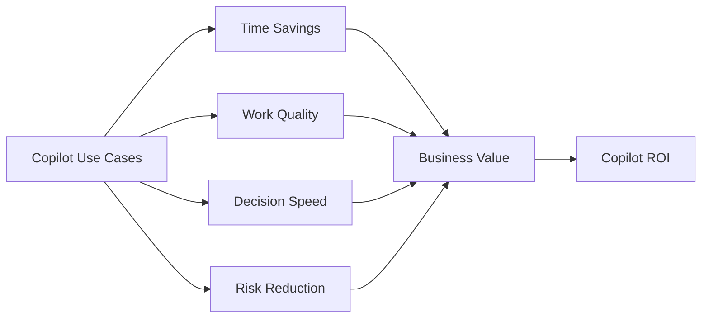

# Copilot ROI Framework

## Executive Summary

Microsoft 365 Copilot adoption should be measured through business outcomes, not only license assignment or active usage.

This framework helps organizations define measurable value across productivity, quality, risk reduction, adoption maturity and operational efficiency.

---

## 한국어 요약

Copilot ROI는 license 배정 수나 active user만으로 판단하면 부족합니다. 실제 가치는 회의, 이메일, 문서 작성, 보고, 분석, 제안, 고객 커뮤니케이션 같은 업무 흐름에서 시간이 줄고 품질이 높아지며 반복 가능한 use case가 만들어질 때 확인됩니다.

이 framework는 Copilot 도입을 “사용률 보고”가 아니라 “business value realization”으로 관리하기 위한 측정 모델입니다. 특히 pilot 단계부터 baseline, role별 use case, adoption signal, governance signal을 같이 잡아야 executive review에서 설득력이 생깁니다.

---

## ROI Measurement Domains

| Domain | Measurement Focus |
|---|---|
| Productivity | Time saved in meetings, email, document creation and analysis |
| Quality | Better executive summaries, proposals, reports and customer communication |
| Adoption | Active usage, repeat usage, champion engagement and use case maturity |
| Governance | Data protection, responsible AI usage and policy compliance |
| Operations | Reduced manual effort in support, reporting and knowledge work |

---

## Core Metrics

- Copilot active users
- Weekly repeat users
- High-value use cases by department
- Hours saved per role
- Proposal or report creation time reduction
- Meeting follow-up automation rate
- User satisfaction and confidence score
- Security and compliance issue reduction

---

## Baseline Measurement

Before measuring Copilot value, define the current baseline.

| Work Pattern | Baseline Question | Example Measurement |
|---|---|---|
| Meetings | How much time is spent preparing, summarizing and following up? | minutes per meeting, follow-up completion time |
| Email | How much effort is spent drafting, summarizing and responding? | average drafting time, response cycle time |
| Documents | How long does it take to create reports, proposals or executive summaries? | document creation time, review cycle count |
| Analysis | How often do users repeat data analysis or explanation work? | analyst hours, repeated request volume |
| Knowledge work | How quickly can users find and reuse internal knowledge? | search time, duplicate work reduction |

---

## Value Model

---

## Recommended Approach

1. Define business scenarios before pilot launch.
2. Group users by role and work pattern.
3. Measure baseline effort before Copilot usage.
4. Track adoption and outcome metrics during pilot.
5. Convert measurable time savings and quality improvements into business value.
6. Review governance and risk signals before enterprise rollout.

---

## Pilot Scorecard

| Scorecard Area | What To Track | Why It Matters |
|---|---|---|
| Adoption | enabled users, active users, repeat users and champion participation | shows whether Copilot becomes a real work habit |
| Use Case Value | high-value scenarios completed by department | connects usage to business outcomes |
| Time Savings | estimated minutes or hours saved by role | supports ROI discussion |
| Quality | review rework, summary quality, proposal quality and user confidence | prevents ROI from being reduced to time only |
| Governance | oversharing findings, DLP events, risky usage and training completion | confirms scale-out readiness |
| Operating Model | owner, cadence, backlog and training content maturity | proves the program can continue after pilot |

---

## Executive Decision Points

- Which departments create the highest value from Copilot?
- Which use cases should become standard operating practices?
- What governance controls are required before scale-out?
- What training or prompt guidance is needed to increase repeat usage?
- How will ROI be reported to leadership?

---

## Anonymized Success Pattern

In manufacturing, professional services and enterprise group environments, the strongest Copilot ROI cases usually start with a small number of measurable role-based scenarios rather than a broad generic rollout.

Examples include executive meeting follow-up, proposal drafting support, report summarization, Excel analysis assistance, policy Q&A and project status reporting. These scenarios are easier to measure because they have clear baseline effort, visible output quality and defined user groups.

---

## 검색 키워드

- Microsoft 365 Copilot ROI
- Copilot value realization
- Copilot adoption metrics
- Copilot pilot scorecard
- Copilot productivity measurement
- Copilot ROI framework
- Copilot 도입 효과
- Copilot 사용률 측정
- Copilot 가치 측정

---

## Related Documents

- [Copilot Overview](./overview)
- [Copilot Adoption Program](./adoption-program)
- [Copilot Readiness](./readiness)
- [Copilot Governance](./governance)
- [Enterprise AI Adoption Program](../projects/enterprise-ai-adoption-program)

---

## References

- Microsoft 365 Copilot adoption guidance
- Microsoft Viva and adoption measurement practices
- Microsoft Purview and responsible AI governance guidance
