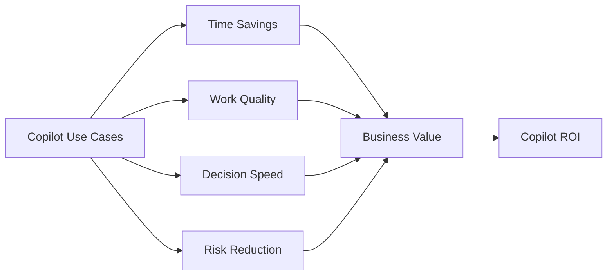

# Copilot ROI Framework

## Executive Summary

Microsoft 365 Copilot adoption should be measured through business outcomes, not only license assignment or active usage.

This framework helps organizations define measurable value across productivity, quality, risk reduction, adoption maturity and operational efficiency.

---

## ROI Measurement Domains

| Domain | Measurement Focus |
|---|---|
| Productivity | Time saved in meetings, email, document creation and analysis |
| Quality | Better executive summaries, proposals, reports and customer communication |
| Adoption | Active usage, repeat usage, champion engagement and use case maturity |
| Governance | Data protection, responsible AI usage and policy compliance |
| Operations | Reduced manual effort in support, reporting and knowledge work |

---

## Core Metrics

- Copilot active users
- Weekly repeat users
- High-value use cases by department
- Hours saved per role
- Proposal or report creation time reduction
- Meeting follow-up automation rate
- User satisfaction and confidence score
- Security and compliance issue reduction

---

## Value Model

---

## Recommended Approach

1. Define business scenarios before pilot launch.
2. Group users by role and work pattern.
3. Measure baseline effort before Copilot usage.
4. Track adoption and outcome metrics during pilot.
5. Convert measurable time savings and quality improvements into business value.
6. Review governance and risk signals before enterprise rollout.

---

## Executive Decision Points

- Which departments create the highest value from Copilot?
- Which use cases should become standard operating practices?
- What governance controls are required before scale-out?
- What training or prompt guidance is needed to increase repeat usage?
- How will ROI be reported to leadership?

---

## References

- Microsoft 365 Copilot adoption guidance
- Microsoft Viva and adoption measurement practices
- Microsoft Purview and responsible AI governance guidance
