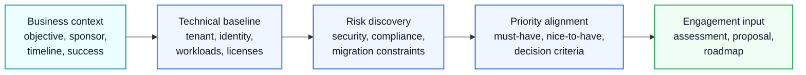

# Discovery Questionnaire

## Executive Summary

This questionnaire is used during discovery workshops for Microsoft 365, Azure, Security, Copilot and migration engagements.

The objective is to capture business context, technical environment, risks, constraints and success criteria before proposal, assessment or implementation planning.

---

## 1. Business Context

- What is the primary business objective?
- What business problem are you trying to solve?
- Who is the executive sponsor?
- Which departments are impacted?
- What is the target timeline?
- Are there budget constraints?
- What does project success look like?

---

## 2. Current Microsoft 365 Environment

- Current Microsoft 365 licenses?
- Total number of users?
- Number of frontline users?
- Current tenant structure?
- Current domain structure?
- Any hybrid configuration?
- Any third-party security or collaboration tools?

---

## 3. Identity and Access

- Is Microsoft Entra ID currently used?
- Is MFA enabled for all users?
- Are Conditional Access policies configured?
- Are guest users allowed?
- Are privileged roles reviewed regularly?
- Is PIM currently used?
- Are break-glass accounts configured?

---

## 4. Exchange Online

- Is email already on Exchange Online?
- Are there on-premises Exchange servers?
- Are shared mailboxes used?
- Are distribution groups used?
- Are SMTP relay dependencies present?
- Is external forwarding allowed?
- Are SPF, DKIM and DMARC configured?

---

## 5. Teams

- Is Teams used as the primary collaboration platform?
- Who can create Teams?
- Is guest access enabled?
- Is external access enabled?
- Are Teams lifecycle policies defined?
- Are inactive Teams reviewed?
- Are private or shared channels used?

---

## 6. SharePoint and OneDrive

- Is SharePoint used for document management?
- Are legacy file servers or NAS still used?
- Is external sharing enabled?
- Are anonymous links allowed?
- Are permissions reviewed regularly?
- Is metadata used?
- Is there a document lifecycle policy?

---

## 7. Security

- Is Microsoft Defender used?
- Is Defender for Endpoint deployed?
- Is Defender for Office 365 deployed?
- Is Microsoft Secure Score reviewed?
- Are security incidents monitored?
- Is there a SOC process?
- Are endpoint devices managed?

---

## 8. Compliance and Data Protection

- Is Microsoft Purview used?
- Are sensitivity labels deployed?
- Are DLP policies configured?
- Are retention policies configured?
- Are audit logs reviewed?
- Are there regulatory requirements?
- Are there data residency requirements?

---

## 9. Copilot Readiness

- Is Microsoft 365 Copilot planned?
- Which users are target users?
- Are SharePoint permissions reviewed?
- Are sensitive documents classified?
- Is there an AI governance policy?
- Is there a user training plan?
- Is there a champion program?

---

## 10. Migration

- What is the source environment?
- What workloads need migration?
- How much data needs migration?
- Are there domain dependencies?
- Are there coexistence requirements?
- Are there blackout periods?
- Is executive user migration required?

---

## 11. Operations

- Who operates Microsoft 365 today?
- Is there an internal help desk?
- Are standard operating procedures documented?
- Are change management processes defined?
- Are admin roles clearly assigned?
- Is reporting required?

---

## 12. Risks and Constraints

- Known technical risks?
- Known business risks?
- Security concerns?
- Compliance concerns?
- Timeline constraints?
- Resource constraints?
- User resistance concerns?

---

## Expected Output

The questionnaire should support creation of:

- Discovery Summary
- Current State Assessment
- Risk Register
- Scope Definition
- SOW
- WBS
- Roadmap
- Executive Summary
