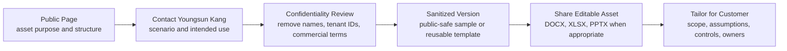
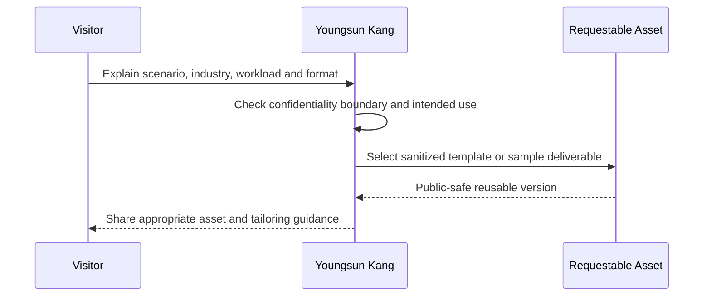

# Downloads Center

The Downloads Center organizes reusable consulting assets that can support presales, assessment, architecture, delivery and operational handover.

The public pages describe the structure and purpose of each asset. Customer-specific versions, editable templates and delivery-ready documents are intentionally not posted publicly because they may require context, tailoring and confidentiality review.

For access to reusable templates or sample deliverables, contact **Youngsun Kang** through [Contact and Asset Request](../contact). The documents can be shared after confirming the intended use case, customer context and confidentiality boundary.

  

    <small>REQUEST JOURNEY</small>
    <strong>Public description first, editable asset after context review</strong>
    The site explains asset purpose and structure. Editable DOCX, XLSX or PPTX files are shared only after confirming scenario, audience and confidentiality boundary.
  

  

    <small>01</small>
    <strong>Preview</strong>
    Review the public-safe page to understand the asset structure and consulting use case.
  

  

    <small>02</small>
    <strong>Request</strong>
    Contact Youngsun Kang with the industry, workload, scenario and desired output format.
  

  

    <small>03</small>
    <strong>Tailor</strong>
    Use the sanitized asset as a starting point, then adapt scope, owners and assumptions.
  

  

    <strong>Requestable Asset Catalog</strong>
    Public description first, editable document after contact and confidentiality review
  

  

    <a class="kc-asset-card" href="./m365-assessment-workbook">
      <small>ASSESSMENT</small>
      <strong>M365 Assessment Workbook</strong>
      Tenant, security, endpoint, migration and governance readiness workbook.
      <em>Editable by request</em>
    </a>
    <a class="kc-asset-card" href="../copilot/readiness">
      <small>COPILOT</small>
      <strong>Copilot Readiness Pack</strong>
      Data readiness, security readiness, use case priority and adoption planning.
      <em>Sanitized sample</em>
    </a>
    <a class="kc-asset-card" href="../copilot/agent-factory-operating-model">
      <small>AI AGENT</small>
      <strong>Agent Factory Model</strong>
      Agent portfolio governance, owner model, lifecycle and operating cadence.
      <em>Template by request</em>
    </a>
    <a class="kc-asset-card" href="./downloads-sow-template">
      <small>PROPOSAL</small>
      <strong>SOW Template</strong>
      Scope, deliverables, assumptions, exclusions and acceptance structure.
      <em>DOCX by request</em>
    </a>
    <a class="kc-asset-card" href="./downloads-wbs-template">
      <small>DELIVERY</small>
      <strong>WBS Template</strong>
      Workstream, activity, owner, milestone and dependency planning model.
      <em>XLSX by request</em>
    </a>
    <a class="kc-asset-card" href="../contact">
      <small>REQUEST</small>
      <strong>Contact Youngsun Kang</strong>
      Share the scenario, industry, workload and preferred output format.
      <em>Start request</em>
    </a>
  

## Public-to-Private Sharing Model

## Sharing Policy

| Asset Type | Public Site | Shared After Contact |
|---|---|---|
| Methodology overview | Available | Available |
| Template structure | Available | Available |
| Editable DOCX/XLSX/PPTX files | Not public | Available when appropriate |
| Customer-specific deliverables | Not public | Sanitized version only |
| Pricing, commercial terms or named references | Not public | Case-by-case review |

This approach keeps the Knowledge Center useful while avoiding accidental exposure of customer names, commercial details or internal delivery artifacts.

## Confidentiality Guardrails

The Downloads Center follows a public-safe sharing model.

| Guardrail | Rule |
|---|---|
| Customer identity | customer names, tenant names, project code names and named references are not published |
| Architecture details | tenant IDs, domains, IP ranges, policy IDs, security exceptions and internal diagrams are removed |
| Commercial information | pricing, discount, contract terms and internal cost assumptions are not posted publicly |
| Editable files | DOCX, XLSX and PPTX versions are shared only after confirming the intended use case |
| Reusable patterns | public pages describe structure, decision logic and sanitized examples |

If a document is shared externally, it should be sanitized first and reviewed against the intended audience.

## Asset Categories

| Category | Purpose | Typical Use |
|---|---|---|
| Discovery | capture business, tenant, security and migration requirements | assessment workshops and presales discovery |
| Assessment | evaluate readiness, risk, scope and dependencies | M365, Copilot, security and migration planning |
| Proposal | structure executive summary, SOW, WBS, timeline and risk | presales and delivery planning |
| Security | document controls, exceptions and approval evidence | regulated SaaS and Microsoft 365 security review |
| Migration | define source inventory, batch plan, cutover and rollback | Exchange, Google Workspace, file server and tenant migration |
| Governance | define owner model, policy workbook and operating rhythm | post-deployment operation and handover |

## Requestable Asset Catalog

The following assets are intentionally described publicly but shared only after contact. This protects customer confidentiality while still showing the practical structure of the Knowledge Center.

| Asset | What It Helps With | Public Sharing Position |
|---|---|---|
| Copilot Readiness Workbook | data readiness, security readiness, use case prioritization and adoption planning | description public, editable workbook by request |
| Agent Factory Operating Model Template | Copilot Studio and AI Agent portfolio governance, ownership and lifecycle model | description public, sanitized template by request |
| Microsoft 365 Security Baseline Checklist | MFA, Conditional Access, Defender, Purview, Intune and admin role review | checklist structure public, editable version by request |
| Exchange Online Security Review Template | mail flow, authentication, anti-phishing, transport rule and external sender review | methodology public, customer-ready version by request |
| Migration Pre-Assessment Checklist | source inventory, identity, coexistence, cutover and rollback planning | structure public, workbook by request |
| SOW / WBS / Risk Register Templates | proposal scope, timeline, workstream, assumption and risk alignment | sample structure public, editable files by request |
| Executive Steering Committee Template | executive status, decision log, issue escalation and value tracking | format described publicly, template by request |

## Recommended Assets

- [Discovery Questionnaire](./discovery-questionnaire)
- [M365 Assessment Workbook](./m365-assessment-workbook)
- [SOW Template](./downloads-sow-template)
- [WBS Template](./downloads-wbs-template)
- [Risk Register Template](./risk-register-template)

## Request Flow

1. Review the public asset pattern.
2. Identify the scenario: Microsoft 365, Security, Copilot, Azure, Migration or Proposal.
3. Contact Youngsun Kang through [Contact and Asset Request](../contact) with the intended use case.
4. Receive a sanitized or reusable version where appropriate.
5. Tailor the document to the customer environment before use.

## Request Triage Matrix

| Request Situation | Recommended Asset | Review Before Sharing |
|---|---|---|
| early presales discussion | discovery questionnaire and executive summary structure | remove customer names and commercial assumptions |
| technical assessment workshop | assessment workbook and control checklist | confirm target workload, scope and audience |
| Copilot or AI Agent planning | Copilot readiness workbook and Agent Factory template | confirm data readiness, governance owner and risk boundary |
| migration planning | migration pre-assessment, cutover and rollback checklist | remove tenant details and migration wave names |
| executive steering review | status template, decision log and risk register | sanitize issues, owners and internal escalations |

## Contact Path

When requesting documents, include the intended scenario, customer industry, target Microsoft workload and preferred output format. Customer names, commercial details and confidential project information are not required for the first request.

Start here: [Contact and Asset Request](../contact)

## Quality Standard

Requestable assets should be usable in real consulting work. A strong asset should include:

- business context and target audience
- scope and out-of-scope boundary
- required inputs and assumptions
- decision criteria or acceptance criteria
- owner, reviewer and approval model
- risk, dependency and follow-up section
- public-safe version and customer-specific editable version separation

## Field-Informed Download Ideas

These are recommended next additions based on recurring delivery patterns:

- Copilot readiness workbook
- Copilot adoption WBS
- Microsoft 365 security baseline checklist
- Exchange Online security review template
- Entra ID and Intune policy matrix
- Migration pre-assessment checklist
- Cutover and rollback runbook
- Executive steering committee status template

## 검색 키워드

- Microsoft 365 template
- Copilot readiness workbook
- Agent Factory template
- Microsoft 365 SOW template
- Microsoft 365 WBS template
- risk register template
- migration checklist
- security baseline checklist
- Microsoft 365 제안서 산출물
