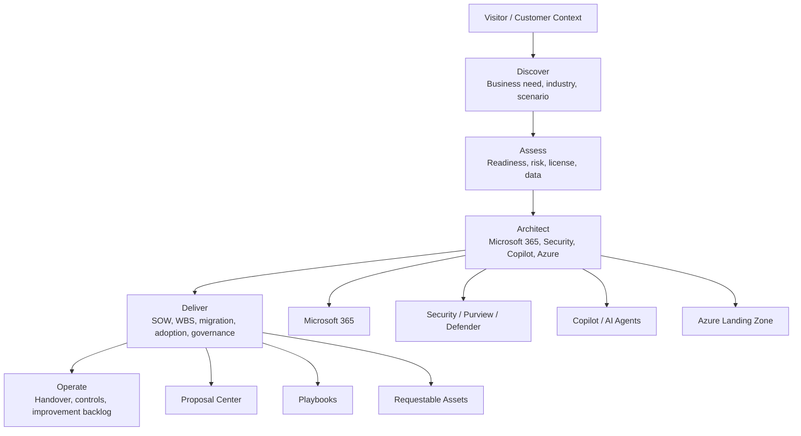
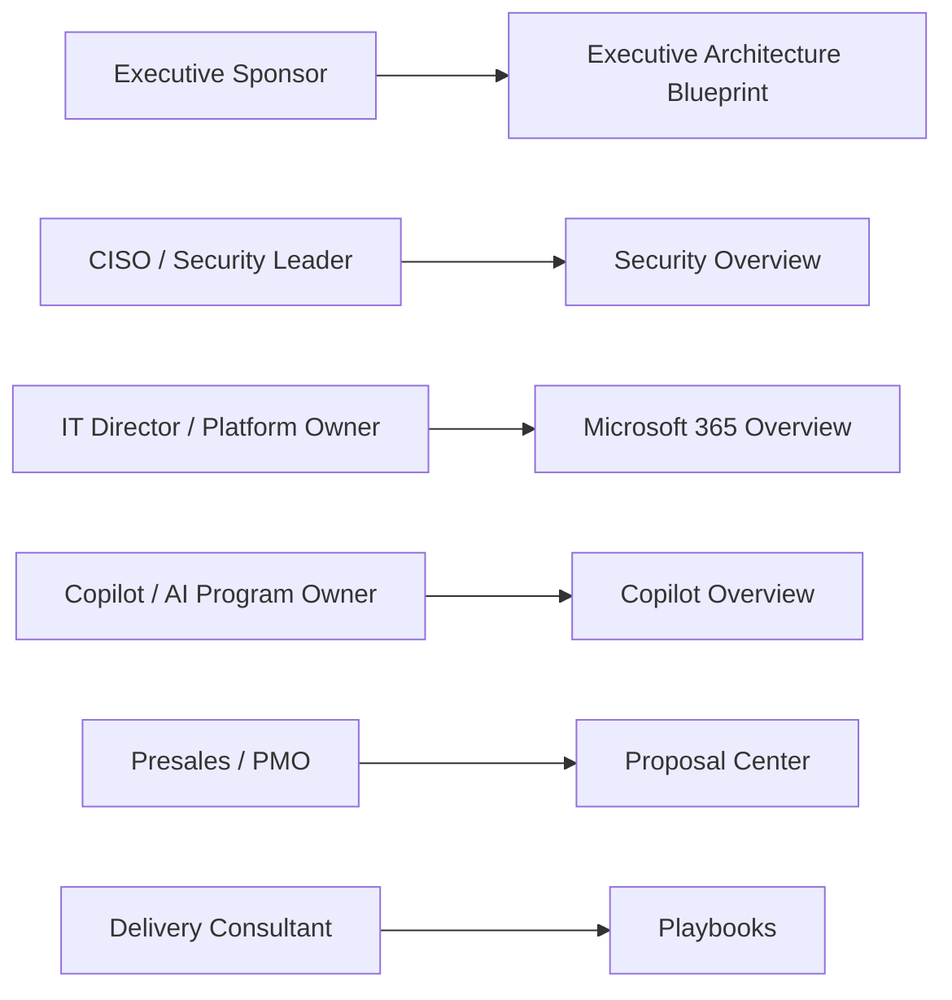

# Enterprise Microsoft Knowledge Center

This site is a practical Microsoft Enterprise Knowledge Center for architecture, presales, delivery and governance work.

It is designed for Microsoft 365, Security, Copilot, Azure, AI agent and migration scenarios where enterprise customers need more than product documentation. The goal is to connect field-tested consulting patterns with reusable assets that support assessment, architecture, proposal, implementation and operational handover.

## Platform Map

The Knowledge Center is organized as a consulting platform, not a flat document archive.

## Who This Is For

- Enterprise architects designing Microsoft cloud platforms
- Microsoft 365 and security consultants preparing assessments or proposals
- Presales teams building SOW, WBS, risk and executive materials
- Delivery teams planning migration, adoption and governance workstreams
- Leaders evaluating Copilot, AI agents and secure modern work adoption

## Knowledge Areas

| Area | What It Covers |
|---|---|
| Microsoft 365 | tenant, Exchange Online, Teams, SharePoint, OneDrive and collaboration governance |
| Security | Zero Trust, Conditional Access, Defender, Purview, DLP and compliance readiness |
| Copilot | readiness, adoption, use cases, AI governance, cost control and value tracking |
| Azure | landing zone, identity, network, workload and cost architecture |
| Migration | Google Workspace, Exchange, file server, tenant and collaboration migration |
| Proposal Center | executive summary, SOW, WBS, risk register and timeline structure |
| Toolkit | assessment checklist, architecture builder, migration checklist and prompt assets |
| Projects | anonymized customer success patterns and reusable field lessons |

## Recommended Paths

### Start Here By Role

| Visitor | Best First Page | Why |
|---|---|---|
| CIO / Executive Sponsor | [Executive Architecture Blueprint](./architecture/executive-architecture-blueprint) | connects Microsoft cloud architecture to business value, risk and roadmap decisions |
| CISO / Security Leader | [Security](./security/overview) | starts with Zero Trust, Defender, Purview, Conditional Access and risk governance |
| IT Director / Platform Owner | [Microsoft 365](./microsoft365/overview) | reviews tenant, collaboration, endpoint, identity and operations decisions |
| Copilot / AI Program Owner | [Copilot](./copilot/overview) | connects Copilot readiness, adoption, governance, ROI and AI Agent architecture |
| Presales / PMO | [Proposal Center](./proposal/overview) | organizes executive summary, SOW, WBS, risk, timeline and governance materials |
| Delivery Consultant | [Playbooks](./playbooks/overview) | provides repeatable execution patterns for assessment, migration, security and adoption |

### For Architecture Review

Start with [Architecture](./architecture/overview), then review [Security](./security/overview), [Microsoft 365](./microsoft365/overview) and [Azure](./azure/overview).

### For Copilot or AI Adoption

Start with [Copilot](./copilot/overview), then review [Copilot Readiness](./copilot/readiness), [Copilot Governance](./copilot/governance), [AI Agent Architecture](./copilot/agentic-ai-architecture) and [Customer Success Reference Patterns](./projects/customer-success-reference-patterns).

### For Presales and Delivery

Start with [Proposal Center](./proposal/overview), then use [Toolkit](./toolkit/overview), [Downloads](./downloads/overview) and [Playbooks](./playbooks/overview).

### For Migration Planning

Start with [Migration](./migration/overview), then review Google Workspace, tenant-to-tenant, file server and cross-tenant planning guidance.

## Operating Principle

Every section is intended to answer four questions:

1. What business problem does this solve?
2. What Microsoft capabilities are involved?
3. What architecture or governance decisions are required?
4. What reusable assets can help deliver the work?

## Public-Safe Knowledge Principle

The Knowledge Center is designed to be publicly shareable. Customer names, tenant IDs, project code names, commercial terms and customer-specific architecture details are not published.

Customer success examples are intentionally anonymized by industry, scenario and delivery pattern. Editable templates and customer-ready deliverables can be requested through [Contact and Asset Request](./contact) after confirming the use case and confidentiality boundary.
