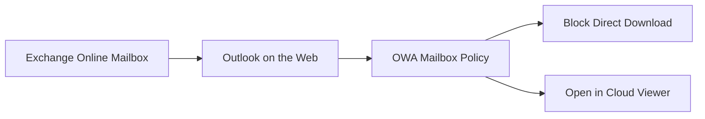

# Exchange Online Attachment Download Restriction

## Executive Summary

This guide describes how to restrict users from directly downloading email attachments from Outlook on the web and guide them to open files through a safer cloud-based experience.

This control is useful when organizations want to reduce the risk of malicious attachments being downloaded directly to unmanaged or vulnerable endpoints.

---

## Business Scenario

Organizations often receive attachments through email from external senders.

Direct local download may introduce risks such as:

- Malware execution
- Data leakage
- Uncontrolled local file storage
- Endpoint infection
- Unmanaged file transfer

A safer approach is to restrict direct attachment download and encourage users to open files through OneDrive or browser-based preview where security controls can be applied.

---

## Target Use Cases

| Use Case | Description |
|---|---|
| Unmanaged device access | Prevent local download from browser sessions |
| High-risk users | Restrict attachment handling for selected users |
| External attachment risk | Reduce malicious file exposure |
| Secure collaboration | Encourage cloud-based file access |

---

## Architecture



---

## Configuration Concept

Exchange Online can control Outlook on the web behavior through OWA mailbox policies.

The recommended design is:

1. Identify target user group.
2. Review current OWA mailbox policies.
3. Create or modify an OWA mailbox policy.
4. Disable direct file access where required.
5. Assign the policy to target users.
6. Validate attachment behavior.

---

## PowerShell Validation

Administrators should first review existing OWA mailbox policies.

```powershell
Get-OwaMailboxPolicy | Select-Object Identity
```

Review target policy settings before changing production configuration.

---

## Recommended Implementation Steps

| Step | Activity |
|---|---|
| 1 | Review business requirement |
| 2 | Identify target users or groups |
| 3 | Review current OWA mailbox policy |
| 4 | Create dedicated policy if required |
| 5 | Configure attachment access settings |
| 6 | Assign policy to pilot users |
| 7 | Validate attachment open/download behavior |
| 8 | Expand deployment after pilot |

---

## Operational Considerations

| Area | Consideration |
|---|---|
| User Experience | Users may experience different attachment behavior in Outlook on the web |
| Scope | Apply policy to pilot group before broad rollout |
| Support | Help desk should understand expected behavior |
| Exceptions | Executive or business-critical exceptions may be required |
| Security Review | Validate with Defender for Office 365 and DLP policies |

---

## Validation Checklist

- OWA mailbox policy applied
- Target users assigned correctly
- Attachment download behavior validated
- OneDrive or browser preview behavior validated
- Exception users tested
- Help desk guide prepared

---

## Risk and Mitigation

| Risk | Impact | Mitigation |
|---|---|---|
| User confusion | Support tickets increase | Provide user communication |
| Business process impact | Users cannot download required files | Define exception process |
| Wrong policy assignment | Unexpected access restriction | Pilot before full deployment |
| Inconsistent client behavior | Different Outlook clients behave differently | Document supported scope |

---

## Recommended Deliverables

- OWA Policy Design
- Target User List
- Pilot Validation Result
- Exception Process
- User Communication Guide
- Help Desk Runbook

---

## References

- Exchange Online PowerShell
- Outlook on the web mailbox policy
- Microsoft Defender for Office 365
- Microsoft Purview Data Loss Prevention