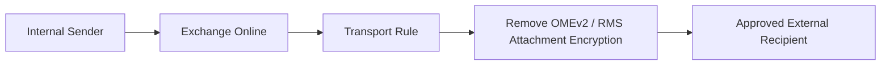

# Exchange Online OMEv2 and RMS Attachment Decryption Rule

## Executive Summary

This guide describes how Exchange Online transport rules can be used to remove OMEv2 protection and RMS attachment encryption for specific outbound mail scenarios.

This configuration should be used carefully because it can remove encryption protection from sensitive documents.

---

## Business Scenario

Organizations may need to remove encryption from specific outbound messages when:

- A trusted external recipient cannot open protected files
- A business process requires recipient-side labeling
- Inter-company collaboration requires file reclassification
- A controlled exception is approved by security or compliance

---

## Important Warning

Removing encryption from email or attachments can increase data leakage risk.

This should only be used with:

- Approved recipients
- Narrow sender/recipient scope
- Legal or compliance approval
- Audit review
- Periodic policy review

---

## Architecture



---

## Control Scope

| Control | Recommendation |
|---|---|
| Recipient Scope | Limit to approved recipients or domains |
| Sender Scope | Restrict to internal users or specific groups |
| Rule Condition | Use clear and auditable conditions |
| Rule Action | Remove OMEv2 and RMS attachment encryption |
| Review | Review periodically with security team |

---

## Example PowerShell Pattern

Connect to Exchange Online.

```powershell
Import-Module ExchangeOnlineManagement
Connect-ExchangeOnline
```

Create a transport rule for a specific approved recipient scenario.

```powershell
New-TransportRule `
  -Name "Remove OMEv2 for Approved External Recipient" `
  -SentTo "<approved-recipient@domain.com>" `
  -FromScope InOrganization `
  -RemoveOMEv2 $true
```

Enable RMS attachment encryption removal.

```powershell
Set-TransportRule `
  "Remove OMEv2 for Approved External Recipient" `
  -RemoveRMSAttachmentEncryption $true
```

---

## Validation

Validate with test messages:

| Test | Expected Result |
|---|---|
| Approved recipient | Attachment can be opened without original encryption |
| Non-approved recipient | Encryption remains enforced |
| Internal recipient | Rule behavior follows defined condition |
| Audit review | Rule execution can be reviewed |

---

## Governance Requirements

| Area | Requirement |
|---|---|
| Data Protection | Confirm sensitivity and business justification |
| Recipient Validation | Confirm external recipient is trusted |
| Audit | Maintain transport rule change history |
| Exception Review | Review exception periodically |
| Risk Acceptance | Capture business approval |

---

## Risk and Mitigation

| Risk | Impact | Mitigation |
|---|---|---|
| Overly broad rule | Sensitive data exposed | Limit recipient and sender scope |
| No approval | Compliance violation | Require formal exception approval |
| Recipient misuse | Data leakage | Use trusted recipients only |
| Forgotten exception | Long-term exposure | Review rules periodically |

---

## Recommended Deliverables

- Encryption Exception Request
- Transport Rule Design
- Approved Recipient List
- Security Approval
- Test Evidence
- Review Schedule

---

## References

- Exchange Online Transport Rules
- Office Message Encryption
- Microsoft Purview Information Protection
- RMS Attachment Encryption