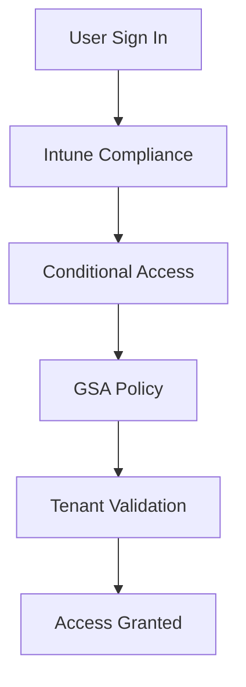

# Global Secure Access Whitelist Design

## Executive Summary

This document describes how Microsoft Global Secure Access (GSA) can be used to enforce tenant restrictions, corporate access controls and Microsoft 365 application restrictions.

The objective is to ensure that users access only approved corporate tenants and applications from managed devices.

---

# Business Scenario

Organizations frequently face challenges such as:

- Personal Microsoft account usage
- Unauthorized tenant access
- Shadow IT
- Data exfiltration
- Unmanaged device access

Typical customer requirements include:

- Only corporate tenant access allowed
- Block personal M365 tenants
- Allow approved partner tenants
- Restrict unmanaged device access
- Enforce Zero Trust controls

---

# Architecture Overview


---

# Core Components

| Component | Purpose |
|------------|------------|
| Global Secure Access | Traffic control |
| Entra Conditional Access | Access policy |
| Intune Compliance | Device validation |
| Tenant Restriction | Tenant control |
| Defender for Endpoint | Device risk evaluation |

---

# Tenant Restriction Design

## Objective

Prevent users from signing into unauthorized Microsoft 365 tenants.

---

## Recommended Model

### Allowed

```text
contoso.com
subsidiary.contoso.com
partner-a.com
```

### Blocked

```text
gmail.com tenant
personal Microsoft Account
external M365 tenant
consumer OneDrive
```

---

# Access Flow



---

# Device Requirements

## Managed Devices

Allowed

- Entra Joined
- Hybrid Joined
- Intune Compliant

## Unmanaged Devices

Restricted

- Browser only
- Download blocked
- Session control

---

# Recommended Conditional Access Policies

| Policy | Recommendation |
|----------|----------|
| MFA | Required |
| Compliant Device | Required |
| Risk Level | Low |
| Device Platform | Managed Only |
| Session Control | Enable |

---

# Operational Benefits

- Tenant Governance
- Data Protection
- Shadow IT Prevention
- Compliance Alignment
- Zero Trust Adoption

---

# Risks

| Risk | Mitigation |
|---------|---------|
| User Impact | Pilot deployment |
| Partner Access Issue | Exception process |
| Legacy Application | Compatibility assessment |

---

# Deliverables

- GSA Architecture Design
- Tenant Restriction Design
- Conditional Access Matrix
- Intune Compliance Design
- Deployment Runbook
- Validation Report