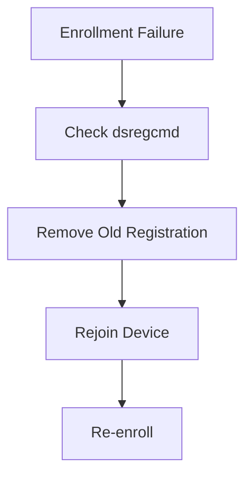

# Intune Enrollment Error 0x80180031

## Executive Summary

Error 0x80180031 is commonly encountered during Windows enrollment.

The issue is usually related to existing device registration or enrollment conflicts.

---

## Symptoms

Users may observe:

- Enrollment failure
- Device registration failure
- Azure AD Join failure
- MDM enrollment failure

---

## Common Root Causes

| Cause | Description |
|---------|---------|
| Existing Enrollment | Previous MDM registration |
| Hybrid Join Conflict | Duplicate registration |
| Stale Device Object | Device already exists |
| Enrollment Restriction | Intune policy block |

---

## Troubleshooting Workflow



---

## Diagnostic Commands

```powershell
dsregcmd /status
```

```powershell
dsregcmd /leave
```

---

## Validation

- Device enrolled
- Intune policy applied
- Compliance state healthy

---

## Deliverables

- Root Cause Analysis
- Enrollment Recovery Procedure
- Validation Report