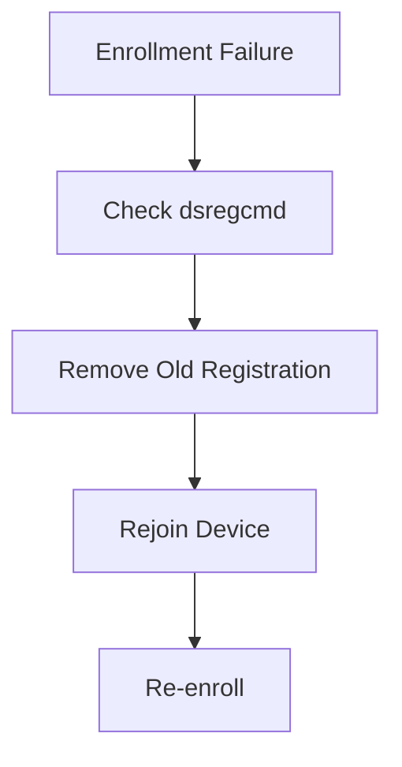

# Intune Enrollment Error 0x80180031

## Executive Summary

Error 0x80180031 is commonly encountered during Windows enrollment.

The issue is usually related to existing device registration or enrollment conflicts.

In enterprise support, this error should be handled with a repeatable recovery procedure so that service desk teams can distinguish registration conflict, enrollment restriction and device object cleanup scenarios.

## 한국어 요약

Intune Enrollment Error 0x80180031은 Windows device enrollment 과정에서 기존 등록 정보나 device object 충돌 때문에 자주 발생합니다.

무작정 재시도하기보다 `dsregcmd /status`, 기존 registration 상태, Entra ID device object, Intune enrollment restriction을 순서대로 확인해야 합니다.

---

## Symptoms

Users may observe:

- Enrollment failure
- Device registration failure
- Azure AD Join failure
- MDM enrollment failure

---

## Common Root Causes

| Cause | Description |
|---------|---------|
| Existing Enrollment | Previous MDM registration |
| Hybrid Join Conflict | Duplicate registration |
| Stale Device Object | Device already exists |
| Enrollment Restriction | Intune policy block |

---

## Troubleshooting Workflow


```mermaid
flowchart TD
    A[Enrollment Failure]
    B[Check dsregcmd]
    C[Remove Old Registration]
    D[Rejoin Device]
    E[Re-enroll]

    A --> B
    B --> C
    C --> D
    D --> E
```

---

## Diagnostic Commands

```powershell
dsregcmd /status
```

```powershell
dsregcmd /leave
```

---

## Validation

- Device enrolled
- Intune policy applied
- Compliance state healthy

---

## Deliverables

- Root Cause Analysis
- Enrollment Recovery Procedure
- Validation Report

## Decision Checklist

| Decision | Recommended Question |
|---|---|
| Device state | Is the device Azure AD joined, hybrid joined or workplace joined? |
| Existing object | Does a stale device object exist in Entra ID or Intune? |
| Policy block | Are enrollment restrictions blocking the platform or user? |
| Re-enrollment | Is device reset required, or can registration cleanup resolve it? |
| Support handoff | What evidence should service desk collect before escalation? |

## Common Risks

- Deleting device objects without confirming ownership and impact
- Re-enrolling before removing stale registration state
- Ignoring enrollment restriction policies
- Not documenting the final healthy enrollment state

## 검색 키워드

- Intune 0x80180031
- Intune enrollment error
- dsregcmd status
- Azure AD Join enrollment failure
- Intune 등록 오류
