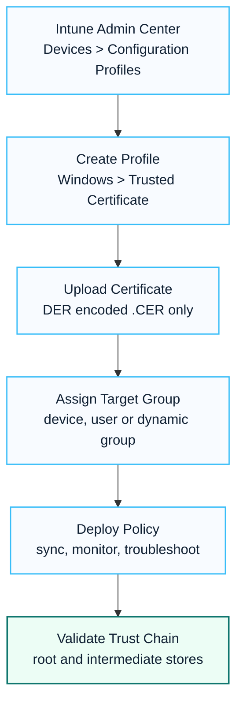

# Intune Trusted Certificate Deployment

## Executive Summary

Trusted Root CA certificates must be deployed before PKCS, SCEP, or imported certificate profiles can be used successfully.

This guide explains the deployment process using Intune Trusted Certificate Profiles.

---

## 한국어 요약

Intune Trusted Certificate Deployment는 Wi-Fi, VPN, SCEP, PKCS, email signing, line-of-business application 접속처럼 인증서 신뢰 체인이 필요한 시나리오의 선행 작업입니다.

Root CA와 Intermediate CA를 올바른 형식으로 배포하고, 대상 그룹과 검증 책임을 명확히 정의해야 인증서 기반 인증 장애를 줄일 수 있습니다.

---

## Prerequisites

Required certificates:

- Root CA Certificate
- Intermediate CA Certificate

Export requirements:

- DER encoded .CER file
- Public certificate only
- No private key (.PFX)

---

## Architecture


---

## Deployment Process



Recommended execution notes:

- Start with a pilot group before broad assignment.
- Deploy the root and intermediate chain in the correct order.
- Keep certificate owner, renewal date and dependent service documented.
- Validate both device certificate store and application behavior.

---

## Validation

Confirm certificate deployment.

```powershell
certmgr.msc
```

Verify:

- Trusted Root Certification Authorities
- Intermediate Certification Authorities

---

## Deployment Decision Points

Certificate deployment should be treated as an identity and device trust dependency. Before assigning a Trusted Certificate profile broadly, confirm which downstream scenario needs the certificate: Wi-Fi, VPN, SCEP, PKCS, email signing, browser trust or line-of-business application access. The assignment scope should match that scenario rather than every managed device by default.

Key decisions:

- whether the certificate is required for user devices, shared devices or servers
- whether the profile should target users, devices or dynamic groups
- whether the CA chain requires both root and intermediate certificates
- how renewal, revocation and CA rollover will be handled
- who owns validation when certificate-dependent services fail

---

## Common Issues

| Issue | Resolution |
|---------|---------|
| Wrong Format | Use DER .CER |
| Missing Intermediate CA | Deploy chain |
| Assignment Issue | Validate group targeting |
| Device Sync Delay | Force sync |

---

## Operational Best Practice

- Pilot first
- Validate chain trust
- Document CA hierarchy
- Maintain renewal process

---

## Deliverables

- Certificate Deployment Design
- Root CA Inventory
- Validation Report
- Operational Runbook

---

## 검색 키워드

- Intune certificate deployment
- Intune Trusted Certificate profile
- Root CA certificate Intune
- Intermediate CA deployment
- SCEP PKCS certificate prerequisite
- Intune 인증서 배포
