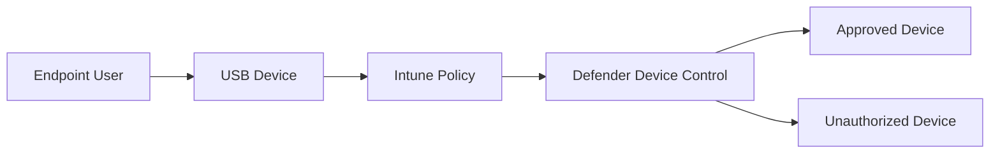

# Intune USB Device Whitelist Control

## Executive Summary

Organizations often need to block unauthorized USB storage devices while allowing approved corporate USB devices.

Microsoft Intune and Microsoft Defender Device Control can implement granular USB access policies.

---

## Business Scenario

Typical requirements:

- Block personal USB storage
- Allow encrypted corporate USB drives
- Restrict file copy operations
- Maintain audit trail
- Meet compliance requirements

---

## Architecture

---

## Supported Controls

| Control | Supported |
|----------|----------|
| Block All USB | Yes |
| Allow Specific USB | Yes |
| Read Only | Yes |
| Read/Write | Yes |
| Audit Mode | Yes |
| Device Serial Number | Yes |

---

## Implementation Approach

### Phase 1

Audit USB activity

### Phase 2

Create allow list

### Phase 3

Deploy enforcement policy

---

## Validation

- Approved USB accessible
- Unapproved USB blocked
- Audit logs generated
- User notification verified

---

## Deliverables

- USB Control Policy
- Approved Device Inventory
- Test Report
- Operational Runbook