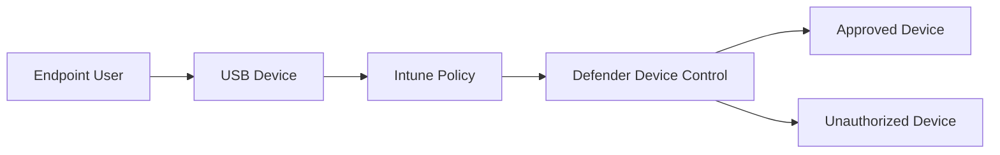

# Intune USB Device Whitelist Control

## Executive Summary

Organizations often need to block unauthorized USB storage devices while allowing approved corporate USB devices.

Microsoft Intune and Microsoft Defender Device Control can implement granular USB access policies.

The strongest design starts with audit evidence, approved device inventory and exception governance before enforcement. This reduces business disruption while still improving data leakage control.

## 한국어 요약

Intune USB Whitelist Control은 승인된 USB device만 허용하고 개인 USB나 미승인 removable media를 차단하기 위한 보안 정책입니다.

Defender Device Control과 Intune을 활용해 audit mode, approved device inventory, enforcement policy, exception workflow를 단계적으로 운영해야 합니다.

---

## Business Scenario

Typical requirements:

- Block personal USB storage
- Allow encrypted corporate USB drives
- Restrict file copy operations
- Maintain audit trail
- Meet compliance requirements

---

## Architecture

```mermaid
flowchart LR
    USER[Endpoint User]
    USB[USB Device]
    INTUNE[Intune Policy]
    DEFENDER[Defender Device Control]

    USER --> USB
    USB --> INTUNE
    INTUNE --> DEFENDER
    DEFENDER --> ALLOW[Approved Device]
    DEFENDER --> BLOCK[Unauthorized Device]
```

---

## Supported Controls

| Control | Supported |
|----------|----------|
| Block All USB | Yes |
| Allow Specific USB | Yes |
| Read Only | Yes |
| Read/Write | Yes |
| Audit Mode | Yes |
| Device Serial Number | Yes |

---

## Implementation Approach

### Phase 1

Audit USB activity

### Phase 2

Create allow list

### Phase 3

Deploy enforcement policy

---

## Validation

- Approved USB accessible
- Unapproved USB blocked
- Audit logs generated
- User notification verified

---

## Deliverables

- USB Control Policy
- Approved Device Inventory
- Test Report
- Operational Runbook

## Decision Checklist

| Decision | Recommended Question |
|---|---|
| Approved device | Which USB devices are business-approved and how are they identified? |
| Enforcement | Which user groups move from audit to block first? |
| Exception | Who approves temporary or project-based USB use? |
| Monitoring | Which logs prove block, allow and read-only behavior? |
| User impact | How are users notified when a USB device is blocked? |

## Common Risks

- Building an allow list without serial number validation
- Enforcing block policies before audit data is reviewed
- Not planning exceptions for manufacturing, field or executive users
- Failing to monitor policy bypass attempts

## 검색 키워드

- Intune USB whitelist
- Defender Device Control USB
- USB allow list policy
- removable media control
- Intune USB 차단
