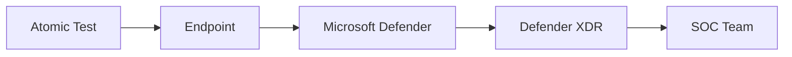
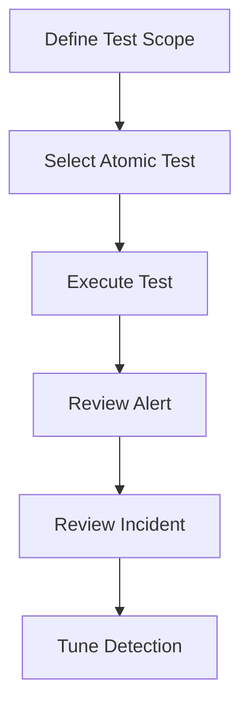

# Microsoft Defender Validation with Atomic Red Team

## Executive Summary

Atomic Red Team provides safe adversary simulation tests used to validate Microsoft Defender detection and response capabilities.

It allows organizations to verify detection coverage before real incidents occur.

---

## Business Scenario

Organizations require:

- Detection Validation
- SOC Readiness Testing
- MITRE ATT&CK Mapping
- Defender Tuning
- Security Baseline Verification

---

## Architecture

---

## Validation Objectives

| Objective | Description |
|------------|------------|
| Detection | Verify alert generation |
| Visibility | Verify telemetry |
| Response | Verify automated response |
| Coverage | Verify MITRE mapping |

---

## Common ATT&CK Techniques

| Technique | Description |
|------------|------------|
| T1059 | Command Execution |
| T1105 | File Download |
| T1003 | Credential Access |
| T1055 | Process Injection |
| T1562 | Defense Evasion |

---

## Recommended Testing Process

---

## Validation Checklist

- Alert Generated
- Incident Generated
- Device Timeline Updated
- MITRE Mapping Correct
- Analyst Notification Received

---

## Deliverables

- Detection Validation Report
- MITRE Coverage Report
- Tuning Recommendations
- Security Improvement Plan