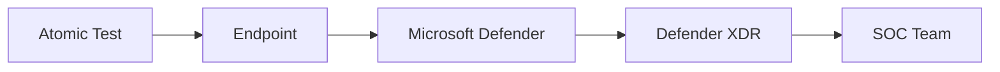
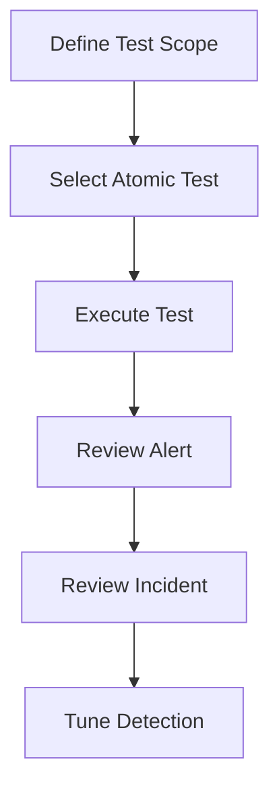

# Microsoft Defender Validation with Atomic Red Team

## Executive Summary

Atomic Red Team provides safe adversary simulation tests used to validate Microsoft Defender detection and response capabilities.

It allows organizations to verify detection coverage before real incidents occur.

---

## Business Scenario

Organizations require:

- Detection Validation
- SOC Readiness Testing
- MITRE ATT&CK Mapping
- Defender Tuning
- Security Baseline Verification

---

## Architecture

```mermaid
flowchart LR

    TEST[Atomic Test]
    DEVICE[Endpoint]
    DEFENDER[Microsoft Defender]
    XDR[Defender XDR]
    SOC[SOC Team]

    TEST --> DEVICE
    DEVICE --> DEFENDER
    DEFENDER --> XDR
    XDR --> SOC
```

---

## Validation Objectives

| Objective | Description |
|------------|------------|
| Detection | Verify alert generation |
| Visibility | Verify telemetry |
| Response | Verify automated response |
| Coverage | Verify MITRE mapping |

---

## Common ATT&CK Techniques

| Technique | Description |
|------------|------------|
| T1059 | Command Execution |
| T1105 | File Download |
| T1003 | Credential Access |
| T1055 | Process Injection |
| T1562 | Defense Evasion |

---

## Recommended Testing Process

```mermaid
flowchart TD

A[Define Test Scope]
B[Select Atomic Test]
C[Execute Test]
D[Review Alert]
E[Review Incident]
F[Tune Detection]

A --> B
B --> C
C --> D
D --> E
E --> F
```

## Safety Guardrails

Atomic testing should be scoped and approved before execution. Do not run broad test sets against production endpoints without a change window, rollback owner and SOC notification. Select a small number of techniques that match the control you want to validate, then document expected telemetry before running the test.

Recommended controls:

- use dedicated test endpoints or pilot security groups where possible
- notify SOC analysts before execution so validation traffic is not mistaken for a real incident
- record the exact Atomic Red Team test ID, command, timestamp and target device
- avoid destructive techniques unless there is an approved lab environment
- compare Microsoft Defender timeline, incident queue and alert evidence after each test

## Evidence Review

The strongest outcome is not simply that an alert was generated. A good validation report should explain whether the alert was timely, mapped to the expected MITRE technique, enriched with useful device context and routed to the right response team. If no alert is generated, capture whether the gap is due to policy, telemetry, exclusion, licensing, platform support or test execution.

---

## Validation Checklist

- Alert Generated
- Incident Generated
- Device Timeline Updated
- MITRE Mapping Correct
- Analyst Notification Received

---

## Deliverables

- Detection Validation Report
- MITRE Coverage Report
- Tuning Recommendations
- Security Improvement Plan

---

## 한국어 요약

이 문서는 Atomic Red Team을 활용해 Microsoft Defender for Endpoint와 Microsoft Defender XDR의 탐지, incident 생성, device timeline, SOC routing을 검증하는 방법을 설명합니다.

핵심은 “테스트를 실행했다”가 아니라 “예상한 telemetry와 alert가 생성되었고, analyst가 조치 가능한 evidence를 받았는지”를 확인하는 것입니다. 운영 환경에서는 승인된 범위, 테스트 시간, 대상 device, rollback owner, SOC notification을 반드시 정리해야 합니다.

## Validation Evidence Model

| Evidence | Why It Matters |
|---|---|
| Atomic test ID | 어떤 MITRE technique을 검증했는지 추적 |
| Target endpoint | 테스트 장비와 production 영향 범위 확인 |
| Defender alert | 탐지 여부와 alert severity 확인 |
| Incident correlation | 단일 alert가 incident로 묶이는지 확인 |
| Device timeline | process, file, network telemetry 확인 |
| SOC response | analyst notification과 triage 절차 확인 |

## Related Documents

- [Defender for Endpoint](../security/defender-for-endpoint)
- [Defender XDR](../security/defender-xdr)
- [Security Modernization Program](../projects/security-modernization-program)
- [Security Reference Architecture](../architecture/security-reference-architecture)

## Search Keywords

이 문서는 다음 검색 의도에 답합니다.

- Atomic Red Team Microsoft Defender
- Microsoft Defender XDR validation
- MDE detection validation
- MITRE ATT&CK Defender test
- SOC readiness testing
- Microsoft Defender 탐지 검증
- Atomic Red Team 보안 테스트
- Defender XDR Incident 검증

## Contact / Asset Request

고객 환경에서 Atomic Red Team 기반 validation plan, MITRE mapping report, SOC handover checklist가 필요하면 [Contact and Asset Request](../contact)를 통해 public-safe template을 요청할 수 있습니다.
