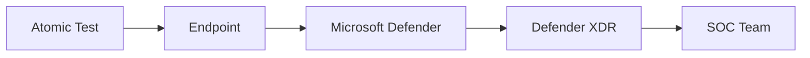
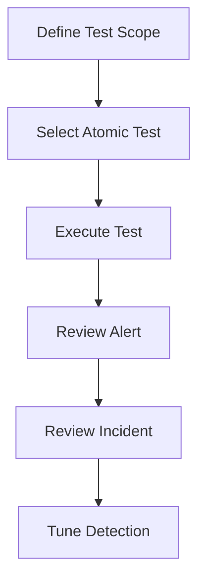

# Microsoft Defender Validation with Atomic Red Team

## Executive Summary

Atomic Red Team provides safe adversary simulation tests used to validate Microsoft Defender detection and response capabilities.

It allows organizations to verify detection coverage before real incidents occur.

---

## Business Scenario

Organizations require:

- Detection Validation
- SOC Readiness Testing
- MITRE ATT&CK Mapping
- Defender Tuning
- Security Baseline Verification

---

## Architecture

```mermaid
flowchart LR

    TEST[Atomic Test]
    DEVICE[Endpoint]
    DEFENDER[Microsoft Defender]
    XDR[Defender XDR]
    SOC[SOC Team]

    TEST --> DEVICE
    DEVICE --> DEFENDER
    DEFENDER --> XDR
    XDR --> SOC
```

---

## Validation Objectives

| Objective | Description |
|------------|------------|
| Detection | Verify alert generation |
| Visibility | Verify telemetry |
| Response | Verify automated response |
| Coverage | Verify MITRE mapping |

---

## Common ATT&CK Techniques

| Technique | Description |
|------------|------------|
| T1059 | Command Execution |
| T1105 | File Download |
| T1003 | Credential Access |
| T1055 | Process Injection |
| T1562 | Defense Evasion |

---

## Recommended Testing Process

```mermaid
flowchart TD

A[Define Test Scope]
B[Select Atomic Test]
C[Execute Test]
D[Review Alert]
E[Review Incident]
F[Tune Detection]

A --> B
B --> C
C --> D
D --> E
E --> F
```

## Safety Guardrails

Atomic testing should be scoped and approved before execution. Do not run broad test sets against production endpoints without a change window, rollback owner and SOC notification. Select a small number of techniques that match the control you want to validate, then document expected telemetry before running the test.

Recommended controls:

- use dedicated test endpoints or pilot security groups where possible
- notify SOC analysts before execution so validation traffic is not mistaken for a real incident
- record the exact Atomic Red Team test ID, command, timestamp and target device
- avoid destructive techniques unless there is an approved lab environment
- compare Microsoft Defender timeline, incident queue and alert evidence after each test

## Evidence Review

The strongest outcome is not simply that an alert was generated. A good validation report should explain whether the alert was timely, mapped to the expected MITRE technique, enriched with useful device context and routed to the right response team. If no alert is generated, capture whether the gap is due to policy, telemetry, exclusion, licensing, platform support or test execution.

---

## Validation Checklist

- Alert Generated
- Incident Generated
- Device Timeline Updated
- MITRE Mapping Correct
- Analyst Notification Received

---

## Deliverables

- Detection Validation Report
- MITRE Coverage Report
- Tuning Recommendations
- Security Improvement Plan
