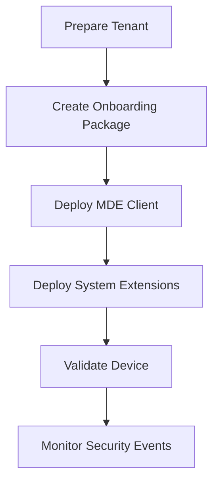

# Microsoft Defender for Endpoint macOS Onboarding

## Executive Summary

This guide describes the onboarding process for macOS devices into Microsoft Defender for Endpoint (MDE).

The objective is to provide centralized endpoint visibility, threat detection, vulnerability management and incident response capabilities for macOS devices.

---

## Business Scenario

Organizations commonly require:

- Corporate MacBook management
- Security monitoring
- Threat detection
- Device inventory
- Vulnerability management
- Zero Trust compliance

---

## Supported Platforms

| Platform | Supported |
|-----------|-----------|
| macOS Ventura | Yes |
| macOS Sonoma | Yes |
| Apple Silicon | Yes |
| Intel Mac | Yes |

---

## Architecture

---

## Deployment Models

### Option 1

Intune Managed Deployment

Recommended

### Option 2

Manual Deployment

Pilot environments only

### Option 3

Jamf + Defender Integration

Enterprise macOS environments

---

## Required Components

- Microsoft Defender for Endpoint License
- Intune (Recommended)
- Microsoft Defender Portal Access
- Network Connectivity

---

## Onboarding Workflow

---

## Validation

Verify:

- Device visible in Defender Portal
- Sensor healthy
- AV enabled
- EDR enabled
- Device inventory updated

---

## Operational Checklist

- Device onboarded
- Security policy assigned
- Tamper protection enabled
- Vulnerability assessment active
- Test alert generated

---

## Deliverables

- macOS Onboarding Design
- Pilot Validation Report
- Security Baseline
- Operations Runbook