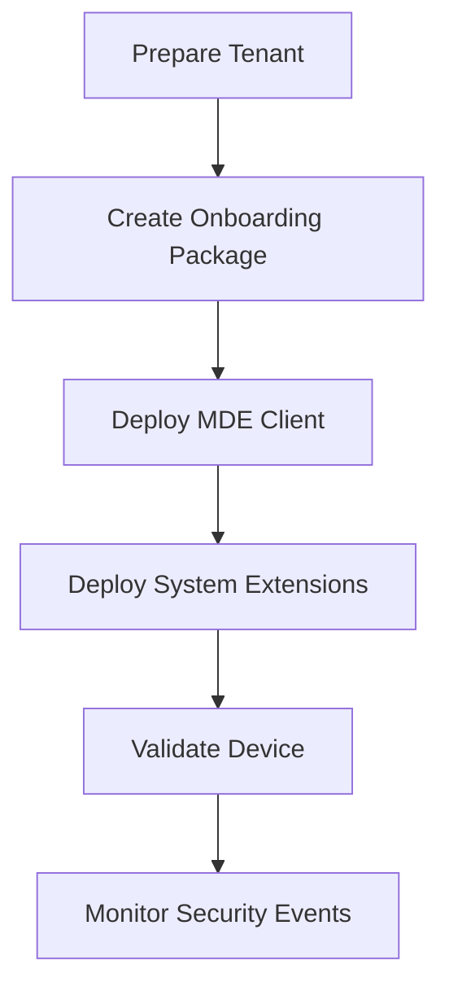

# Microsoft Defender for Endpoint macOS Onboarding

## Executive Summary

This guide describes the onboarding process for macOS devices into Microsoft Defender for Endpoint (MDE).

The objective is to provide centralized endpoint visibility, threat detection, vulnerability management and incident response capabilities for macOS devices.

---

## Business Scenario

Organizations commonly require:

- Corporate MacBook management
- Security monitoring
- Threat detection
- Device inventory
- Vulnerability management
- Zero Trust compliance

---

## Customer Impact

| Issue | Business Impact |
|---|---|
| unmanaged Mac devices | weak visibility for executives, developers and creative teams using macOS |
| no unified endpoint signal | Defender XDR incidents may miss macOS context |
| inconsistent security baseline | antivirus, EDR, network protection and device control may vary by device |
| manual onboarding | rollout quality depends on local administrator action |
| missing validation evidence | security and audit teams cannot prove coverage |

---

## Supported Platforms

| Platform | Supported |
|-----------|-----------|
| macOS Ventura | Yes |
| macOS Sonoma | Yes |
| Apple Silicon | Yes |
| Intel Mac | Yes |

---

## Architecture

```mermaid
flowchart LR

    MAC[macOS Device]
    INTUNE[Intune]
    MDE[Defender for Endpoint]
    XDR[Microsoft Defender XDR]

    MAC --> INTUNE
    INTUNE --> MDE
    MDE --> XDR
```

---

## Deployment Models

| Model | Best For | Notes |
|---|---|---|
| Intune Managed Deployment | Microsoft 365 managed endpoint environments | recommended default for policy consistency and reporting |
| Manual Deployment | small pilots or break-glass validation | not recommended for production scale |
| Jamf + Defender Integration | established Jamf-based macOS fleets | align Jamf ownership with Defender security operations |

---

## Required Components

- Microsoft Defender for Endpoint License
- Intune (Recommended)
- Microsoft Defender Portal Access
- Network Connectivity

---

## Onboarding Workflow

```mermaid
flowchart TD

A[Prepare Tenant]
B[Create Onboarding Package]
C[Deploy MDE Client]
D[Deploy System Extensions]
E[Validate Device]
F[Monitor Security Events]

A --> B
B --> C
C --> D
D --> E
E --> F
```

---

## Validation

Verify:

- Device visible in Defender Portal
- Sensor healthy
- AV enabled
- EDR enabled
- Device inventory updated
- device risk signal available for Conditional Access scenario
- test detection or test alert reviewed by security operations

---

## Acceptance Criteria

| Area | Acceptance Criteria |
|---|---|
| onboarding | target macOS devices appear in Microsoft Defender portal with healthy sensor state |
| policy | antivirus, EDR and relevant configuration profiles are assigned successfully |
| operations | security team can review device timeline, alerts and vulnerability data |
| compliance | device inventory and risk signals can support Zero Trust access decisions |
| documentation | pilot validation report and operations runbook are handed over |

---

## Operational Checklist

- Device onboarded
- Security policy assigned
- Tamper protection enabled
- Vulnerability assessment active
- Test alert generated
- ownership model confirmed between endpoint, security and helpdesk teams
- exception process documented for unsupported or unmanaged devices

---

## Deliverables

- macOS Onboarding Design
- Pilot Validation Report
- Security Baseline
- Operations Runbook

## 한국어 요약

MDE macOS onboarding은 macOS 장비를 Microsoft Defender for Endpoint와 Defender XDR 운영 체계에 연결하기 위한 보안 배포 작업입니다.

Intune, Jamf, device compliance, network permission, privacy permission, sensor health, alert visibility를 함께 검토해야 하며, pilot validation과 help desk runbook을 준비해야 안정적으로 확산할 수 있습니다.

## Requestable Assets

Editable or customer-ready versions can be requested through [Contact and Asset Request](../contact).

- macOS onboarding checklist
- Intune configuration profile review sheet
- Jamf integration decision matrix
- pilot validation report template
- Defender for Endpoint operations handover checklist

## Search Keywords

- Microsoft Defender for Endpoint macOS onboarding
- MDE macOS Intune deployment
- Jamf Defender integration
- macOS endpoint security baseline
- Defender XDR macOS visibility
- Zero Trust macOS compliance
