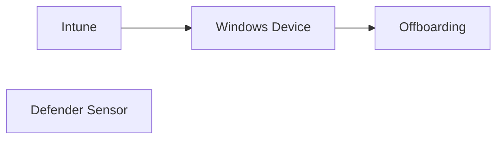

# Microsoft Defender for Endpoint Windows Offboarding

## Executive Summary

This guide explains how to remove Windows endpoints from Microsoft Defender for Endpoint using Intune deployment.

Offboarding should be performed in a controlled manner to maintain security visibility and audit integrity.

---

## Common Use Cases

- Device Retirement
- Device Replacement
- Lab Environment Cleanup
- Tenant Migration
- Security Tool Transition

---

## Architecture

---

## Offboarding Workflow

### Step 1

Download offboarding package from Microsoft Defender Portal.

### Step 2

Create Intune deployment package.

### Step 3

Assign deployment group.

### Step 4

Deploy package.

### Step 5

Validate removal.

---

## Validation

Verify:

- Device no longer reporting
- Sensor removed
- Defender Portal inventory updated

---

## Operational Considerations

| Area | Consideration |
|---------|---------|
| Compliance | Preserve required audit records |
| Security | Avoid unmanaged device state |
| Timing | Coordinate with device lifecycle |
| Documentation | Maintain offboarding records |

---

## Deliverables

- Offboarding Procedure
- Deployment Package
- Validation Report
- Asset Update Record